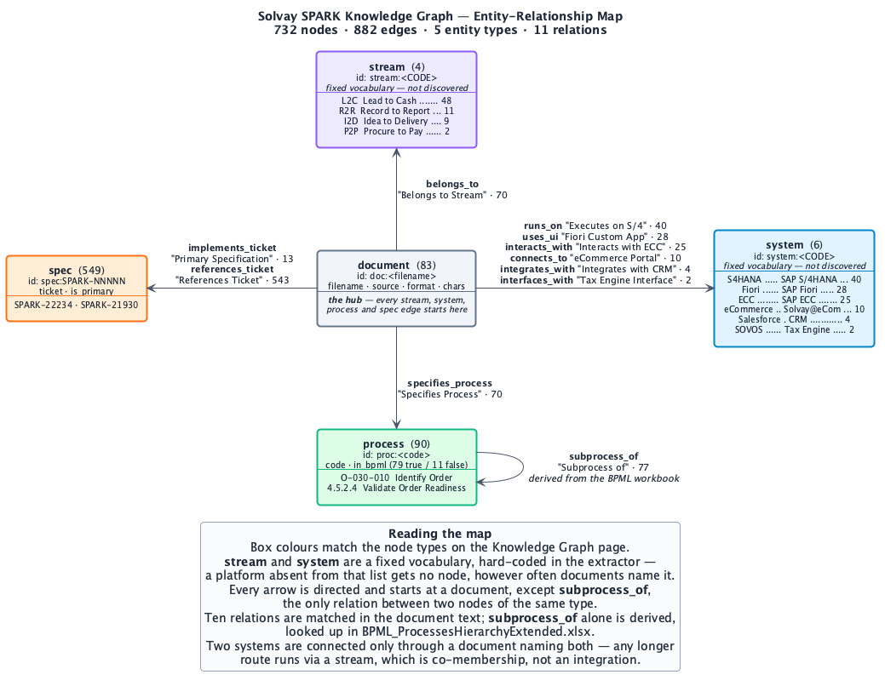
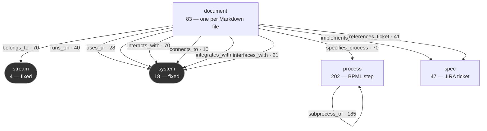

# Entity–Relationship Map — Solvay SPARK Knowledge Graph

Built from `knowledge_graph.py` (the extraction rules) and `knowledge_graph.json`
(the built graph): **354 nodes, 560 edges**.

Regenerate the graph with `POST /api/graph/rebuild`, or in Python:

```python
import knowledge_graph
knowledge_graph.extract_graph(force=True)
```

---

## 1. Entity types

| Type | Id prefix | Count | What it represents | Example |
|---|---|---|---|---|
| `stream` | `stream:` | 4 | A top-level business value chain. Fixed list. | `stream:L2C` — Lead to Cash (48 connections) |
| `system` | `system:` | 18 | An IT platform. Fixed list. | `system:S4HANA` — SAP S/4HANA (40) |
| `document` | `doc:` | 83 | One converted Markdown file | `doc:20251031_…CMIR & Master Data_docx.md` (33) |
| `process` | `proc:` | 202 | A BPML process, or an L4 step from the register | `proc:4.10.2.1` — Process Consignment Return |
| `spec` | `spec:` | 47 | A JIRA ticket / functional specification | `spec:SPARK-22234` — the SOVOS interface |

Property sets differ by type. Documents carry `filename`, `source`, `format` and
`chars`; processes carry `code`, **`in_bpml`** and — for the 111 Lead-to-Cash L4
steps — **`jira_key`**; specs carry `ticket` and
`is_primary`. Every node carries `degree`, `size` and `color`.

---

## 2. The fixed vocabulary

**These ten hubs are hard-coded in `STREAMS` and `SYSTEMS` — they are not discovered
from the corpus.** A platform that is not on this list gets no node, however often the
documents name it.

### Streams (4)

| Code | Label | Covers | Documents |
|---|---|---|---|
| L2C | Lead to Cash | Sales order management, pricing, billing, logistics, collections | 48 |
| R2R | Record to Report | Financial accounting, commissions, general ledger, reporting | 11 |
| I2D | Idea to Delivery | Transit times, shipping, warehouse operations, physical delivery | 9 |
| P2P | Procure to Pay | Procurement, vendor purchase orders, goods receipt, invoice verification | 2 |

### Systems (6)

| Code | Label | Role | Documents |
|---|---|---|---|
| S4HANA | SAP S/4HANA | Target ERP — sales, billing, master data, central finance | 40 |
| ECC | SAP ECC | Legacy ERP being migrated under SPARK | 25 |
| Fiori | SAP Fiori | Role-based UX for custom enhancements | 28 |
| eCommerce | Solvay@eCommerce | Customer ordering portal, catalogue, invoice visibility | 10 |
| Salesforce | Salesforce (CRM) | Complaints, accounts, order intake | 4 |
| SOVOS | SOVOS (Tax Engine) | Tax determination and electronic compliance | 2 |

---

## 3. Relationships

All eleven. The **match target** is the document body plus its filename, with
underscores opened into spaces; all keyword patterns are case-insensitive.

| Relation | Source | Target | UI label | Edges | Rule that creates it |
|---|---|---|---|---|---|
| `belongs_to` | document | stream | Belongs to Stream | 70 | `\bL2C\b` / `\bI2D\b` / `\bR2R\b` / `\bP2P\b` matches |
| `runs_on` | document | system | Executes on S/4 | 40 | `\bS[/ ]?4[\s/-]?HANA\b\|\bS/4\b\|\bS4\b` matches |
| `uses_ui` | document | system | Fiori Custom App | 28 | `\bfiori\b` matches |
| `interacts_with` | document | system | Interacts with ECC | 25 | `\bECC\b` matches |
| `connects_to` | document | system | eCommerce Portal | 10 | `\be[-\s]?commerce\b` matches |
| `integrates_with` | document | system | Integrates with CRM | 4 | `\bsalesforce\b` matches |
| `interfaces_with` | document | system | Tax Engine Interface | 2 | `\bsovos\b` matches |
| `specifies_process` | document | process | Specifies Process | 70 | `(?<![A-Za-z0-9-])([A-Za-z][A-Za-z0-9]{0,3})-(\d{2,3}(?:-\d{2,3})+)\b` in the **body only** |
| `subprocess_of` | process | process | Subprocess of | 77 | **Not matched — looked up.** See below. |
| `implements_ticket` | document | spec | Primary Specification | 13 | `\bSPARK[-_ ]?(\d{4,6})\b` matches **and** the bare number appears in the filename |
| `references_ticket` | document | spec | References Ticket | 543 | Same match, but the number is **not** in the filename |

The seven system relations are one-per-platform: the relation name tells you which
system it points at. The UI labels are hard-coded per system, which is why `runs_on`
always reads "Executes on S/4".

### Read vs. derived

Nine relations are **read** — a pattern matched text, so you can go and see it in the
source document.

`subprocess_of` is **derived**. It appears in no document; it comes from
`solvay-spark/pkg/BPML_ProcessesHierarchyExtended.xlsx`, whose own Markdown conversion
is a 172-byte stub, so the workbook is read directly. Each code is looked up, linked to
its real parent, and the chain is walked to the top:

```
O-030-010 Identify Order → 4.5.2.4 Validate/Perform Order Readiness
                         → 4.5.2 Order Fulfillment
                         → 4.5   Manage Sales Orders
                         → 4.0   Lead to Cash
```

This is why process ids mix two notations: the letter codes come from the documents,
the numbered ones from the workbook.

**`in_bpml` records whether the workbook confirms a process: 79 of 90 true, 11 false.**
The eleven (`DM-270-*`, `O-160-030`, `O-160-100`, `E-020-010`, `O-140-150`) are named in
documents but absent from the export, so they are kept and left **without a parent**
rather than given an invented one.

`implements_ticket` is partly derived too — the filename is evidence the body may not
repeat.

---

## 4. Schema diagram



Source: `kg-entity-relationships.puml`. Re-render after a rebuild with:

```bash
plantuml -tpng docs/kg-entity-relationships.puml
```

The same schema as Mermaid, for viewers that render it inline:



**Reading the diagram:** dark boxes are the hard-coded vocabulary. `subprocess_of` is
the only self-loop.

---

## 5. Direction and shape

**The document is the hub.** Every stream, system, process and spec edge starts at a
document — all 560 edges have a `document` source except the 185 `subprocess_of` ones.
Nothing connects a stream to a system, or a spec to a process, directly.

The practical consequence: **two systems are only ever connected through a document
that names both.** If no single document mentions both, there is no two-hop route, and
anything longer runs through a stream hub — which is co-membership, not an integration.
Salesforce and SOVOS are exactly this case: their shortest route is four hops via
`stream:L2C`, and `evidence/paths.py` rejects it for that reason.

`subprocess_of` is the only relation joining two nodes of the same type, and the only
one that forms a chain rather than a star.

---

## Known disagreements between the code and the data

1. **`is_primary` on the node contradicts `implements_ticket` on the edge.** The JSON
   has 13 primary edges over 12 distinct tickets, but only **10** spec nodes are flagged
   `is_primary: true`. `add_node` keeps the first write, so a ticket first seen as an
   incidental reference keeps `false` even when a later document is its primary spec.
   `SPARK-21930` and `SPARK-21266` are both affected. **Trust the edge, not the node
   flag.**

2. **The module docstring lists `L-xxx-xxx` as a discovered code family.** No `L-`
   prefixed code exists in the graph; the actual prefixes are `O`, `DM`, `M`, `DC`, `E`,
   `P`, `X`, plus the numbered BPML codes.

3. **`kg_algorithm.html` is out of date.** It quotes 1,200 relationships (actual 560),
   S/4HANA at 68 connections (actual 40), and SOVOS touching 14 documents (actual 2).
