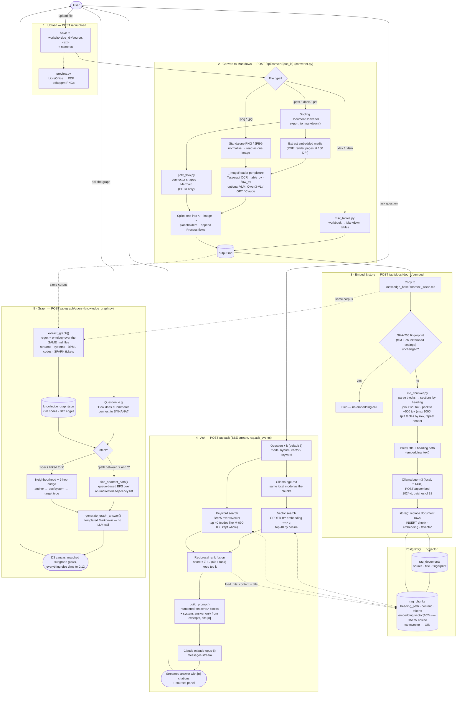

# Processing pipeline

From an uploaded document to a cited answer: convert to Markdown, chunk and
embed it into pgvector, then answer questions from the top-k retrieved chunks.
The same Markdown is also read by a second, independent engine that answers by
**graph traversal** instead of retrieval — see [Knowledge graph](#knowledge-graph) below.

## Knowledge graph

Stage 5 is not a variant of stages 3–4; it is a separate engine that happens to read
the same input. Three things are worth holding onto:

- **No embedding, no database, no model.** `knowledge_graph.py` builds its graph with
  regular expressions and a hand-written ontology (4 business streams, 6 core systems),
  caches it as JSON, and answers by walking it in memory. `generate_graph_answer()` is
  string formatting, not generation.
- **The hierarchy comes from the codes themselves.** A BPML code like `M-090-030-010`
  yields its own node plus a `subprocess_of` edge to the synthesised parent `M-090-030`.
- **Over-linking is the trade-off.** Edges are created on literal keyword presence
  (`"ECC" in content`), so any mention produces a relationship. `references_ticket`
  alone accounts for 548 of the 842 edges.

## What leaves the machine

Only two things, and only when they are switched on:

| Stage | Goes out | To |
|---|---|---|
| 2 (optional) | pictures from the document | OpenAI or Anthropic, **only** with the cloud VLM option |
| 4 | the question + the top-k excerpts | Anthropic (`claude-opus-5`) |

Embedding used to be a third: Cohere `embed-v4.0` received every chunk and every
question. Replacing it with **Ollama `bge-m3` on localhost** (1024-d instead of 1536-d)
removed that entirely. Stages 1, 3 and 5 now run without any network call.
