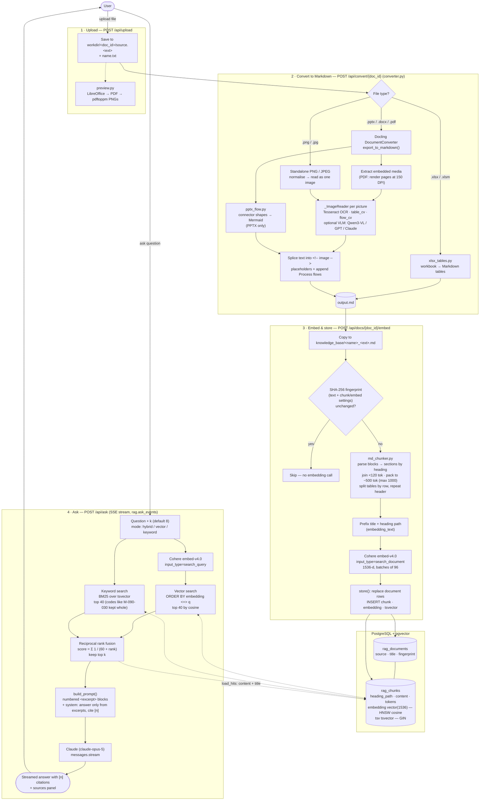

# Processing pipeline

From an uploaded document to a cited answer: convert to Markdown, chunk and
embed it into pgvector, then answer questions from the top-k retrieved chunks.

```mermaid
flowchart TD
    User([User])

    subgraph S1["1 · Upload — POST /api/upload"]
        Upload["Save to workdir/&lt;doc_id&gt;/source.&lt;ext&gt;<br/>+ name.txt"]
        Preview["preview.py<br/>LibreOffice → PDF → pdftoppm PNGs"]
        Upload -.-> Preview
    end

    subgraph S2["2 · Convert to Markdown — POST /api/convert/#123;doc_id#125; (converter.py)"]
        Route{File type?}
        XLSX["xlsx_tables.py<br/>workbook → Markdown tables"]
        IMG["Standalone PNG / JPEG<br/>normalise → read as one image"]
        Docling["Docling DocumentConverter<br/>export_to_markdown()"]
        Flows["pptx_flow.py<br/>connector shapes → Mermaid<br/>(PPTX only)"]
        Media["Extract embedded media<br/>(PDF: render pages at 150 DPI)"]
        Reader["_ImageReader per picture<br/>Tesseract OCR · table_cv · flow_cv<br/>optional VLM: Qwen3-VL / GPT / Claude"]
        Splice["Splice text into &lt;!-- image --&gt;<br/>placeholders + append Process flows"]
        MD[("output.md")]

        Route -- ".xlsx / .xlsm" --> XLSX
        Route -- ".png / .jpg" --> IMG
        Route -- ".pptx / .docx / .pdf" --> Docling
        Docling --> Flows
        Docling --> Media --> Reader --> Splice
        Flows --> Splice
        IMG --> Reader
        XLSX --> MD
        Splice --> MD
    end

    subgraph S3["3 · Embed & store — POST /api/docs/#123;doc_id#125;/embed"]
        KB["Copy to knowledge_base/&lt;name&gt;_&lt;ext&gt;.md"]
        FP{"SHA-256 fingerprint<br/>(text + chunk/embed settings)<br/>unchanged?"}
        Skip["Skip — no embedding call"]
        Chunk["md_chunker.py<br/>parse blocks → sections by heading<br/>join &lt;120 tok · pack to ~500 tok (max 1000)<br/>split tables by row, repeat header"]
        Ctx["Prefix title + heading path<br/>(embedding_text)"]
        EmbedDoc["Cohere embed-v4.0<br/>input_type=search_document<br/>1536-d, batches of 96"]
        Store["store(): replace document rows<br/>INSERT chunk · embedding · tsvector"]

        KB --> FP
        FP -- yes --> Skip
        FP -- no --> Chunk --> Ctx --> EmbedDoc --> Store
    end

    subgraph PG["PostgreSQL + pgvector"]
        Docs[("rag_documents<br/>source · title · fingerprint")]
        Chunks[("rag_chunks<br/>heading_path · content · tokens<br/>embedding vector(1536) — HNSW cosine<br/>tsv tsvector — GIN")]
        Docs --- Chunks
    end

    subgraph S4["4 · Ask — POST /api/ask (SSE stream, rag.ask_events)"]
        Q["Question + k (default 8)<br/>mode: hybrid / vector / keyword"]
        EmbedQ["Cohere embed-v4.0<br/>input_type=search_query"]
        Vec["Vector search<br/>ORDER BY embedding &lt;=&gt; q<br/>top 40 by cosine"]
        KW["Keyword search<br/>BM25 over tsvector<br/>top 40 (codes like M-090-030 kept whole)"]
        Fuse["Reciprocal rank fusion<br/>score = Σ 1 / (60 + rank)<br/>keep top k"]
        Prompt["build_prompt()<br/>numbered &lt;excerpt&gt; blocks<br/>+ system: answer only from excerpts, cite [n]"]
        LLM["Claude (claude-opus-5)<br/>messages.stream"]
        Answer(["Streamed answer with [n] citations<br/>+ sources panel"])

        Q --> EmbedQ --> Vec
        Q --> KW
        Vec --> Fuse
        KW --> Fuse
        Fuse --> Prompt --> LLM --> Answer
    end

    User -- "upload file" --> Upload
    Upload --> Route
    MD --> KB
    Store --> Docs
    Store --> Chunks
    User -- "ask question" --> Q
    Vec <-.-> Chunks
    KW <-.-> Chunks
    Fuse -. "load_hits: content + title" .-> Chunks
    Answer --> User
```
