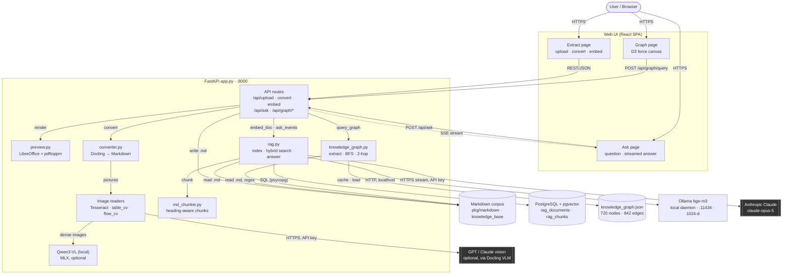

# System Architecture Diagram

This diagram shows Docling Studio's internal components, the direction data flows
between them, and how it reaches its external dependencies. **PostgreSQL + pgvector**
holds the retrieval index, **Ollama** embeds locally, and **Anthropic Claude** writes
the answers. For the step-by-step processing detail see [`pipeline.md`](pipeline.md).

## Two engines over one corpus

The converted Markdown in `solvay-spark/pkg/markdown/` and `knowledge_base/` is the
substrate both answering engines read, and that is the single most important thing to
understand about this architecture:

- **`rag.py`** chunks and embeds the files into Postgres, then answers a question by
  retrieving from that index and handing the top chunks to Claude.
- **`knowledge_graph.py`** reads the *same files* with regex and an ontology, builds a
  720-node / 842-edge graph, and answers by **traversing it** — BFS shortest path and
  2-hop bridge expansion. **No LLM and no database are involved in this path**; its
  answers are templated from the graph itself.

They are independent: nothing is shared but the files on disk.

Claude never searches anything. `rag.py` does the retrieval itself: it embeds the
question with **Ollama `bge-m3` on localhost** (1024-d — this replaced Cohere
`embed-v4.0`, so chunk text no longer leaves the machine to be embedded), runs **two**
searches against the same `rag_chunks` table — cosine nearest-neighbour over the
pgvector HNSW index, and BM25 over a `tsvector` full-text index, so exact codes like
`M-090-030` still match — fuses the two rankings with reciprocal rank fusion, and sends
only the top-k chunks to Claude as numbered excerpts. The answer streams back to the
browser as server-sent events.

## Diagram

**Reading the diagram:**

- Solid arrows = request/command direction; dashed = streamed response (SSE).
- Dark boxes = external systems this app depends on but doesn't control. They are also
  the only things data leaves the machine for. **Ollama is deliberately not one of
  them** — embedding moved on-machine when Cohere was replaced by `bge-m3`.
- Cylinders = local state: the Markdown corpus, the Postgres index, and the cached graph.
- `rag.py` and `knowledge_graph.py` never call each other. They meet only at `Files`.
