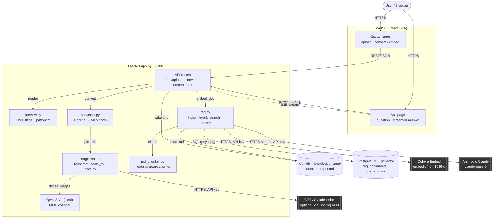

# System Architecture Diagram

This diagram shows Docling Studio's internal components, the direction data flows
between them, and how it reaches its most important external dependencies:
**Cohere Embed** (vectors) and **Anthropic Claude** (answers), with **PostgreSQL + pgvector**
holding the index in between. For the step-by-step processing detail see
[`pipeline.md`](pipeline.md).

## How a question reaches Claude

Claude never searches the database. `rag.py` does the retrieval itself: it embeds the
question with Cohere, runs **two** searches against the same `rag_chunks` table in
Postgres — cosine nearest-neighbour over the pgvector HNSW index, and BM25 over a
`tsvector` full-text index (so exact codes like `M-090-030` still match) — fuses the
two rankings with reciprocal rank fusion, and sends only the top-k chunks to Claude as
numbered excerpts. The answer streams back to the browser as server-sent events.
Cohere is called twice in the life of a document: once per chunk at embed time
(`search_document`) and once per question (`search_query`).

## Diagram

**Reading the diagram:**

- Solid arrows = request/command direction; dashed = streamed response (SSE).
- Dark boxes = external systems this app depends on but doesn't control.
- Cylinders = local state: files on disk and the Postgres index.
