# 7.1 Produce/Loading/Packaging Product

7.1.1 Manage BOM Inventory

# M-090-010: Check for Material Availability

# Role = Production Supervisor - Process Manufacturing

Done

Condition: Missing parts

Interface: Expedite missing materials

Condition: One Material

Start: Need to check material availability

Interface: create process order

Task: check material availability (Automatic)

END: Material Availability is checked

Condition: No Missing parts

Task: check material availability (Collective) (Automatic)

Condition: multiple Material

App name

# M-090-040: Expedite missing materials

# Role = Production Supervisor - Process Manufacturing

Done

Create Purchase Order

Task: Create Purchase Order

Monitor product availability

Create Purchase Order

Start: Parts are missing

Task: Identify missing material

Task: Create Stock Transport Order

END: missing materials expedited

Create Process Order

Task: Create Process Order

App name

# M-090-090: Schedule Consumable Material Requirements

# Role = Production Supervisor - Process Manufacturing

Done

Start: Need to schedule consumable material requirements

Task: Create Purchase Requisition

END: consumable material requirements scheduled

Create Purchase Requisition

App name

# 7.1 Produce/Loading/Packaging Product

7.1.10 Waste Management

# Scrap management

# Role = Quality Planner

Done

Need to scrap stock after quality inspection

Task: Identify the stock that needs to be scrapped

Task: Select the amount of stock to be scrapped

Task: Select cost center

Task: Post the scrap movement

END: Stock Scrapped

Manage stock

App name

# 7.1 Produce/Loading/Packaging Product

7.1.11 Material quantities reconciliation (end of month closing)

# M-100-060: Correct the errors in goods movement

# Role = 

Done

Start: Need to correct errors in goods movement

Task: Correct Errors in goods movement

Task: Reprocess materials

END: errors in goods movement corrected

COGI

MIGO

App name

# 7.1 Produce/Loading/Packaging Product

7.1.12 Repetitive Manufacturing

# M-XXX-XXX: Staging/ stock transfers

# Role = 

Done

Send label printing to external tool.

Event: label printing received to external tool.

Labeling request sent to printing tool

Planned orders sent to MES

Event: planned orders received in MES

Send planned orders to MES

Outbound delivery created and material Staged to Production Storage Location

Start: Planned Orders Received from OMP

Condition: EWM

Determine Quantity

Create Replenishment Proposal

Staging Request initiated

Condition: IM

PULL LIST

PULL LIST

Condition: IM

Placeholder: Batch Determination

Stock Transport Posting

Physical Material Movement

Staging Completed

Condition: EWM

PULL LIST

# M-XXX-XXX: Batch determination In Repetitive Manufacturing 

# Role = 

Done

Start: Replenishment proposal received

Task: Automatic Batch Selection for Component

End: Batch Determination completed 

Task: Select Batch for Component

PULL LIST

# M-XXX-XXX: Production Declaration

# Role = 

Done

Start: Need to declare  production for IM materials

Production Execution on shop floor

Confirmation, production declaration, backflush in mes

Task: send these details to sap as a request

event: details received in sap

Task: in sap the posting is done

End: Batch Production Declared

MFBF

Note: mes? Which one later defined

# M-XXX-XXX: Reconciliation and Error Correction Process Flow (Repetitive Manufacturing in SAP)

# Role = 

Done

Start: Need to reconcile and Correct Errors

End: Reconciliation and error Correction Executed

Identify Discrepancies or Errors

Analyze Root Cause of Errorst

Correct Errors in SAP

Reprocess REM Goods Movement

Reprocess REM Goods Movement

# 7.1 Produce/Loading/Packaging Product

7.1.4 Execution of operations plan

# Process Instruction Record (EBR)

# 

Start: Need to process instruction record

Start: instruction record processed

placeholder: process order released

Task: Create PI Sheets

Task: Send process instruction record to IP21

Event: IP21 received the instruction record

CO60

Note: the interfaces still needs to be decided.

App Name

Note: app not in celonis

# Energy Manufacturing Process

# 

App Name

# M-100-010: Confirm process order operation/phase

# Role = Production Operator - process manufacturing

Done

Start: Need to confirm process order operation/phase

Task: from MES goods issue and activities

Task: Post activities automatic

Task: Post Goods Movements (automatic)

Task: save confirmation

END: operation/phase of process order confirmed

Confirm process order phase

Manage process order

Note: integration with scale to be confirmed

App name

# M-100-020: Backflush Raw Materials

# 

Done

Condition: EWM

Placeholder: 8.3.1 Manage and track inventory of packed goods to and from production (WH)

Start: Need to backflush raw materials

Task: Indicate backflush indicator in the material master

Task: Automatic good issue of components from production storage location during confirmation

END: raw materials backflushed

MM02

Manage Product Master

Condition: IM

App name

# M-100-070: Order Closure

# Role = Production Supervisor - Process Manufacturing

Done

COR6N, Manage process orders

Manage process orders

Change process order

Not all confirmed

Task: Confirm open Operations and Phase

Open Items left

Task: Resolve open items

Manage process orders

Change process order

Manual 

Task: manually close order

Manage process orders

Start: Need to close process order

Task: check if all operations and phases are confirmed

Task: check if there are any open items

Task: Technically close the order

Task: Send Status update to MES

Interface: DS-020-070 Perform Production Period End Close 

Task: Save order

Task: Send Status update to MES

END: process order closed

all confirmed

No open items

Manage process orders

Change process order

Automatic

Task: automatically close order as background job

App name

# M-100-090: Archive Process Record

# Role = production supervisor - process manufacturing

Done

Note: To be deleted

Start: Need to achieve process order

placeholder: close process order

Task: archive process order

END: process order closed

Manage Process Orders

App name

# M-100-120: Consume Material/Re-order Material

# Role = production supervisor - process manufacturing

Done

Start: Need to consume material manually

END: Material manually consumed

Task: Send the actual consumption quantities from custom app to SAP

Event: Receive Actual consumption quantities

Task: consume materials/re-order material

MIGO

Note: MES to be decided, ask ninad

App name

# M-100-240: reject component material

# Role = Production Supervisor - Process manufacturing

Done

Manage process orders

Task: Delete component from process order

Start: Need to reject component material

END: component material rejected

Task: Delete component from confirmation list

Task: correct component batch being issued from order

Confirm process order

MIGO

App Name

# 7.1 Produce/Loading/Packaging Product

7.1.5 Process Order creation and release

# M-090-020: Complete process order

# Role = 

Done

Start: Need to complete process order

placeholder: release process order

Task: Print shop floor paper (automatic)

END: process order completed

Note: discuss printing of pick list in EWM

# M-090-030: Create process order

# Role = Production Supervisor - Process Manufacturing

# 

Done

Create Process Order

Create Process Order

Task: Copy Process Order

Task: Make Adjustments to Process Order

Condition: Manually

Task: Create Manual Process Order

Condition: Manually conversion

Manage process orders

Start: Need to create process order

Task: Convert planned order into process order (manual)

Task: send process order data to mes + the status

Event: received

END: process order created

Manage planned orders, COR7, COR8, monitor material coverage, MD04

Condition: Automatic conversion

Task: Convert planned orders into process orders (automatic)

Note: when planned order is created then send to MES to be checked what mes does with this , +  decide which mes

Condition: Santo André

Created from excel sheet for santo andré. Is interface.

Event: SAP receive the process orders

App name

# M-100-050: Release Process Order

# Role = Production Supervisor - Process Manufacturing

# 

Done

Condition: automatic

Task: Automatic batch determination

Manage process orders

Change Process order

Start: Need to release process order

Placeholder: create process order

placeholder: Check Material availability 

Task: Release process order

Task: send the status to mes from sap

Event: received

END: process order released

Task: manual batch determination

Condition: Manual

Manage process orders

Change process order

App name

# M-100-220: Plan Production line changes

# Role = 

Done

Start: Need production line changes

Task: asses change requirements

Task: Develop Change Over Plan and Checklist

Task: Execute Change Over

END: production line changes executed

# M-100-280: batch determination for the raw materials

# Role = 

Done

Task: automatic batch selection for component

Start: Need to determine batch for raw material

END: batch determined for raw materials

Task: select batch for component

Change process order

# 7.1 Produce/Loading/Packaging Product

7.1.6 Production Process control Analysis

# M-100-190: Perform In-Line Inspection

# Role = Quality Planner

Done

Start: Need to perform in-line inspection

placeholder: create in-process inspection lot from production

Task: Check the inspection points

Task: perform in-line inspection

END: in-line inspection performed

QE51N

App name

# M-100-260: Restrict Batch of Product/Partial Lot

# Role = Quality Planner

Start: Need to Restrict Batch of Product/Partial Lot

End: Batch of Product/Partial Lot Restricted

Task: Restrict Batch of Product/Partial Lot

migo

App name

# M-130-010: Create In-Process Inspection Lot from Production

# Role = Quality Planner

Done

LIMS not activated

Start: Need to create in-process inspection lot from production

Task: create in-process inspection lot from production (automatic)

Interface: send inspection lot to LIMS

Event: send inspection lot to LIMS

END: in-process inspection lot from production created

LIMS activated

App name

# M-130-040: Results Recording In Process

# Role = Quality Planner

Done

Manage inspection lots

Task: Identify Inspection lot

LIMS not activated

Manage inspection lots

QE51E

Task: record results in sap

Start: Need to record results

Interface: perform test and measure characteristics

END: results recorded

Interface: complete inspection lot(UD)

Task: Identify point or physical sample

Task: record results in LIMS

task: transfer results from LIMS to SAP

event: message received

LIMS activated

Manage inspection lots

# 7.1 Produce/Loading/Packaging Product

7.1.7 Production receipt of bulk/Production receipt of packed product

# M-100-040: Perform Final Confirmation

# Role = 

Done

Task: receive from mes the details of confirmation goods receipt, goods issue, activities

Start: Need to perform final confirmation

Task: Post activities

Task: automatic goods issue

Task: automatic goods receipt

Task: send status update to mes

event: status update received

END: final confirmation performed

Confirm process order

Manage process orders

Note: libra will send the process order and phase details (actual data)

Note: when EWM, process order confirmation does not generate a GR as the outbound delivery starts

App name

# 7.1 Produce/Loading/Packaging Product

7.1.8 Production Receipt of packed product

# M-100-080: Print Production Label

# Role = 

Done

Start: Need to print production label

placeholder: release process order

Placeholder: a packing specification or instruction created from I2D

placeholder: Creation of Handling Unit and referring to the order

Task: Send print production labels task to external tool

event: task received 

Task: Execute Printing

END: production labels printed

COP1

POF1, POP1

Note: still under discussion (lots of gaps)

Note: Check for the I2D process flows.

App name

# M-100-100: Build Pallet

# Role = 

Done

Need to build a pallet

Pallet Bulit

Interface: 8.3.1-090-Packing in handling units [EWM] and Labeling

App name

# 7.1 Produce/Loading/Packaging Product

7.1.9 Defective Production Management

# M-100-150: Identify and Manage Production Issues

# 

Done

Task: Assign defect to quality notification

placeholder: manage internal non-conformities

Investigation done

Production Broke down

Task: Identify Production Defect

Task: Record Production Defect

Task: Process defect &amp; define quality task

Task: Review Quality Task

Task: Close Defect

Production Defect Recorded

Investigation not done

Process defect &amp; Problem solving process (D1-D8)

Task: Team Definition

Task: Defect Description

Task: Containment actions

Task: Root Causes

Task: Defined corrective actions

Task: implemented corrective actions

Task: preventive actions

Task: congratulate your team

apps?

App name

# M-100-160: Identify Process Setting Change Requirements

# 

To be deleted

Need to identify Process setting change requirements

Task: Identify process setting change

Process setting change requirements identified

App name

# M-100-170: Manage Internal Non-Conformities

# 

Done

Defect assigned to quality notification

Task: define root cause analysis

Task:document actions

Task: Define corrective actions

Task: Execute RCA &amp; Corrective actions &amp; documents outcome

Task: Review RCA, Document RCA, Review Corrective Actions 

Task: Define Preventive Action

Task: Execute Preventive actions &amp; document outcome

Manage defect

Internal non-conformity managed

Task: Review Preventive actions

Task: Complete quality notification

Task: display list of quality notification

Task: display list of quality tasks

Display quality notification

Manage defect

App name

# M-140-010: Contain as Off-spec Material for Future Processing

To be Deleted

Need to contain as Off-spec material for future processing

Task: contain as off-spec material for future processing

Process setting change requirements identified

App name

# M-140-030: Rework Material

Done

Task: Remove or add operations

Start: need to rework material

Task: create process order

Task: remove unnecessary components from the BOM

Task: Execute Process Order

Placeholder: In Process Inspection: create in process inspection lot, perform in line inspection, results recording in process, complete inspection lot(UD)

Placeholder:complete process order

End: Rework Executed

Create Process Order, manage process orders

App name

# M-140-050: Contain Material

Done

migo

Task: contain material

Start: need to contain material

End: Material contained

Task: Handover Material to supplier/Customer for containment

migo

App name

# M-140-070: Post Batch to blocked stock

# Role = Quality Planner

To be Deleted

App name

# M-140-080: Contain as Off-Spec Material (Quarantine)

# Role = Quality Planner

MIGO

Start: Need to contain off-spec material (quarantine)

placeholder: manage blocked stock

placeholder: Determine/record cause of deviation

END: off-spec material contained and recorded (quarantine)

Note:

Raj will confirm for manage blocked stock

App name

# M-140-120: Blend

# 

Done

Manage process orders, COR1

Manage process orders, COR1

MIGO

Start: Need to blend

Task: create process order for the off-spec material

Task: Add necessary components

Task: Blend

Task: Goods receipt of material with expected specifications

END: blended

App name

# M-140-190: Reclassify Material

# 

Done

MIGO

Start: Need to reclassify Material

Task: material to material transfer

END: Material reclassified

IM

Task: Post stock to quality inspection stock

Task: Inspection Lot Created 

Task: Execute Inspection

Task: Record Results

Task: Make Usage Decision

MIGO

QA32

QA12

Start: Need to process manual inspection lots

Start: manual inspection lots processed

Task: Post stock to quality inspection stock (EWM)

Task: Inspection Lot Created 

Task: Execute Inspection

Task: Record Results

Task: Make Usage Decision

EWM

Task: Create Inspection Lot

Task: Execute Inspection

Task: Record Results

Task: Make usage decision

Note: gaps created for integration but not yet confirmed. So not yet included

Note: did not know where to create this flow.

<!-- tables in image1.png read by image processing + tesseract -->

| Manual inspection lots stock relevant IM managed (1MR) | M-140-050 M-100-260 M-140-190 | Contain material Restrict Batch of Product/Partial Lot Reclassify Material | Juan Pablo Bernal-Nino |
|---|---|---|---|
| Manual Inspection lots Stock relevant EWM managed | M-140-050 M-100-260 M-140-190 | Contain material Restrict Batch of Product/Partial Lot Reclassify Material | Juan Pablo Bernal-Nino |

App name

# 7.2 Assess production Performance

7.2.1 Monitor and optimize production process

# M-170-010-Inventory Report

Done

Consumption

Task: Display Consumption Report

COOIS, MB51

Blocked Stock

Task: Display Blocked Inventory

Start: Inventory Report Displayed

Start: Need to display an inventory Report

Stock - Single material, stock - multiple material

Consignment Stock

Task: Display consignment Inventory

Subcontractor Stock, Subcontracting cockpit, Stock - Single material, stock - multiple material

Inventory Reconciliation

Task: Display Inventory Reconciliation

MB5L

App name

# M-170-030-Master data report

Done

Task: Display resources report

Manage resources

Task: Display Bill of materials report

Maintain bill of material

Task: Display Bill of materials comparison report

Start: Need to display a master data Report

End: master data Report displayed

Bom comparison

Task: Display Master Recipes report

Manage Master Recipes

Task: Display material masters report

Manage product master data, MM03

Task: Display production version report

App name

C223, manage production versions

# M-170-040-Process order information system

Done

Task: Display Order Header

Start: Need to display process order information system

End: Process order information system displayed

COOISPI, manage process orders

Task: Display Items

COOISPI, manage process orders

Task: Display Confirmations

COOISPI, manage process orders

Task: Display Documents Goods Movement

COOISPI

App name

# M-170-050-Calculate Adherence to Schedule

Note: To be deleted

App name

# M-170-060-Gather Production Operation Information

Done

Start: Need to gather production operation information

End: Production operation information gathered

Task: Display production operations/phases 

COOISPI, manage process orders

App name

# 7.3 Develop and maintain the Quality Management System (QMS)

7.3.8 Quality management System review

# QM Notification: Create QM Notification to Supplier

# Role = Quality Planner

Done

Reference present

Create quality notification

Task: Assign Order/Delivery and Item reference

Start: Need to create notification for supplier

Task: Identify the notification type

Task: save QM Notification

placeholder: QM Notification: Evaluate defects and QM notifications

END: notification for supplier created

Reference not 

present

Create quality notification

Create quality notification

App name

# QM Notification: Evaluate defects and QM notifications

# Role = Quality Planner

Done

Start: Need to evaluate defect and QM notifications

Task: create item

Task: Determine code Group

Task: Select Defect Code

Task: Defect Quantity and text

Placeholder:

C-110-020 QM Notification: Assign Immediate Tasks &amp; define Owner

END: Defect evaluated and QM Notifications

change quality notification

App name

# QM Notification: Assign Immediate Tasks &amp; define Owner

# Role = Quality Planner

Done

Start: Need to Review  and manage tasks for Quality notification

Task: Assign customer complaint task to notification

Task: enter task text

Task: assign user responsible for task

Task: Save Notification

END: tasks for Quality notification Reviewed  and managed

change quality notification

App name

# C-110-040 Save Notification

# Role = Quality Planner

Deleted

App name

# QM Notification: Manage Email/Workflow to the Responsible

# Role = Quality Planner

Done

Start: owner assigned to tasks in quality notification

Task: receive email notification automatically

END: email notification received

App name

# QM Notification: Complete and document Tasks

# Role = Quality Planner

Done

Start: Need to complete the task

Task: Release the task

Task: Perform Necessary Steps

Task: Document Task

Task: Save Notification

END: task completed and documented

change quality notification

change quality notification

change quality notification

App name

# QM Notificaton: Review tasks Completion, Assign the Causes and Close the NC

# Role = Quality Planner

Done

Investigation not completed

Placeholder: QM Notification: Complete and document Tasks

Start: Need to Review task and assign Causes

Task: Review Quality Task

END: outcome recorded and notification closed

Task: Enter Cause Code

Task: Enter Cause Text

Task: record outcome and close notification

Investigation completed

App name

# C-110-080 Trigger Workflow

# Role = Quality Planner

Deleted

App name

# M-140-090-Determine/record cause of deviation

# Role = Quality Planner

App name

# M-140-150-Determine Best Alternative for Use of Off-spec Material

# Role = Quality Planner

To be Deleted

App name

# M-140-160: Notify Supplier/Source of Deviation

# Role = Quality Planner

Done

email

Task: Send email to supplier for deviation

Start: Need to notify Supplier/Source of Deviation

END: Supplier/source of deviation notified

Task:send task of deviation to supplier

Supplier has sap

Change quality notification

App name

# M-140-170: Notify different functions of Deviation/Non conformity

# Role = Quality Planner

Note: To be deleted because same as M-140-160: notify supplier/source of deviation 

Start: Need to notify Supply Chain of Deviation

Task: Notify supply chain of Deviation

END: Supply chain of deviation notified

App name

# M-140-200: Return Material to Supplier

# Role = Quality Planner

Done

Start: Need to return material to supplier

Task: return material (not rework) to supplier 

END: material to supplier returned

MIGO

App name

# P-140-020: Issue Return Notice (for Rework)

# Role = Quality Planner

Done

email

Task: Send email to supplier for deviation

Start: Need to Issue Return Notice

placeholder: Return Material to Supplier

END: return notice issued

Task:send task of deviation to supplier

Supplier has sap

Change quality notification

App name

# P-140-030: Return Material to Supplier (for rework)

# Role = Quality Planner

Done

MIGO

Task: post return document

Start: Need to Return Material to Supplier

Task: Prepare Material to return

Task: return material to supplier

END: material to supplier returned

Task: create return PO

ME21, Manage purchase orders

App name

# 7.4 Monitor quality of finished products, raw materials and intermediate products

7.4.10 Release Products

# Electronic Batch Record Release

# 

Done

Task: Automatically send inspection lot/ Batch

Event: inspection lot/ Batch received in EBR

Start: Inspection lot/Batch or Analytics results created or documented

End: IUsage Decision Reeived

Task: Send Usage Decision from EBR to SAP

Task: Automatically send analytics results

Event: analytics results received in EBR

App Name

# M-130-020: Complete Inspection Lot(UD) in Process

# Role = Quality Planner

Task: Perform Decision in LIMS

Task: Send Decision to SAP

Event: Usage decision received

Condition: Is additional sample required

Manage inspection lots

Manage inspection lots

Start: Need to complete Inspection lot(UD)

Task: Review inspection Lots

Placeholder: Results recording in process

Task: Record Usage Decision (manual)

END: inspection lot(UD) completed

Condition: No additional sample isrequired

Condition: LIMS not activated

QA11, QE51E

App name

# M-130-020: Complete Inspection Lot(UD) after production

# Role = 

Done

Task: Perform Decision in LIMS

Task: Send Decision to SAP

Event: Usage decision received

Condition: No additional sample required

Manage inspection lots

Manage inspection lots

Start: Need to complete Inspection lot(UD)

Task: Review inspection Lots

Placeholder: Results recording in process

Task: Record Usage Decision (manual)

END: inspection lot(UD) completed

Condition: LIMS not activated

Condition: Is additional sample required

QA11, QE51E

App name

# M-140-020: Contain as Off-Spec Material for Another Customer

# Role = Quality Engineer

Done

Start: Need to contain as Off-spec material for another customer

Task: Update assigned sales order in process order with correct customer

END: Off-Spec material contained for another customer

Manage process orders, COR2

App Name

# M-140-040: Post batch to unrestricted stock

# Role = Quality Engineer

MIGO, QA11

Condition: batch need to be fully transferred

Start: Need to transfer batch to unrestricted stock after UD

Task: Post full batch to unrestricted stock 

Task: Review Stock Transfer

END: batch moved to unrestricted stock

MMBE

Task: Post batch partially to unrestricted stock 

Condition: batch need to be partially transferred

MIGO

App Name

# M-140-140: Change batch status to available

# Role = Quality Engineer

Start: Need to change batch status to available

Task: change batch status to available

END: batch status changed to available

Change batch

To be double checked.

# 7.4 Monitor quality of finished products, raw materials and intermediate products

7.4.3 Maintain production /batch records and manage lot traceability

# L-110-010: Establish batch level

# Role = Master Data Specialist - Product Data

Done

Note: Deleted

Start: Need to establish a batch level

Task: Activate batch unique at Material level

END: Batch level established

Manage product master data

App Name

# L-110-020: Establish batch status management

# Role = Master Data Specialist - Product Data

Done

Note: Deleted, part of establish material as batch management

Change batch 

Condition: unrestrict

Task: unrestrict batch usage

Condition: batch status required

Start: Need to establish batch status management

END: Batch status management established

Task: restrict batch usage

Condition: restrict

Condition: batch status not required

Change batch 

App name

# L-110-030: Establish material as batch managed

# Role = Master Data Specialist - Product Data

Done

Manage product master data

MM01

MM02

Start: Need to establish a material as batch managed

Placeholder: M-150-020: Process class (Create)

Placeholder: M-150-040: Process class classification

Task: Activate batch management indicator of material

END: material is batch managed 

App Name

# L-110-040: Define batch Management Data

# Role = Master Data Specialist - Product Data

Done

Start: Need to establish batch characteristics and class

Interface: M-150-020: Process class (Create)

Interface: M-150-040: Process material classification

Interface: L-110-070: Establish Batch Determination

Interface: L-110-140: Activate Batch Derivation

Interface: Activate shelf life expiry date

END: class and batch characteristics are defined

App Name

# L-110-050: Establish batch numbering    (1/2)

# Role = Production Supervisor - Procurement

Done

Inbound Delivery Creation

VL31

Task: Create Batch

Goods Receipt Declaration

MIGO

Task: Create Batch

Creation of Process order

Condition:Manual 

COR1, manage process orders

Task: Create Batch

Start: Need to establish batch numbering

Release of Process order

COR2, manage process orders

Task: Create Batch

END: batch numbering established

Repetitive manufacturing declaration

MF50

Task: Create Batch

Internal Transfer: Batch to Batch

MIGO

Task: Create Batch

Usage Decision from QM

QA11

Task: Create Batch

MSC1N

No Link

Task: Create Batch

App Name

# L-110-050: Establish batch numbering    (2/2)

# Role = Production Supervisor - Procurement

Done

Inbound Delivery Creation

Task: Create Batch automatic

Goods Receipt Declaration

Task: Create Batch automatic

Creation of Process order

Condition:Manual 

Task: Create Batch automatic

Start: Need to establish batch numbering

Release of Process order

Task: Create Batch automatic

END: batch numbering established

Repetitive manufacturing declaration

Task: Create Batch automatic

Internal Transfer: Batch to Batch

Task: Create Batch automatic

Usage Decision from QM

Task: Create Batch automatic

No Link

Task: Create Batch automatic

App Name

# L-110-060: Establish produced batch

# Role = Production Engineering - Process Manufacturing

Done

Note: To be deleted because part of establish batch numbering

Condition: Process Order/Planned Order Created

Task: Batch assignment to process/planned order (automatic)

Start: Need to establish produced batch

END: Produced batch established

Task: manually create batch

Condition: No Process order/Planned Order created

Manage process orders

App Name

# L-110-070: Establish batch determination

# Role = Production Engineering - Process Manufacturing

Done

Present

Present

Sales

Task: Create Search Class

Task: Create Sorting Rule

Task: Define Strategy

Batch Determination needs to be shared with EWM

Not Present

CL01

Not Present

Start: Need to establish batch determination

Process Manufacturing

CU70

VCH2

Task: Send Batch to EWM from S4 (Automatic)

Present

Present

END: batch determination established

Task: Create Search Class

Task: Create Sorting Rule

Task: Define Strategy

Not Present

CL01

Not Present

CU70

COB2

Batch Determination does not need to be shared with EWM

IM (repetitive)

Present

Present

Task: Create Search Class

Task: Create Sorting Rule

Task: Define Strategy

MBC2

CL01

Not Present

Not Present

CU70

App Name

# L-110-080-Determine Batch Where Used List

# Role = Master Data Specialist - Product Data

Done

BMBC

Task: use batch information cockpit

Start: Need to determine batch where used list

End: batch where used list determined

Task: use batch where used list

Task: top down and bottom up analysis

MB57

App Name

# L-110-110-Manage Batch Reporting

# Role = Master Data Specialist - Product Data

Done

Start: Need to manage batch reporting

End: batch reporting managed

Task: display batch information

BMBC, MB52

App Name

# L-110-120: Establish Procured batch 

# Role = Production Engineering - Process Manufacturing

Done

Note: To be deleted because part of establish batch numbering

Start: Need to establish procured batch

Task: Assign Batch upon goods receipt

END: procured batch established

MIGO

App Name

# L-110-140: Activate Batch Derivation

# Role = Production Engineering - Process Manufacturing

Done

Usage decision from QM

QA11

Task: Batch Derivation Triggered in Background

Push

Task: perform manual derivation

Manual derivation

Execute manual derivation

Start: Need to activate batch derivation

Start: Batch derivation activated

Header Batch does not exist

COR2, manage process orders

Task: Tigger Batch derivation

Release Process Order

Pull

Header Batch does exist

Task: Batch derivation automatic

Goods Receipt for Process Order

Task: Batch derivation triggered in background

COR2, manage process orders

Note: the topic needs to be discussed

App Name

# 7.4 Monitor quality of finished products, raw materials and intermediate products

7.4.5 Recurring Inspections

Note: where to put the recurring inspection flow?

# L-110-090-Activate shelf life expiry date

# 

Done

Start: Need to activate shelf life expiry date

End: shelf life expiry date activated

Task: Maintain the master data in the material master

Task: GR with Shelf Life Entry

Task: Automatic Expiry check &amp; inspection lot creation

Task: Inspection &amp; Expiry date validation automatic

Task: usage decision

Task: Monitor batch expiry &amp; stock overview

MM02, manage product master data

MIGO

QA11

MMBE, MB1C

App Name

# 7.4 Monitor quality of finished products, raw materials and intermediate products

7.4.6 Reports 

# M-170-020-Report for Quality results

# 

Done

Stock - single material, stock - multiple material, MMBE

Task: inventory with quality data

Task: display inspection results

Display inspection results for inspection lot

Task: display inspection lots information

Manage inspection lots, inspection lot analytics, inspection lot detailed analytics

Start: Need to display report for quality results

End: quality results displayed

Task: display characteristics information

Characteristic detailed analytics, characteristic analytics

Nonconformance detailed analytics, nonconformacne analytics

Task: display nonconformance information

Task: display quality tasks

Manage quality tasks

Task: display usage decisions

Manage usage decisions

App Name

# 7.4 Monitor quality of finished products, raw materials and intermediate products

7.4.7 Quality Control of Raw Materials

# P-130-010: Generate Inspection lot for Partial PO Item

# Role = Quality Planner

Done

Manage inspection Plans &amp; create inspection plan

Manage inspection lots

Condition: Inspection Plan Not Created

Task: Create Inspection Plan

Task: assign Inspection plan to Inspection Lot

LIMS applicable

Condition: Inspection Plan Required

Condition: Inspection Plan Created

Task: send inspection lot to LIMS

event: Inspection Lot Received

Start: Need to generate Inspection lot for Partial PO Item

Task: Generate Inspection lot for PO item

Task: Release Inspection Lot (Automatic)

END: inspection lot for Partial PO item generated

Condition: Inspection Plan Not Required

LIMS not applicable

Create inspection lot

Manage inspection lots

App Name

# P-130-030: Usage Decision

# Role = Quality Planner

Condition: partially approved, 

Placeholder: Put Stock to unrestricted

Done

Condition: partially Rejected, 

Condition: partially approved, rejected or reclassified

Placeholder: Reject

Placeholder: Restrict Batch of Product/Partial Lot

Condition: partially reclassified 

Placeholder: Reclassify

Condition: Fully approved, rejected or reclassified

Condition: EWM managed

Condition: Approve

LIMS not applicable

Placeholder: Put Stock to unrestricted

QE11

Start: Need to make a usage decision

Placeholder: Record Material Inspection Results

Task: Manage usage decision

Condition: Reclassify

END: usage decision made

Placeholder: Reclassify

Condition: Not EWM managed

Condition: Reject

Placeholder: Reject

Placeholder: Restrict Batch of Product/Partial Lot

Manage usage decision

Task: Make usage decision

Task: Send usage decision and batch determination to sap

event: usage decision and batch determination received

LIMS applicable

App Name

Double check

# P-130-050: Create Inspection Lot

# Role = Quality Planner

Done

Manage inspection Plans &amp; create inspection plan

Manage inspection lots

Condition: Inspection Plan Not Created

Task: Create Inspection Plan

Task: assign Inspection plan to Inspection Lot

Condition: Inspection Plan Required

Condition: Inspection Plan Created

Task: send inspection lot to LIMS if applicable

Start: Need to generate Inspection lot for Partial PO Item

Task: Generate Inspection lot for PO

Task: Release Inspection Lot (Automatic)

END: inspection lot for Partial PO item generated

Condition: Inspection Plan Not Required

Create inspection lot

Manage inspection lots

App Name

# P-130-070: Record Material Inspection Results

# Role = Quality Planner

Done

Task: record results in LIMS

Task: send results to SAP

event: results received in sap

Start: Need to record material inspection results

Task: Identify Inspection Lot

Task: Review Testing Documentation

Task: Input inspection results

END: material inspection results recorded

Manage inspection lots

Record Inspection Results

Record Inspection Results (Version 2)

App Name

# P-130-090: Identify Inspection/Quality Requirements for Supplier

# Role = Quality Planner

Done

Condition: Create

Manage Quality Info Records

Start: Need to identify inspection/quality requirements for supplier

Task: Identify Inspection/Quality Requirements

Task: Manage Quality Info Record

Task: Create Info Record

END: Inspection/quality requirements identified

Condition: Update

Manage Quality Info Records

Task: Update Info Record

Manage Quality Info Records

App Name

# P-130-100: Visually Inspect Goods

# Role = Quality Planner

Done

Start: Need to visually inspect goods

Task: Visually inspect goods

END: Goods inspected visually

# P-130-110: Document Results Inbound Certificate Check

# Role = Quality Planner

Done

Start: Need to Document Results

Task: Update Certificate Receipt Status and Attachment

Task: Document Results 

Placeholder: Record Material Inspection Results

END: Results Documented

Condition: Certificate Needed

QC51

App Name

# P-130-130: Assign Priority Testing

# Role = Quality Planner

Note: To be deleted

Start: Need to assign priority Testing

Task: Assign Priority Testing to the Inspection Lots

END: Priority testing assigned

# P-130-140: Perform inspection/sample test

# Role = Quality Planner

Done

placeholder: Visually inspect goods

Inspection plan not present

Condition:LIMS not applicable

Start: Need to perform inspection/sample test

Task: Print Sampling Drawing Instructions

Task: Log Samples and Batch Number

Task: Perform Inspection Test

END: inspection/sample test performed

Inspection plan present

Condition: LIMS applicable

task: perform inspection test in LIMS

App Name

# P-130-160: Review Testing Documentation

# Role = Quality Planner

Done

Note: To be deleted

Start: Need to review testing documentation

Task: Review Testing Documentation

END: inspection/sample test performed

# P-130-170: Transfer Materials from Quality Inspection to Stock

# Role = Quality Planner

Done

Start: Need to transfer materials from quality inspection to unrestricted stock

Placeholder: usage decision accept

Task: Transfer material to unrestricted stock from quality inspection

END: stock transferred from quality inspection to unrestricted stock

Manage inspection lots

App Name

# P-130-180: Reclassify Materials

# Role = Quality Planner

Done

QA11 or manage usage decision

Condition: Fully Reclassify

Start: Need to reclassify material or batch

Placeholder: usage decision

Task: Reclassify material or batch

END: material reclassified

Condition: Partially Reclassify

Task: Partially Reclassify Material or Batch

QA11 or manage usage decision

App Name

# P-130-200: Notify Vendor of Material Acceptance

# Role = Quality Planner

Done

Note: they do not do this step

# P-130-210: Notify Vendor of Material Rejection

# Role = Quality Planner

Done

email

Task: Send email to supplier for rejection

Start: Need to notify vendor of rejected materials

END: vendor notified of rejected materials

Task:send task of rejection to supplier

Supplier has sap

Change quality notification

App Name

# P-140-010: Determine Material Disposition

# Role = Quality Planner

Done

Condition: Rework

placeholder: Rework Material

Condition: return

Start: Need to determine material disposition

Placeholder: notify vendor of rejection

placeholder: issue return notice

END: material disposition determined

placeholder: contain

placeholder: scrap management

App Name

# P-140-040: Rework Material

# Role = Quality Planner

Done

Note: Deleted because exact same as M-140-200

App Name

# 7.4 Monitor quality of finished products, raw materials and intermediate products

7.4.8 Quality Control of intermediates, finished products (bulk, packaged)

# M-140-100: Manage Blocked Stock

# Role = Quality Planner

Done

Placeholder: M-140-190

Reclassify material

placeholder: M-140-120 Blend

Investigation needed

placeholder: M-100-170: manage internal non-conformities

placeholder: scrap management

Need to manage blocked stock coming from in-process or after process UD

Task: post stock to Blocked Stock 

Task: Manage Blocked Stock

Task: M-140-150 Determine Best alternative for Use of Off-Spec Material

END: Blocked stock managed

Investigation not needed

placeholder: M-140-020 Contain as Off-spec material for another customer

QA11

MIGO

placeholder: M-140-030 Rework material

App name

# Quality Returns for Pack Products

# 

Done

MSR\_INSPWH

Inspection approved

Task: Execute follow up activities

Task: Issue refund

placeholder: post to unrestricted stock

Start: Receive customer return request

Task: create advance return order

Task: create return delivery

Task: post goods receipt

Task: perform quality inspection

End: customer return request closed

VA01

VL31N

migo

MSR\_INSPWH

Task: Execute follow up activities

Task: Issue refund

placeholder: manage blocked stock

Inspection  not approved

MSR\_INSPWH

App Name

# LIMS Integration

# 

Done

Event: Inspection Lot received

Task: LIMS Sample is Processed 

Task: Equipment Integration

Task: LIMS results recording

Task: Send results recording to SAP

Task: Sample Authorization QC Decision Done

Task: Send UD to SAP

Start: Inspection lot created and released

End: Usage Decision made

Event: results recording received

Event: UD received

1 step UD

Task: Send Inspection Lot to LIMS

Task: Second Approval in SAP

2 step UD

<!-- OCR of image2.png via tesseract, mean confidence 92.9 -->

| Send Update of batch Master (No characteristics ) | LIMS update batch Master (No Characteristics ) |
| Update batch characteristics | Send updates of batch master (characteristics) |

QA11

Note: last 2 flows not yet in celonis because not confirmed yet + update flow based on celonis

App Name

# M-130-040: Results Recording After Production

# Role = Quality Planner

Done

Manage inspection lots

Task: Identify Inspection lot

Task: record results in sap

Start: Need to record results

task: perform test and measure characteristics

END: results recorded

Placeholder: complete inspection lot(UD)

Task: Identify point or physical sample

Task: record results in LIMS

Interface: transfer results from LIMS to SAP

# M-130-050: Create Inspection Lot from Production Goods Receipt

# Role = Quality Planner

Done

Start: Need to create inspection lot from production goods receipt

Task: create inspection lot from production goods receipt

Task: release inspection lot

END: inspection lot from production goods receipt created

Not created at order release

Manage inspection lots

App Name

# 7.4 Monitor quality of finished products, raw materials and intermediate products

7.4.9 Quality Control during product bulk loading

# M-130-030-Create Inspection Lot from Delivery

# 

Done

Start: Need to create inspection lot from delivery

Start: inspection lot from delivery created

Task: create inspection lot from delivery (automatic)

Task: release inspection lot from delivery (automatic)

Task: share inspection lot with LIMS if appliable

Event: LIMS received

App Name

# Quality Returns for Bulk Products

# 

Done

MSR\_INSPWH

Inspection approved

Task: Execute follow up activities

Task: Issue refund

placeholder: post to unrestricted stock

Start: Receive customer return request

Task: create advance return order

Task: create return delivery

Task: post goods receipt

Task: perform quality inspection

End: customer return request closed

VA01

VL31N

migo

MSR\_INSPWH

Task: Execute follow up activities

Task: Issue refund

placeholder: manage blocked stock

Inspection  not approved

MSR\_INSPWH

App Name

# M-130-040-Results Recording In Bulk Loading

# 

Done

Manage inspection lots

Task: Identify Inspection lot

LIMS not activated

Manage inspection lots

QE51N

Task: record results in sap

Start: Need to record results

Placeholder: perform test and measure characteristics

END: results recorded

Interface: complete inspection lot(UD)

Task: Identify point or physical sample

Task: record results in LIMS

task: transfer results from LIMS to SAP

event: message received

LIMS activated

Manage inspection lots

App Name

# 7.5 Manage Plan to Produce Data

7.5.1 Manage Production Master Data

# M-150-020: Process  Class

# Role = BOM Engineer  for everything except the end (last task) which is for the material data specialist - product data. 

# Solvay role: Regional Data Steward

Done

MM02

Create classes

Create characteristic

Manage product master data

Task: Create Characteristic

Task: Assign Characteristic to Class

Task: Assign class to material

Condition: Create

Create classes

Task: Create Class

Start: need to process class

Task: send data to MES  

END: class processed

Change characteristics

Task: Update Characteristic

Condition: Change

Note: to be confirmed which MES System: ask Ninad

Change classes 

Task: Update Class

App name

# M-150-030: Mantain MRP and work scheduling views 

# Role = material data specialist - product data.

# Solvay role: enterprise data steward

# 

Done

Condition: Create

Task: Create MRP views

Condition: Raw Materials/Packing materials

Create Material 

Task: Update mrp views

Condition: Update

Create &amp; change Material

Change Material 

Create Material 

Condition: Non Production Material

Condition: Create

END: mrp and work scheduling views maintained

Task: Create MRP views

Task: Create Work Scheduling view 

Task: Save Material Master

Task: send data to MES (libra)  

Start: need to maintain MRP and/or work scheduling view

Condition: Production Material

Create Material 

Change Material 

Task: Update mrp views

Condition: Finished/Semi-Finished Materials

Condition: work scheduling View Present

Condition: Update

Task: Update work scheduling view

Note: to be confirmed which MES System: ask Ninad

Change Material

App name

Condition: work scheduling View Not Present

# M-150-100: Process Document

# Role = material data specialist - product data.

# App: Update Material

# Solvay role: DATA DOMAIN LEAD/ enterprise data steward

# 

Done

Start: need to process document

Task: Create the document and assign link

Task: Assign document to Material Master

Task: Save Document

Task: Display Material Master

END: document processed

Task: send data to MES (libra)  

Manage documents

MM03

Manage product master

Note: to be confirmed which MES System: ask Ninad

App name

# M-150-180: Process Material Master

# Role = material data specialist - product data.

# Solvay role: 

# raw material/packaging = enterprise data steward

# finished/semi-finished = data domain lead/ data governance lead

# 

Done

Task: Create Basic views

Task: Create Classification View 

Condition: Create

Create Material 

Create Material 

Change Material 

Condition: Raw Materials/Packing materials

Task: Update Basic views

Condition: Update

Task: Update Classification View

Change Material 

Manage product master

Start: need to process material master

Condition: Create

Task: Create Basic views

Task: Create Classification View 

Task: Save Material Master

Task: send data to MES (libra)  

END: material master processed

Create Material 

Create Material 

Change Material 

Condition: Finished/Semi-Finished Materials

Task: Update Basic views

Note: to be confirmed which MES System: ask Ninad

Condition: Update

Task: Update Classification View

App name

Change Material 

# M-160-010: Process  BOM

# Role = BOM Engineer

# App: Maintain bill of material or create/change bill of material

# Solvay Role = enterprise data steward,  data domain lead/ data governance lead

# 

Done

Condition: copy from 

Task: copy a bom

Task: make adjustments to BOM components

Start: A BOM needs to be processed for inhouse produced or subcontracted material

Condition: Create

Condition: from start

Task: input the Header Information

Task: input the components 

Task: input the components Information details

Task: Save the BOM

End: bom has been processed for inhouse produced or subcontracted material

Condition: Update

Task: make changes to the bom

Note: to be confirmed if interface is needed. Because part of the process order or planned order

# M-160-020: Process resource

# Role = Production Engineering - Process Manufacturing

# App: manage resources or create/change resource

# Solvay Role = enterprise data steward,  data domain lead

# 

Done

Task: copy a resource

Task: make adjustments to resource

Condition: copy from 

Start: A resource needs to be processed

Condition: Create

Task: input the Information for basic scheduling and capacity

Task: Save the resource

End: resource has been processed

Condition: from scratch

Task: input the Information for costing

Condition: Update

Task: make changes to the resource

Note: to be confirmed if interface is needed. Because part of the process order or planned order

Note: If PPDS included, more details.

Is the role for inputting costing information different than for the other tasks?

# M-160-030: Process Master Recipe

# Role = Production Engineering - Process Manufacturing

# App: manage master recipes &amp; create/change master recipe

# Solvay Role = enterprise data steward, data domain lead

# 

Done

Task: make adjustments to the materials

Condition: copy from 

Task: copy a master recipe

Task: make adjustments to the operations

Start: A master recipe needs to be processed

Condition: Create

Task: input the header Information

Task: input the operations

Task: assign the BOMs 

Task: Create Production version

Task: Save the master recipe

End: master recipe has been processed

Condition: from scratch

Condition: Update

Task: make changes to the master recipe

Note: to be confirmed if interface is needed. Because part of the process order or planned order

# M-160-040: Process Production Version

# Role = Production Engineering - Process Manufacturing

# Solvay Role = enterprise data steward,  data domain lead

# 

Done

Process Production Versions

Condition: Production Version Proposal 

Task: Review Production Version Proposal

Task: Approve Production Version Proposal

Start: A production Version needs to be processed

End: production version has been processed

Condition: Create

Task: input the Information

Task: Save the production version

Condition: from scratch

Manage Production Versions &amp; C223

Manage Production Versions &amp; C223

Condition: Update

Task: make changes to the Production Version

Note: to be confirmed if interface is needed. Because part of the process order or planned order

Manage Production Versions &amp; C223

App name

# M-160-060: Authorize Change

# Role = /

Done

Manage Change Records

Manage Change Records

End: Authorization granted

Task: Change Status to Approved

Task: Change in progress

Start: A needs to authorize change

End: Authorization rejected

Task: Change Status to Rejected

Manage Change Records

App name

# M-160-070: Identify change in Production Data

# Role = Production Engineering - Process Manufacturing &amp; Bom Engineer

# 

Done

Note: To be Deleted

Start: A needs for authorization to change

End: Authorization for change been granted

Task: Identify change in production data

App name

# M-160-100: Execute Change (in the scenario of a quality)

# Role = Quality Engineer

# 

Done

Manage change records

Manage change records

Manage change records

Manage change records

Task: create change record

Task: change request in review

Placeholder: Authorize Change

Taskt: Create Change Number (automatic) 

Task: Change closed

Task: Change released

Condition: Change Record

Start: There is a need to execute change for inspection plan, bom, master recipe, rate routing or material master

Task: Identify change in production data

Task: review changes 

end: change executed

Condition: Change Number

Manage purchasing info records

Manage change masters

Task: create change number

Task: execute change

App name

# M-160-130: Maintain master data for bulk finished goods

# Role = material data specialist - product data

# App: Manage product master data

Done

Note: To be deleted: Also for subcontracting, packaged finished goods, consignment stock

Start: A need to maintain master data for bulk finished goods

End: master data for bulk finished goods maintained

Task: maintain master data for bulk finished goods

# M-160-220: Process Resources Hierarchy

# Role = Production Engineering - Process Manufacturing

# App: create/change hierarchy

# Solvay Role = enterprise data steward,  data domain lead

# 

# 

Done

Start: A resource hierarchy needs to be updated or created

Condition: Create

Task: input the header resource

Task: assign the resources underneed the hierarchy

Task: Save the resource hierarchy

End: resource hierarchy has been updated or created

Condition: Update

Task: make changes to the resource hierarchy

# M-160-260: Process Rate Routing

# Role = Production Engineering - Process Manufacturing

# Solvay Role = enterprise data steward,  data domain lead

# 

# 

Done

Create Rate Routing

Create Rate Routing

Condition: copy from 

Task: copy a rate routing

Task: make adjustments to the operations

Create Rate Routing

Task: input the operations Manually

Create/change rate routing

Start: A rate routing needs to be updated or created

Condition: Create

Task: input the header Information

Task: Save the rate routing

End: rate routing has been updated or created

Task: operations from reference rate routing

Condition: from scratch

Create Rate Routing

Create Rate Routing

Condition: Update

Task: make changes to the rate routing

Change Rate Routing

App name

# M-160-270: Process Reference Operation Set

# Role = Production Engineering - Process Manufacturing

# Solvay Role = enterprise data steward,  data domain lead

# 

# 

Done

Create Reference Operation Set

Create Reference Operation Set

Condition: copy from 

Task: copy a reference operation set

Task: make adjustments to the reference operation set

create/Change Reference Operation Set

Start: A reference operation set needs to be updated or created

Condition: Create

Task: input the header Information

Task: input the operations

Task: Save the reference operation set

End: reference operation set has been updated or created

Condition: from scratch

Create Reference Operation Set

Create Reference Operation Set

Condition: Update

Task: make changes to the reference operation set

Change Reference Operation Set

App name

# M-160-280: Process Reference Rate Routing

# Role = Production Engineering - Process Manufacturing

# 

Done

Create Reference Rate Routing Set

Create Reference Rate Routing Set

Condition: copy from 

Task: copy a reference Rate Routing Set

Task: make adjustments to the reference Rate Routing Set

Create/Change Reference Rate Routing Set

Start: A reference Rate Routing set needs to be updated or created

Condition: Create

Task: input the header Information

Task: input the operations

Task: Save the reference Rate Routing Set

End: reference Rate Routing Set has been updated or created

Condition: from scratch

Create Reference Rate Routing Set

Create Reference Rate Routing Set

Condition: Update

Task: make changes to the reference Rate Routing

Note: Reference Rate Routing apps not in Celonis

Change Reference Rate Routing Set

App name

# 7.5  Manage Plan to Produce Data

7.5.2 Manage Delivery Master Data

# Manage Certificate of Analysis master data

# 

Done

QC01

QC01

QC01

QC01

Task: Select Certificate Type

Task: Create Profile header

Task: Create profile characteristics

Task: Create profile materials

Create

QC02

Start: need to manage COA master data

Start: COA master data managed

Task: change Certificate Profile header

Update

QC02

Task: change Profile materials

QC02

Task: change profile characteristics

App Name

# 7.5  Manage Plan to Produce Data

7.5.3 Manage Quality master data

# M-160-050: Process QM Master Data

# Role = Quality Planner

# 

# Part one

# 

Done

CR01

Task: Create Quality Work Center

QS31

Task: Create Inspection Method

Inspection Plan Not Relevant

Material QM Relevant

QS21

QP01

Task: Create Inspection Characteristic

Start: need to process QM master data

Task: Create Inspection plan

End: QM master data processed

MM02

Task: Create Production Resource/Tool

Inspection Plan Relevant

Task: Assign Inspection Types

QDR1

Task: Create Dynamic Modification Rule

IE25

Material not QM Relevant

QDP1

QDV1

Task: Create Sampling Scheme

Task: Create Sampling Procedure

App name

# M-160-050: Process QM Master Data

# Role = Quality Planner

# 

# Part two

# 

Done

QC01

QC15

MBC1

COA Required

Task: Create Certificate Profile

Task: Create Certificate Assignment

Task: Create batch strategy for batch determination

Make Material

COA Not Required

Material QM Relevant

QV51

Start: need to process QM master data

Task: Create Sales Quality Info Record

End: QM master data processed

Buy Material

Task: Create Supplier Quality Info Record

Material not QM Relevant

QI01

App name

## Process flows

_Recovered from the PowerPoint connector shapes, which record which box each arrow joins._

### Slide 2

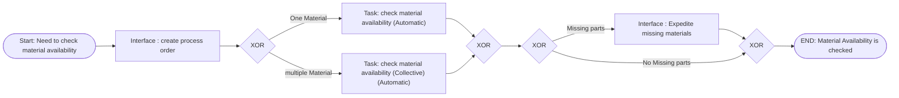

### Slide 3

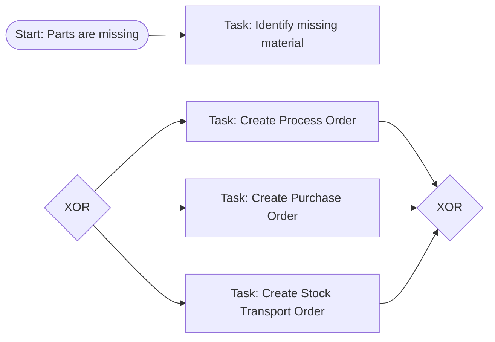

### Slide 4

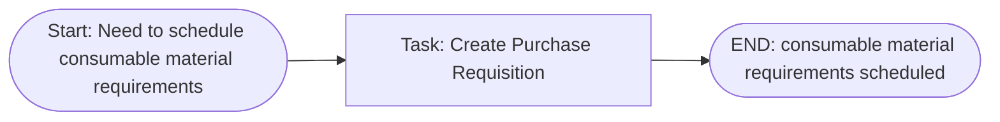

### Slide 6


### Slide 8

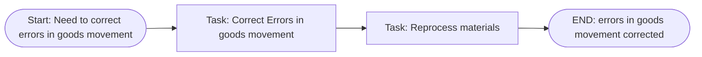

### Slide 10

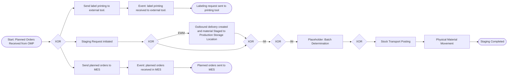

### Slide 11

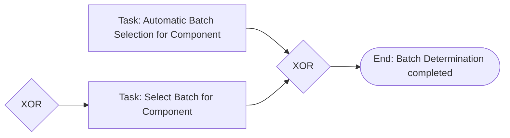

### Slide 12

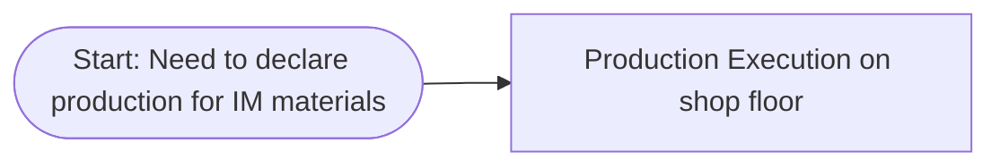

### Slide 13


### Slide 15

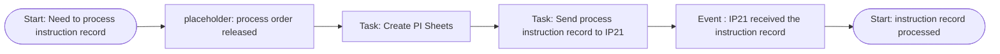

### Slide 17

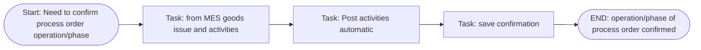

### Slide 18

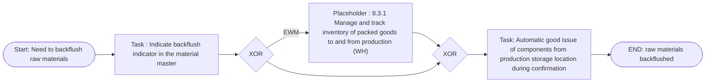

### Slide 19

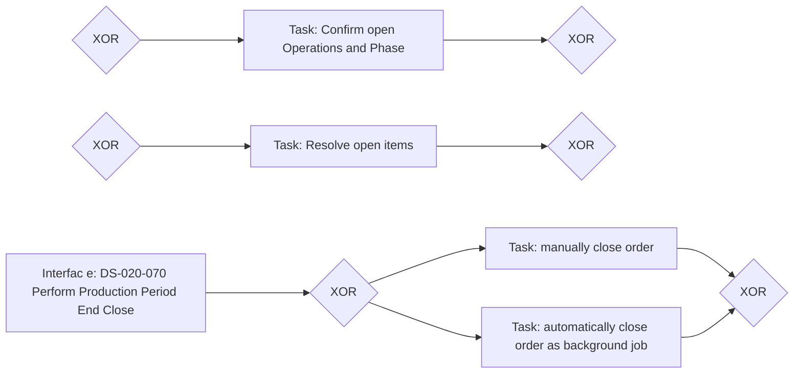

### Slide 20

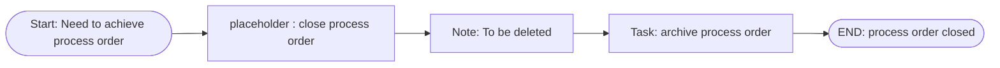

### Slide 21

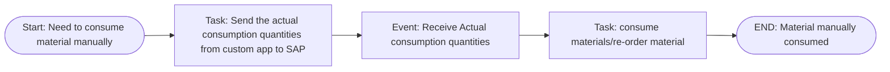

### Slide 22

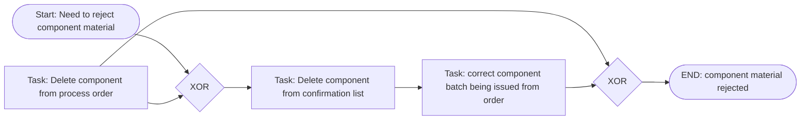

### Slide 24

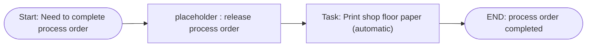

### Slide 25

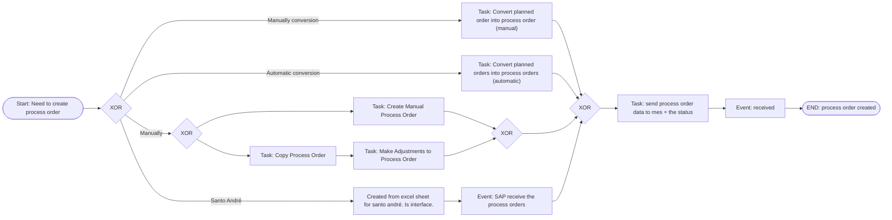

### Slide 26

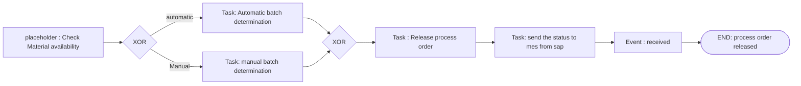

### Slide 27

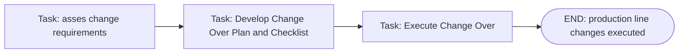

### Slide 28

```mermaid
flowchart LR
    n602(["Start: Need to determine batch for raw material"])
    n605{"XOR"}
    n613["Task: select batch for component"]
    n608["Task: automatic batch selection for component"]
    n611{"XOR"}
    n602 --> n605
    n605 --> n613
    n605 --> n608
    n608 --> n611
    n613 --> n611
```

### Slide 30

```mermaid
flowchart LR
    n630(["Start: Need to perform in-line inspection"])
    n635["placeholder : create in-process inspection lot from production"]
    n640["Task: Check the inspection points"]
    n633["Task: perform in-line inspection"]
    n631(["END: in-line inspection performed"])
    n630 --> n635
    n635 --> n640
    n640 --> n633
    n633 --> n631
```

### Slide 31

```mermaid
flowchart LR
    n647(["Start: Need to Restrict Batch of Product/Partial Lot"])
    n649["Task : Restrict Batch of Product/Partial Lot"]
    n648(["End : Batch of Product/Partial Lot Restricted"])
    n647 --> n649
    n649 --> n648
```

### Slide 32

```mermaid
flowchart LR
    n667{"XOR"}
    n659(["END: in-process inspection lot from production created"])
    n671{"XOR"}
    n669["Interface : send inspection lot to LIMS"]
    n679["Event : send inspection lot to LIMS"]
    n667 --> n659
    n671 --> n667
    n671 --> n669
    n669 --> n679
    n679 --> n667
```

### Slide 33

```mermaid
flowchart LR
    n685(["Start: Need to record results"])
    n688{"AND"}
    n692{"AND"}
    n689["Interface : perform test and measure characteristics"]
    n690["Task: Identify Inspection lot"]
    n695["Task: Identify point or physical sample"]
    n696["Task: record results in LIMS"]
    n697["task : transfer results from LIMS to SAP"]
    n711{"XOR"}
    n693["Task: record results in sap"]
    n714{"XOR"}
    n707["event : message received"]
    n698["Interface : complete inspection lot(UD)"]
    n685 --> n688
    n692 --> n689
    n688 --> n690
    n690 --> n692
    n688 --> n695
    n695 --> n692
    n696 --> n697
    n711 --> n693
    n711 --> n696
    n693 --> n714
    n707 --> n714
    n689 --> n711
    n698 --> n714
```

### Slide 35

```mermaid
flowchart LR
    n738["Task: automatic goods issue"]
    n739["Task: automatic goods receipt"]
    n750["Task: send status update to mes"]
    n751["event : status update received"]
    n734(["END: final confirmation performed"])
    n747["Task: receive from mes the details of confirmation goods receipt, goods issue, activities"]
    n738 --> n739
    n739 --> n750
    n750 --> n751
    n751 --> n734
    n747 --> n738
```

### Slide 37

```mermaid
flowchart LR
    n769["placeholder : release process order"]
    n776["event : task received"]
    n769 --> n776
```

### Slide 38

```mermaid
flowchart LR
    n788(["Need to build a pallet"])
    n789["Interface: 8.3.1-090-Packing in handling units [EWM] and Labeling"]
    n790(["Pallet Bulit"])
    n788 --> n789
    n789 --> n790
```

### Slide 40

```mermaid
flowchart LR
    n805(["Production Broke down"])
    n806["Task: Identify Production Defect"]
    n807["Task: Record Production Defect"]
    n814{"AND"}
    n813["Task: Assign defect to quality notification"]
    n817["Task: Team Definition"]
    n829{"AND"}
    n816["Task: Process defect &amp; define quality task"]
    n823{"AND"}
    n837["Task: Containment actions"]
    n827["Task: Close Defect"]
    n825{"AND"}
    n821["placeholder : manage internal non-conformities"]
    n840["Task: congratulate your team"]
    n808(["Production Defect Recorded"])
    n805 --> n806
    n806 --> n807
    n814 --> n813
    n814 --> n817
    n814 --> n829
    n829 --> n816
    n823 --> n837
    n837 --> n829
    n823 --> n827
    n827 --> n825
    n821 --> n825
    n840 --> n825
    n825 --> n808
```

### Slide 41

```mermaid
flowchart LR
    n852(["Need to identify Process setting change requirements"])
    n853["Task: Identify process setting change"]
    n857["To be deleted"]
    n854(["Process setting change requirements identified"])
    n852 --> n853
    n857 --> n854
```

### Slide 42

```mermaid
flowchart LR
    n864(["Defect assigned to quality notification"])
    n865["Task : define root cause analysis"]
    n882["Task:document actions"]
    n866["Task: Define corrective actions"]
    n874["Task: Execute Preventive actions &amp; document outcome"]
    n875["Task: Review Preventive actions"]
    n878["Task: display list of quality tasks"]
    n867(["Internal non-conformity managed"])
    n864 --> n865
    n865 --> n882
    n882 --> n866
    n874 --> n875
    n878 --> n867
```

### Slide 43

```mermaid
flowchart LR
    n891(["Need to contain as Off-spec material for future processing"])
    n892["Task: contain as off-spec material for future processing"]
    n896["To be Deleted"]
    n893(["Process setting change requirements identified"])
    n891 --> n892
    n896 --> n893
```

### Slide 45

```mermaid
flowchart LR
    n923(["Start: need to contain material"])
    n926{"AND"}
    n927["Task: contain material"]
    n928["Task: Handover Material to supplier/Customer for containment"]
    n930{"AND"}
    n924(["End: Material contained"])
    n923 --> n926
    n926 --> n927
    n926 --> n928
    n927 --> n930
    n928 --> n930
    n930 --> n924
```

### Slide 47

```mermaid
flowchart LR
    n952(["Start: Need to contain off-spec material (quarantine)"])
    n955["placeholder : manage blocked stock"]
    n961["placeholder : Determine/record cause of deviation"]
    n953(["END: off-spec material contained and recorded (quarantine)"])
    n952 --> n955
    n955 --> n961
    n961 --> n953
```

### Slide 48

```mermaid
flowchart LR
    n968(["Start: Need to blend"])
    n978["Task: create process order for the off-spec material"]
    n977["Task: Add necessary components"]
    n971["Task: Blend"]
    n979["Task: Goods receipt of material with expected specifications"]
    n969(["END: blended"])
    n968 --> n978
    n978 --> n977
    n977 --> n971
    n971 --> n979
    n979 --> n969
```

### Slide 49

```mermaid
flowchart LR
    n988(["Start: Need to reclassify Material"])
    n991["Task: material to material transfer"]
    n989(["END: Material reclassified"])
    n999["Task: Post stock to quality inspection stock"]
    n1024["Task: Inspection Lot Created"]
    n1005["Task: Execute Inspection"]
    n1000{"AND"}
    n1017["Task: Post stock to quality inspection stock (EWM)"]
    n1030["Task: Create Inspection Lot"]
    n1033["Task: Make usage decision"]
    n1002{"AND"}
    n1006["Task: Record Results"]
    n1007["Task: Make Usage Decision"]
    n988 --> n991
    n991 --> n989
    n999 --> n1024
    n1024 --> n1005
    n1000 --> n999
    n1000 --> n1017
    n1000 --> n1030
    n1033 --> n1002
    n1005 --> n1006
    n1006 --> n1007
```

### Slide 51

```mermaid
flowchart LR
    n1055{"AND"}
    n1051["Task: Display Consumption Report"]
    n1057{"AND"}
    n1052["Task: Display Blocked Inventory"]
    n1053["Task: Display consignment Inventory"]
    n1054["Task: Display Inventory Reconciliation"]
    n1050(["Start: Need to display an inventory Report"])
    n1055 --> n1051
    n1051 --> n1057
    n1052 --> n1057
    n1053 --> n1057
    n1054 --> n1057
    n1055 --> n1052
    n1055 --> n1053
    n1055 --> n1054
    n1055 --> n1050
```

### Slide 52

```mermaid
flowchart LR
    n1098{"AND"}
    n1097["Task: Display production version report"]
    n1091["Task: Display Bill of materials comparison report"]
    n1100{"AND"}
    n1083["M-170-030-Master data report"]
    n1089["Task: Display Bill of materials report"]
    n1092["Bom comparison"]
    n1093["Task: Display Master Recipes report"]
    n1098 --> n1097
    n1098 --> n1091
    n1091 --> n1100
    n1083 --> n1100
    n1089 --> n1100
    n1098 --> n1092
    n1093 --> n1100
```

### Slide 53

```mermaid
flowchart LR
    n1132{"AND"}
    n1126["Task: Display Items"]
    n1127["Task: Display Confirmations"]
    n1134{"AND"}
    n1128["Task: Display Documents Goods Movement"]
    n1124["Task: Display Order Header"]
    n1132 --> n1126
    n1127 --> n1134
    n1128 --> n1134
    n1126 --> n1134
    n1132 --> n1124
    n1132 --> n1127
    n1124 --> n1134
    n1126 --> n1128
```

### Slide 55

```mermaid
flowchart LR
    n1158(["Start: Need to gather production operation information"])
    n1162["Task: Display production operations/phases"]
    n1159(["End: Production operation information gathered"])
    n1158 --> n1162
    n1162 --> n1159
```

### Slide 57

```mermaid
flowchart LR
    n1175(["Start: Need to create notification for supplier"])
    n1178["Task: Identify the notification type"]
    n1182{"XOR"}
    n1184{"XOR"}
    n1191["Task: save QM Notification"]
    n1195["placeholder : QM Notification: Evaluate defects and QM notifications"]
    n1176(["END: notification for supplier created"])
    n1186["Task: Assign Order/Delivery and Item reference"]
    n1175 --> n1178
    n1178 --> n1182
    n1182 --> n1184
    n1184 --> n1191
    n1191 --> n1195
    n1195 --> n1176
    n1182 --> n1186
    n1186 --> n1184
```

### Slide 58

```mermaid
flowchart LR
    n1203(["Start: Need to evaluate defect and QM notifications"])
    n1212["Task: create item"]
    n1206["Task: Determine code Group"]
    n1210["Task: Select Defect Code"]
    n1211["Task: Defect Quantity and text"]
    n1209["Placeholder: C-110-020 QM Notification: Assign Immediate Tasks &amp; define Owner"]
    n1204(["END: Defect evaluated and QM Notifications"])
    n1203 --> n1212
    n1212 --> n1206
    n1206 --> n1210
    n1210 --> n1211
    n1211 --> n1209
    n1209 --> n1204
```

### Slide 59

```mermaid
flowchart LR
    n1221(["Start: Need to Review  and manage tasks for Quality notification"])
    n1224["Task: Assign customer complaint task to notification"]
    n1227["Task: enter task text"]
    n1228["Task: assign user responsible for task"]
    n1229["Task: Save Notification"]
    n1222(["END: tasks for Quality notification Reviewed  and managed"])
    n1221 --> n1224
    n1224 --> n1227
    n1227 --> n1228
    n1228 --> n1229
    n1229 --> n1222
```

### Slide 61

```mermaid
flowchart LR
    n1248["Task: receive email notification automatically"]
    n1246(["END: email notification received"])
    n1245(["Start: owner assigned to tasks in quality notification"])
    n1248 --> n1246
    n1245 --> n1248
```

### Slide 62

```mermaid
flowchart LR
    n1257(["Start: Need to complete the task"])
    n1264["Task: Release the task"]
    n1260["Task: Perform Necessary Steps"]
    n1262["Task: Document Task"]
    n1263["Task: Save Notification"]
    n1258(["END: task completed and documented"])
    n1257 --> n1264
    n1264 --> n1260
    n1260 --> n1262
    n1262 --> n1263
    n1263 --> n1258
```

### Slide 63

```mermaid
flowchart LR
    n1275(["Start: Need to Review task and assign Causes"])
    n1278["Task: Review Quality Task"]
    n1281["Task: Enter Cause Code"]
    n1282["Task: Enter Cause Text"]
    n1283{"XOR"}
    n1285["Task: record outcome and close notification"]
    n1276(["END: outcome recorded and notification closed"])
    n1286["Placeholder: QM Notification: Complete and document Tasks"]
    n1275 --> n1278
    n1278 --> n1281
    n1281 --> n1282
    n1282 --> n1283
    n1283 --> n1285
    n1285 --> n1276
    n1283 --> n1286
```

### Slide 67

```mermaid
flowchart LR
    n1316(["Start: Need to notify Supplier/Source of Deviation"])
    n1319{"XOR"}
    n1322{"XOR"}
    n1317(["END: Supplier/source of deviation notified"])
    n1320["Task:send task of deviation to supplier"]
    n1325["Task: Send email to supplier for deviation"]
    n1316 --> n1319
    n1322 --> n1317
    n1319 --> n1320
    n1319 --> n1325
    n1325 --> n1322
    n1320 --> n1322
```

### Slide 68

```mermaid
flowchart LR
    n1340(["Start: Need to notify Supply Chain of Deviation"])
    n1343["Task: Notify supply chain of Deviation"]
    n1341(["END: Supply chain of deviation notified"])
    n1340 --> n1343
    n1343 --> n1341
```

### Slide 69

```mermaid
flowchart LR
    n1352(["Start: Need to return material to supplier"])
    n1355["Task: return material (not rework) to supplier"]
    n1353(["END: material to supplier returned"])
    n1352 --> n1355
    n1355 --> n1353
```

### Slide 70

```mermaid
flowchart LR
    n1365(["Start: Need to Issue Return Notice"])
    n1368{"XOR"}
    n1369["placeholder: Return Material to Supplier"]
    n1366(["END: return notice issued"])
    n1374["Task:send task of deviation to supplier"]
    n1378["Task: Send email to supplier for deviation"]
    n1376{"XOR"}
    n1365 --> n1368
    n1369 --> n1366
    n1368 --> n1374
    n1368 --> n1378
    n1378 --> n1376
    n1374 --> n1376
    n1376 --> n1369
```

### Slide 71

```mermaid
flowchart LR
    n1397["Task: Prepare Material to return"]
    n1400{"XOR"}
    n1398["Task: create return PO"]
    n1401["Task: post return document"]
    n1403{"XOR"}
    n1405["Task: return material to supplier"]
    n1394(["END: material to supplier returned"])
    n1397 --> n1400
    n1400 --> n1398
    n1400 --> n1401
    n1401 --> n1403
    n1398 --> n1403
    n1403 --> n1405
    n1405 --> n1394
```

### Slide 74

```mermaid
flowchart LR
    n1452{"XOR"}
    n1450["Placeholder : Results recording in process"]
    n1467["Manage inspection lots"]
    n1448{"XOR"}
    n1469{"XOR"}
    n1451["Task: Record Usage Decision (manual)"]
    n1447["Task: Review inspection Lots"]
    n1445(["Start: Need to complete Inspection lot(UD)"])
    n1461{"XOR"}
    n1473["Task: Perform Decision in LIMS"]
    n1475["Event : Usage decision received"]
    n1452 --> n1450
    n1450 --> n1467
    n1467 --> n1448
    n1448 --> n1450
    n1450 --> n1452
    n1452 -->|"No additional sample isrequired"| n1469
    n1469 -->|"LIMS not activated"| n1451
    n1447 --> n1448
    n1445 --> n1447
    n1451 --> n1461
    n1469 -->|"Is additional sample required"| n1473
    n1475 --> n1461
```

### Slide 75

```mermaid
flowchart LR
    n1489{"XOR"}
    n1491["Placeholder: Results recording in process"]
    n1507["Manage inspection lots"]
    n1493{"XOR"}
    n1509{"XOR"}
    n1492["Task: Record Usage Decision (manual)"]
    n1488["Task: Review inspection Lots"]
    n1486(["Start: Need to complete Inspection lot(UD)"])
    n1502{"XOR"}
    n1513["Task: Perform Decision in LIMS"]
    n1515["Event: Usage decision received"]
    n1487(["END: inspection lot(UD) completed"])
    n1489 -->|"Is additional sample required"| n1491
    n1491 -->|"No additional sample required"| n1507
    n1507 --> n1493
    n1491 --> n1493
    n1493 --> n1509
    n1509 -->|"LIMS not activated"| n1492
    n1488 --> n1489
    n1486 --> n1488
    n1492 --> n1502
    n1509 --> n1513
    n1515 --> n1502
    n1502 --> n1487
```

### Slide 76

```mermaid
flowchart LR
    n1523(["Start: Need to contain as Off-spec material for another customer"])
    n1526["Task: Update assigned sales order in process order with correct customer"]
    n1524(["END: Off-Spec material contained for another customer"])
    n1523 --> n1526
    n1526 --> n1524
```

### Slide 77

```mermaid
flowchart LR
    n1536(["Start: Need to transfer batch to unrestricted stock after UD"])
    n1541{"AND"}
    n1539["Task: Post full batch to unrestricted stock"]
    n1543{"AND"}
    n1553["Task: Review Stock Transfer"]
    n1537(["END: batch moved to unrestricted stock"])
    n1545["Task: Post batch partially to unrestricted stock"]
    n1536 --> n1541
    n1541 -->|"batch need to be fully transferred"| n1539
    n1539 --> n1543
    n1543 --> n1553
    n1553 --> n1537
    n1541 -->|"batch need to be partially transferred"| n1545
    n1545 --> n1543
```

### Slide 78

```mermaid
flowchart LR
    n1560(["Start: Need to change batch status to available"])
    n1563["Task: change batch status to available"]
    n1561(["END: batch status changed to available"])
    n1560 --> n1563
    n1563 --> n1561
```

### Slide 80

```mermaid
flowchart LR
    n1578(["Start: Need to establish a batch level"])
    n1581["Task: Activate batch unique at Material level"]
    n1579(["END: Batch level established"])
    n1578 --> n1581
    n1581 --> n1579
```

### Slide 81

```mermaid
flowchart LR
    n1592(["Start: Need to establish batch status management"])
    n1595{"AND"}
    n1599{"AND"}
    n1596["Task: unrestrict batch usage"]
    n1603["Task: restrict batch usage"]
    n1606{"AND"}
    n1610{"AND"}
    n1593(["END: Batch status management established"])
    n1592 --> n1595
    n1595 -->|"batch status required"| n1599
    n1599 -->|"unrestrict"| n1596
    n1599 -->|"restrict"| n1603
    n1596 --> n1606
    n1603 --> n1606
    n1606 --> n1610
    n1610 --> n1593
    n1595 --> n1610
```

### Slide 82

```mermaid
flowchart LR
    n1627(["Start: Need to establish a material as batch managed"])
    n1634["Placeholder: M-150-020: Process class (Create)"]
    n1638["Placeholder: M-150-040: Process class classification"]
    n1631["Task: Activate batch management indicator of material"]
    n1628(["END: material is batch managed"])
    n1627 --> n1634
    n1634 --> n1638
    n1638 --> n1631
    n1631 --> n1628
```

### Slide 83

```mermaid
flowchart LR
    n1648["Interface : M-150-020: Process class (Create)"]
    n1657["Interface : M-150-040: Process material classification"]
    n1652["Interface : L-110-070: Establish Batch Determination"]
    n1654["Interface : L-110-140: Activate Batch Derivation"]
    n1655["Interface : Activate shelf life expiry date"]
    n1645(["END: class and batch characteristics are defined"])
    n1648 --> n1657
    n1657 --> n1652
    n1652 --> n1654
    n1654 --> n1655
    n1655 --> n1645
```

### Slide 84

```mermaid
flowchart LR
    n1670["Task: Create Batch"]
    n1667{"XOR"}
    n1672["Task: Create Batch"]
    n1694{"XOR"}
    n1664(["END: batch numbering established"])
    n1689["Task: Create Batch"]
    n1688["Task: Create Batch"]
    n1690["Task: Create Batch"]
    n1691["Task: Create Batch"]
    n1692["Task: Create Batch"]
    n1693["Task: Create Batch"]
    n1678{"XOR"}
    n1682["Creation of Process order"]
    n1681["Goods Receipt Declaration"]
    n1665{"XOR"}
    n1663(["Start: Need to establish batch numbering"])
    n1670 --> n1667
    n1672 --> n1667
    n1667 --> n1694
    n1694 --> n1664
    n1689 --> n1667
    n1688 --> n1667
    n1690 --> n1667
    n1691 --> n1667
    n1692 --> n1667
    n1693 --> n1667
    n1678 --> n1672
    n1678 --> n1693
    n1678 --> n1692
    n1678 --> n1691
    n1678 --> n1690
    n1678 --> n1670
    n1678 --> n1682
    n1682 --> n1681
    n1681 --> n1689
    n1678 --> n1688
    n1665 -->|"Manual"| n1678
    n1663 --> n1665
```

### Slide 85

```mermaid
flowchart LR
    n1731["Task: Create Batch automatic"]
    n1728{"XOR"}
    n1733["Task: Create Batch automatic"]
    n1754{"XOR"}
    n1725(["END: batch numbering established"])
    n1749["Task: Create Batch automatic"]
    n1748["Task: Create Batch automatic"]
    n1750["Task: Create Batch automatic"]
    n1751["Task: Create Batch automatic"]
    n1752["Task: Create Batch automatic"]
    n1753["Task: Create Batch automatic"]
    n1738{"XOR"}
    n1742["Creation of Process order"]
    n1741["Goods Receipt Declaration"]
    n1726{"XOR"}
    n1724(["Start: Need to establish batch numbering"])
    n1731 --> n1728
    n1733 --> n1728
    n1728 --> n1754
    n1754 --> n1725
    n1749 --> n1728
    n1748 --> n1728
    n1750 --> n1728
    n1751 --> n1728
    n1752 --> n1728
    n1753 --> n1728
    n1738 --> n1733
    n1738 --> n1753
    n1738 --> n1752
    n1738 --> n1751
    n1738 --> n1750
    n1738 --> n1731
    n1738 --> n1742
    n1742 --> n1741
    n1741 --> n1749
    n1738 --> n1748
    n1726 -->|"Manual"| n1738
    n1724 --> n1726
```

### Slide 86

```mermaid
flowchart LR
    n1777(["Start: Need to establish produced batch"])
    n1780{"XOR"}
    n1781["Task: Batch assignment to process/planned order (automatic)"]
    n1785["Task: manually create batch"]
    n1783{"XOR"}
    n1778(["END: Produced batch established"])
    n1777 --> n1780
    n1780 -->|"Process Order/Planned Order Created"| n1781
    n1780 -->|"No Process order/Planned Order created"| n1785
    n1781 --> n1783
    n1785 --> n1783
    n1783 --> n1778
```

### Slide 87

```mermaid
flowchart LR
    n1804{"XOR"}
    n1831{"XOR"}
    n1855["Task: Create Search Class"]
    n1837{"XOR"}
    n1805{"XOR"}
    n1815{"XOR"}
    n1817{"XOR"}
    n1824["Task: Create Sorting Rule"]
    n1848{"XOR"}
    n1820["Task: Define Strategy"]
    n1812{"XOR"}
    n1808(["END: batch determination established"])
    n1854["Task: Create Search Class"]
    n1833{"XOR"}
    n1856["Task: Create Search Class"]
    n1839{"XOR"}
    n1845{"XOR"}
    n1857["Task: Create Sorting Rule"]
    n1842{"XOR"}
    n1802["Task: Define Strategy"]
    n1850{"XOR"}
    n1822["Task: Define Strategy"]
    n1859["Task: Send Batch to EWM from S4 (Automatic)"]
    n1852{"XOR"}
    n1829{"XOR"}
    n1835{"XOR"}
    n1858["Task: Create Sorting Rule"]
    n1804 --> n1831
    n1831 --> n1855
    n1855 --> n1837
    n1837 --> n1805
    n1804 --> n1815
    n1804 --> n1817
    n1824 --> n1848
    n1848 --> n1820
    n1812 --> n1808
    n1855 --> n1854
    n1854 --> n1837
    n1833 --> n1856
    n1856 --> n1839
    n1805 --> n1845
    n1815 --> n1824
    n1817 --> n1857
    n1857 --> n1842
    n1802 --> n1850
    n1822 --> n1822
    n1859 --> n1812
    n1859 --> n1852
    n1852 --> n1812
    n1817 --> n1802
    n1829 --> n1835
    n1858 --> n1822
```

### Slide 88

```mermaid
flowchart LR
    n1902(["Start: Need to determine batch where used list"])
    n1907{"XOR"}
    n1905["Task: use batch where used list"]
    n1910{"XOR"}
    n1906["Task: top down and bottom up analysis"]
    n1903(["End: batch where used list determined"])
    n1904["Task: use batch information cockpit"]
    n1902 --> n1907
    n1907 --> n1905
    n1905 --> n1910
    n1910 --> n1906
    n1906 --> n1903
    n1907 --> n1904
    n1904 --> n1910
```

### Slide 89

```mermaid
flowchart LR
    n1923(["Start: Need to manage batch reporting"])
    n1925["Task: display batch information"]
    n1924(["End: batch reporting managed"])
    n1923 --> n1925
    n1925 --> n1924
```

### Slide 90

```mermaid
flowchart LR
    n1933(["Start: Need to establish procured batch"])
    n1936["Task: Assign Batch upon goods receipt"]
    n1934(["END: procured batch established"])
    n1933 --> n1936
    n1936 --> n1934
```

### Slide 91

```mermaid
flowchart LR
    n1950{"XOR"}
    n1952{"XOR"}
    n1956{"XOR"}
    n1966["Task: Batch Derivation Triggered in Background"]
    n1967["Task: perform manual derivation"]
    n1954{"XOR"}
    n1958{"XOR"}
    n1980["Task: Batch derivation triggered in background"]
    n1979["Task: Batch derivation automatic"]
    n1978["Task: Tigger Batch derivation"]
    n1960{"XOR"}
    n1962{"XOR"}
    n1964{"XOR"}
    n1994(["Start: Batch derivation activated"])
    n1950 --> n1952
    n1950 --> n1956
    n1952 --> n1966
    n1952 --> n1967
    n1967 --> n1954
    n1966 --> n1954
    n1956 --> n1958
    n1956 --> n1980
    n1958 --> n1979
    n1958 --> n1978
    n1978 --> n1960
    n1979 --> n1960
    n1960 --> n1962
    n1962 --> n1964
    n1954 --> n1964
    n1964 --> n1994
    n1980 --> n1962
```

### Slide 93

```mermaid
flowchart LR
    n2014(["Start: Need to activate shelf life expiry date"])
    n2018["Task: Maintain the master data in the material master"]
    n2019["Task: GR with Shelf Life Entry"]
    n2020["Task: Automatic Expiry check &amp; inspection lot creation"]
    n2021["Task: Inspection &amp; Expiry date validation automatic"]
    n2022["Task: usage decision"]
    n2023["Task: Monitor batch expiry &amp; stock overview"]
    n2015(["End : shelf life expiry date activated"])
    n2014 --> n2018
    n2018 --> n2019
    n2019 --> n2020
    n2020 --> n2021
    n2021 --> n2022
    n2022 --> n2023
    n2023 --> n2015
```

### Slide 95

```mermaid
flowchart LR
    n2042(["Start: Need to display report for quality results"])
    n2045{"XOR"}
    n2047{"XOR"}
    n2043(["End: quality results displayed"])
    n2042 --> n2045
    n2045 --> n2047
    n2047 --> n2043
```

### Slide 97

```mermaid
flowchart LR
    n2074(["Start: Need to generate Inspection lot for Partial PO Item"])
    n2077["Task: Generate Inspection lot for PO item"]
    n2079{"XOR"}
    n2080["Task: Create Inspection Plan"]
    n2081["Task: assign Inspection plan to Inspection Lot"]
    n2086{"XOR"}
    n2090{"XOR"}
    n2088{"XOR"}
    n2092["Task: Release Inspection Lot (Automatic)"]
    n2110{"XOR"}
    n2112{"XOR"}
    n2075(["END: inspection lot for Partial PO item generated"])
    n2109["Task: send inspection lot to LIMS"]
    n2114["event : Inspection Lot Received"]
    n2074 --> n2077
    n2077 --> n2079
    n2080 --> n2081
    n2079 -->|"Inspection Plan Required"| n2086
    n2081 --> n2090
    n2086 -->|"Inspection Plan Not Created"| n2080
    n2090 --> n2088
    n2079 -->|"Inspection Plan Not Required"| n2088
    n2088 --> n2092
    n2092 --> n2110
    n2110 --> n2112
    n2112 --> n2075
    n2086 -->|"Inspection Plan Created"| n2090
    n2110 --> n2109
    n2114 --> n2112
```

### Slide 98

```mermaid
flowchart LR
    n2124["Task: Make usage decision"]
    n2196["Task: Send usage decision and batch determination to sap"]
    n2125["event : usage decision and batch determination received"]
    n2128(["Start: Need to make a usage decision"])
    n2190{"XOR"}
    n2131["Placeholder : Record Material Inspection Results"]
    n2126["Task : Manage usage decision"]
    n2138["Placeholder : Reclassify"]
    n2135{"XOR"}
    n2133{"XOR"}
    n2142{"XOR"}
    n2137["Placeholder: Put Stock to unrestricted"]
    n2139["Placeholder : Reject"]
    n2153{"XOR"}
    n2157["Placeholder: Put Stock to unrestricted"]
    n2159["Placeholder: Reclassify"]
    n2158["Placeholder: Reject"]
    n2166{"XOR"}
    n2199["Placeholder: Restrict Batch of Product/Partial Lot"]
    n2173{"XOR"}
    n2171{"XOR"}
    n2175{"XOR"}
    n2192{"XOR"}
    n2124 --> n2196
    n2196 --> n2125
    n2128 --> n2190
    n2190 --> n2131
    n2131 --> n2126
    n2138 --> n2135
    n2133 -->|"EWM managed"| n2142
    n2137 --> n2135
    n2139 --> n2135
    n2126 --> n2133
    n2142 -->|"partially approved, rejected or reclassified"| n2153
    n2153 -->|"partially approved,"| n2157
    n2153 -->|"partially reclassified"| n2159
    n2153 -->|"partially Rejected,"| n2158
    n2157 --> n2166
    n2159 --> n2166
    n2158 --> n2199
    n2199 --> n2166
    n2142 -->|"Fully approved, rejected or reclassified"| n2173
    n2133 -->|"Not EWM managed"| n2173
    n2173 --> n2171
    n2171 -->|"Reclassify"| n2137
    n2171 -->|"Reject"| n2139
    n2171 -->|"Approve"| n2138
    n2166 --> n2175
    n2190 --> n2124
    n2125 --> n2192
    n2135 --> n2175
    n2175 --> n2192
```

### Slide 99

```mermaid
flowchart LR
    n2208(["Start: Need to generate Inspection lot for Partial PO Item"])
    n2211["Task: Generate Inspection lot for PO"]
    n2213{"XOR"}
    n2214["Task: Create Inspection Plan"]
    n2215["Task: assign Inspection plan to Inspection Lot"]
    n2219{"XOR"}
    n2223{"XOR"}
    n2221{"XOR"}
    n2225["Task: Release Inspection Lot (Automatic)"]
    n2209(["END: inspection lot for Partial PO item generated"])
    n2208 --> n2211
    n2211 --> n2213
    n2214 --> n2215
    n2213 -->|"Inspection Plan Required"| n2219
    n2215 --> n2223
    n2219 -->|"Inspection Plan Not Created"| n2214
    n2223 --> n2221
    n2213 --> n2221
    n2221 --> n2225
    n2225 --> n2209
    n2219 -->|"Inspection Plan Created"| n2223
```

### Slide 100

```mermaid
flowchart LR
    n2248(["Start: Need to record material inspection results"])
    n2251["Task: Identify Inspection Lot"]
    n2253["Task: Review Testing Documentation"]
    n2255["Task: Input inspection results"]
    n2263{"XOR"}
    n2249(["END: material inspection results recorded"])
    n2261{"XOR"}
    n2265["Task: record results in LIMS"]
    n2267["event : results received in sap"]
    n2248 --> n2251
    n2253 --> n2255
    n2255 --> n2263
    n2263 --> n2249
    n2251 --> n2261
    n2261 --> n2253
    n2261 --> n2265
    n2267 --> n2263
```

### Slide 101

```mermaid
flowchart LR
    n2275(["Start: Need to identify inspection/quality requirements for supplier"])
    n2278["Task: Identify Inspection/Quality Requirements"]
    n2281["Task: Manage Quality Info Record"]
    n2282{"XOR"}
    n2286["Task: Create Info Record"]
    n2284{"XOR"}
    n2276(["END: Inspection/quality requirements identified"])
    n2287["Task: Update Info Record"]
    n2275 --> n2278
    n2278 --> n2281
    n2281 --> n2282
    n2282 -->|"Create"| n2286
    n2286 --> n2284
    n2284 --> n2276
    n2282 -->|"Update"| n2287
    n2287 --> n2284
```

### Slide 102

```mermaid
flowchart LR
    n2301(["Start: Need to visually inspect goods"])
    n2304["Task: Visually inspect goods"]
    n2302(["END: Goods inspected visually"])
    n2301 --> n2304
    n2304 --> n2302
```

### Slide 103

```mermaid
flowchart LR
    n2312(["Start: Need to Document Results"])
    n2318{"XOR"}
    n2320["Task: Update Certificate Receipt Status and Attachment"]
    n2315["Task: Document Results"]
    n2321["Placeholder : Record Material Inspection Results"]
    n2313(["END: Results Documented"])
    n2312 --> n2318
    n2318 -->|"Certificate Needed"| n2320
    n2320 --> n2315
    n2315 --> n2321
    n2321 --> n2313
```

### Slide 104

```mermaid
flowchart LR
    n2330(["Start: Need to assign priority Testing"])
    n2333["Task: Assign Priority Testing to the Inspection Lots"]
    n2331(["END: Priority testing assigned"])
    n2330 --> n2333
    n2333 --> n2331
```

### Slide 105

```mermaid
flowchart LR
    n2341(["Start: Need to perform inspection/sample test"])
    n2348{"XOR"}
    n2363{"XOR"}
    n2344["Task: Print Sampling Drawing Instructions"]
    n2353["Task: Perform Inspection Test"]
    n2365{"XOR"}
    n2350{"XOR"}
    n2352["Task: Log Samples and Batch Number"]
    n2357["task : perform inspection test in LIMS"]
    n2369["placeholder : Visually inspect goods"]
    n2341 --> n2348
    n2348 -->|"LIMS not applicable"| n2363
    n2363 --> n2344
    n2353 --> n2365
    n2365 --> n2350
    n2352 --> n2353
    n2344 --> n2352
    n2357 --> n2350
    n2348 -->|"LIMS applicable"| n2357
    n2363 --> n2369
    n2369 --> n2365
```

### Slide 106

```mermaid
flowchart LR
    n2377(["Start: Need to review testing documentation"])
    n2380["Task: Review Testing Documentation"]
    n2378(["END: inspection/sample test performed"])
    n2377 --> n2380
    n2380 --> n2378
```

### Slide 107

```mermaid
flowchart LR
    n2389(["Start: Need to transfer materials from quality inspection to unrestricted stock"])
    n2392["Placeholder : usage decision accept"]
    n2394["Task : Transfer material to unrestricted stock from quality inspection"]
    n2390(["END: stock transferred from quality inspection to unrestricted stock"])
    n2389 --> n2392
    n2392 --> n2394
    n2394 --> n2390
```

### Slide 108

```mermaid
flowchart LR
    n2403(["Start: Need to reclassify material or batch"])
    n2406["Placeholder: usage decision"]
    n2411{"XOR"}
    n2408["Task: Reclassify material or batch"]
    n2413{"XOR"}
    n2404(["END: material reclassified"])
    n2415["Task: Partially Reclassify Material or Batch"]
    n2403 --> n2406
    n2406 --> n2411
    n2411 -->|"Fully Reclassify"| n2408
    n2408 --> n2413
    n2413 --> n2404
    n2411 -->|"Partially Reclassify"| n2415
    n2415 --> n2413
```

### Slide 110

```mermaid
flowchart LR
    n2444{"XOR"}
    n2439["Task:send task of rejection to supplier"]
    n2443["Task: Send email to supplier for rejection"]
    n2441{"XOR"}
    n2444 --> n2439
    n2444 --> n2443
    n2443 --> n2441
    n2439 --> n2441
```

### Slide 111

```mermaid
flowchart LR
    n2459(["Start: Need to determine material disposition"])
    n2462["Placeholder: notify vendor of rejection"]
    n2464{"XOR"}
    n2468["placeholder : Rework Material"]
    n2466{"XOR"}
    n2463["placeholder : issue return notice"]
    n2460(["END: material disposition determined"])
    n2459 --> n2462
    n2464 -->|"Rework"| n2468
    n2468 --> n2466
    n2462 --> n2464
    n2464 -->|"return"| n2463
    n2463 --> n2466
    n2466 --> n2460
```

### Slide 114

```mermaid
flowchart LR
    n2503(["Need to manage blocked stock coming from in-process or after process UD"])
    n2519["Task: post stock to Blocked Stock"]
    n2506["Task: Manage Blocked Stock"]
    n2511{"XOR"}
    n2518["Placeholder: M-140-190 Reclassify material"]
    n2515["placeholder: M-140-120 Blend"]
    n2516["placeholder: M-140-020 Contain as Off-spec material for another customer"]
    n2517["placeholder: M-140-030 Rework material"]
    n2513{"XOR"}
    n2534{"XOR"}
    n2533["placeholder: M-100-170: manage internal non-conformities"]
    n2536{"XOR"}
    n2504(["END: Blocked stock managed"])
    n2503 --> n2519
    n2519 --> n2506
    n2511 --> n2518
    n2511 --> n2515
    n2511 --> n2516
    n2511 --> n2517
    n2517 --> n2513
    n2516 --> n2513
    n2515 --> n2513
    n2518 --> n2513
    n2534 --> n2533
    n2533 --> n2536
    n2506 --> n2504
```

### Slide 115

```mermaid
flowchart LR
    n2555{"XOR"}
    n2559["Task: Execute follow up activities"]
    n2562["placeholder : post to unrestricted stock"]
    n2557{"XOR"}
    n2569["placeholder : manage blocked stock"]
    n2567["Task: Execute follow up activities"]
    n2570(["End: customer return request closed"])
    n2555 --> n2559
    n2562 --> n2557
    n2569 --> n2557
    n2567 --> n2555
    n2557 --> n2570
```

### Slide 116

```mermaid
flowchart LR
    n2584["Task : LIMS Sample is Processed"]
    n2591["Task : Equipment Integration"]
    n2585["Task: LIMS results recording"]
    n2588(["Start: Inspection lot created and released"])
    n2589["Task: Send Inspection Lot to LIMS"]
    n2590["Event : Inspection Lot received"]
    n2619{"AND"}
    n2592["Task: Send results recording to SAP"]
    n2594["Task: Sample Authorization QC Decision Done"]
    n2621{"AND"}
    n2595["Task: Send UD to SAP"]
    n2596["Event : UD received"]
    n2593["Event : results recording received"]
    n2598{"AND"}
    n2597["Task : Second Approval in SAP"]
    n2603{"AND"}
    n2602(["End : Usage Decision made"])
    n2584 --> n2591
    n2591 --> n2585
    n2588 --> n2589
    n2589 --> n2590
    n2590 --> n2584
    n2585 --> n2619
    n2619 --> n2592
    n2592 --> n2594
    n2594 --> n2621
    n2621 --> n2595
    n2595 --> n2596
    n2592 --> n2593
    n2596 --> n2598
    n2598 --> n2597
    n2597 --> n2603
    n2603 --> n2602
    n2593 --> n2621
    n2598 --> n2603
```

### Slide 117

```mermaid
flowchart LR
    n2632(["Start: Need to record results"])
    n2635{"AND"}
    n2639{"AND"}
    n2636["task : perform test and measure characteristics"]
    n2637["Task: Identify Inspection lot"]
    n2642["Task: Identify point or physical sample"]
    n2643["Task: record results in LIMS"]
    n2644["Interface: transfer results from LIMS to SAP"]
    n2632 --> n2635
    n2639 --> n2636
    n2635 --> n2637
    n2637 --> n2639
    n2635 --> n2642
    n2642 --> n2639
    n2643 --> n2644
```

### Slide 118

```mermaid
flowchart LR
    n2659(["Start: Need to create inspection lot from production goods receipt"])
    n2668{"XOR"}
    n2662["Task: create inspection lot from production goods receipt"]
    n2664["Task: release inspection lot"]
    n2670{"XOR"}
    n2672{"XOR"}
    n2674{"XOR"}
    n2660(["END: inspection lot from production goods receipt created"])
    n2659 --> n2668
    n2668 --> n2662
    n2662 --> n2664
    n2664 --> n2670
    n2670 --> n2672
    n2672 --> n2674
    n2674 --> n2660
```

### Slide 120

```mermaid
flowchart LR
    n2690(["Start: Need to create inspection lot from delivery"])
    n2692["Task: create inspection lot from delivery (automatic)"]
    n2694{"XOR"}
    n2699{"XOR"}
    n2697["Task: share inspection lot with LIMS if appliable"]
    n2698["Event : LIMS received"]
    n2701(["Start: inspection lot from delivery created"])
    n2696["Task: release inspection lot from delivery (automatic)"]
    n2690 --> n2692
    n2694 --> n2699
    n2694 --> n2697
    n2698 --> n2699
    n2699 --> n2701
    n2692 --> n2696
    n2696 --> n2694
```

### Slide 121

```mermaid
flowchart LR
    n2720{"XOR"}
    n2724["Task: Execute follow up activities"]
    n2727["placeholder: post to unrestricted stock"]
    n2722{"XOR"}
    n2734["placeholder: manage blocked stock"]
    n2732["Task: Execute follow up activities"]
    n2735(["End: customer return request closed"])
    n2720 --> n2724
    n2727 --> n2722
    n2734 --> n2722
    n2720 --> n2732
    n2722 --> n2735
```

### Slide 122

```mermaid
flowchart LR
    n2750(["Start: Need to record results"])
    n2753{"AND"}
    n2757{"AND"}
    n2754["Placeholder: perform test and measure characteristics"]
    n2755["Task: Identify Inspection lot"]
    n2760["Task: Identify point or physical sample"]
    n2761["Task: record results in LIMS"]
    n2762["task: transfer results from LIMS to SAP"]
    n2775{"XOR"}
    n2758["Task: record results in sap"]
    n2778{"XOR"}
    n2771["event: message received"]
    n2763["Interface: complete inspection lot(UD)"]
    n2750 --> n2753
    n2757 --> n2754
    n2753 --> n2755
    n2755 --> n2757
    n2753 --> n2760
    n2760 --> n2757
    n2761 --> n2762
    n2775 --> n2758
    n2775 --> n2761
    n2758 --> n2778
    n2771 --> n2778
    n2754 --> n2775
    n2763 --> n2778
```

### Slide 124

```mermaid
flowchart LR
    n2798["Task: Update Characteristic"]
    n2800{"XOR"}
    n2803{"XOR"}
    n2804["Task: Update Class"]
    n2810["Task: Create Characteristic"]
    n2813{"XOR"}
    n2811["Task: Assign Characteristic to Class"]
    n2815["Task: Assign class to material"]
    n2816{"XOR"}
    n2818["Task: Create Class"]
    n2801(["Start: need to process class"])
    n2827{"XOR"}
    n2839{"XOR"}
    n2845["Task: send data to MES"]
    n2802(["END: class processed"])
    n2798 --> n2800
    n2803 --> n2804
    n2804 --> n2800
    n2810 --> n2813
    n2811 --> n2815
    n2816 --> n2818
    n2818 --> n2813
    n2813 --> n2811
    n2801 --> n2827
    n2827 -->|"Create"| n2816
    n2827 -->|"Change"| n2803
    n2816 --> n2810
    n2815 --> n2839
    n2800 --> n2839
    n2839 --> n2845
    n2845 --> n2802
    n2803 --> n2798
```

### Slide 125

```mermaid
flowchart LR
    n2852["Task: Create MRP views"]
    n2855{"XOR"}
    n2853["Task: Create Work Scheduling view"]
    n2863["Task: Save Material Master"]
    n2929["Task: send data to MES (libra)"]
    n2857(["END: mrp and work scheduling views maintained"])
    n2869{"XOR"}
    n2867["Task: Update work scheduling view"]
    n2875{"XOR"}
    n2881{"XOR"}
    n2885{"XOR"}
    n2891["Create Material"]
    n2894{"XOR"}
    n2898{"XOR"}
    n2900["Task: Update mrp views"]
    n2897["Task: Create MRP views"]
    n2892{"XOR"}
    n2908{"XOR"}
    n2858{"XOR"}
    n2856(["Start: need to maintain MRP and/or work scheduling view"])
    n2918{"XOR"}
    n2860["Task: Update mrp views"]
    n2920{"XOR"}
    n2852 --> n2855
    n2855 -->|"Production Material"| n2853
    n2863 --> n2929
    n2929 --> n2857
    n2869 -->|"work scheduling View Not Present"| n2867
    n2869 -->|"work scheduling View Present"| n2875
    n2867 --> n2875
    n2853 --> n2881
    n2881 --> n2885
    n2853 -->|"Non Production Material"| n2891
    n2891 --> n2881
    n2894 --> n2863
    n2898 -->|"Create"| n2900
    n2898 -->|"Create"| n2897
    n2892 -->|"Update"| n2898
    n2897 --> n2908
    n2900 --> n2908
    n2908 --> n2894
    n2858 --> n2852
    n2892 -->|"Finished/Semi-Finished Materials"| n2858
    n2856 --> n2892
    n2858 -->|"Update"| n2918
    n2918 --> n2860
    n2918 --> n2869
    n2860 --> n2920
    n2875 --> n2920
    n2920 --> n2894
```

### Slide 126

```mermaid
flowchart LR
    n2937(["Start: need to process document"])
    n2940["Task: Create the document and assign link"]
    n2943["Task: Save Document"]
    n2944["Task: Display Material Master"]
    n2946["Task: Assign document to Material Master"]
    n2937 --> n2940
    n2943 --> n2944
    n2940 --> n2946
    n2946 --> n2943
```

### Slide 127

```mermaid
flowchart LR
    n2963["Task: Create Basic views"]
    n2965["Task: Create Classification View"]
    n2968{"XOR"}
    n2971{"XOR"}
    n2972["Task: Save Material Master"]
    n3033["Task: send data to MES (libra)"]
    n2967(["END: material master processed"])
    n2979{"XOR"}
    n2983{"XOR"}
    n2986{"XOR"}
    n2982["Task: Create Basic views"]
    n2977{"XOR"}
    n2993{"XOR"}
    n2966(["Start: need to process material master"])
    n3006{"XOR"}
    n3013["Task: Update Classification View"]
    n2960["Task: Update Basic views"]
    n3010{"XOR"}
    n3025["Task: Update Classification View"]
    n3019["Task: Update Basic views"]
    n3022{"XOR"}
    n2963 --> n2965
    n2968 -->|"Update"| n2971
    n2972 --> n3033
    n3033 --> n2967
    n2979 --> n2972
    n2983 -->|"Update"| n2986
    n2983 -->|"Create"| n2982
    n2977 -->|"Raw Materials/Packing materials"| n2983
    n2982 --> n2993
    n2993 --> n2979
    n2968 -->|"Create"| n2963
    n2977 -->|"Finished/Semi-Finished Materials"| n2968
    n2966 --> n2977
    n2965 --> n3006
    n3006 --> n2979
    n2986 --> n3013
    n2986 --> n2960
    n3013 --> n3010
    n2960 --> n3010
    n3010 --> n2993
    n2971 --> n3025
    n2971 --> n3019
    n3025 --> n3022
    n3019 --> n3022
    n3022 --> n3006
```

### Slide 128

```mermaid
flowchart LR
    n3044(["Start: A BOM needs to be processed for inhouse produced or subcontracted material"])
    n3048{"XOR"}
    n3053{"XOR"}
    n3040["Task: input the Header Information"]
    n3041["Task: input the components"]
    n3042["Task: input the components Information details"]
    n3052["Task: copy a bom"]
    n3057["Task: make adjustments to BOM components"]
    n3061["Task: make changes to the bom"]
    n3064{"XOR"}
    n3066{"XOR"}
    n3072["Task: Save the BOM"]
    n3047(["End: bom has been processed for inhouse produced or subcontracted material"])
    n3044 --> n3048
    n3048 -->|"Create"| n3053
    n3053 -->|"from start"| n3040
    n3040 --> n3041
    n3041 --> n3042
    n3052 --> n3057
    n3048 -->|"Update"| n3061
    n3057 --> n3064
    n3042 --> n3064
    n3064 --> n3066
    n3061 --> n3066
    n3066 --> n3072
    n3072 --> n3047
```

### Slide 129

```mermaid
flowchart LR
    n3082(["Start: A resource needs to be processed"])
    n3086{"XOR"}
    n3091{"XOR"}
    n3111{"AND"}
    n3080["Task: input the Information for basic scheduling and capacity"]
    n3113{"AND"}
    n3084{"XOR"}
    n3090["Task: copy a resource"]
    n3095["Task: make adjustments to resource"]
    n3099["Task: make changes to the resource"]
    n3103{"XOR"}
    n3108["Task: Save the resource"]
    n3085(["End: resource has been processed"])
    n3109["Task: input the Information for costing"]
    n3082 --> n3086
    n3086 -->|"Create"| n3091
    n3091 -->|"from scratch"| n3111
    n3111 --> n3080
    n3080 --> n3113
    n3113 --> n3084
    n3091 -->|"copy from"| n3090
    n3090 --> n3095
    n3086 --> n3099
    n3095 --> n3084
    n3084 --> n3103
    n3099 --> n3103
    n3103 --> n3108
    n3108 --> n3085
    n3111 --> n3109
    n3109 --> n3113
```

### Slide 130

```mermaid
flowchart LR
    n3126(["Start: A master recipe needs to be processed"])
    n3130{"XOR"}
    n3135{"XOR"}
    n3124["Task: input the header Information"]
    n3161["Task: input the operations"]
    n3162["Task: assign the BOMs"]
    n3128{"XOR"}
    n3134["Task: copy a master recipe"]
    n3155{"XOR"}
    n3139["Task: make adjustments to the operations"]
    n3143["Task: make changes to the master recipe"]
    n3146{"XOR"}
    n3151["Task: Create Production version"]
    n3148{"XOR"}
    n3154["Task: Save the master recipe"]
    n3129(["End: master recipe has been processed"])
    n3157["Task: make adjustments to the materials"]
    n3126 --> n3130
    n3130 -->|"Create"| n3135
    n3135 --> n3124
    n3124 --> n3161
    n3161 --> n3162
    n3162 --> n3128
    n3135 -->|"copy from"| n3134
    n3134 --> n3155
    n3155 --> n3139
    n3130 -->|"from scratch"| n3143
    n3146 --> n3128
    n3151 --> n3148
    n3143 --> n3148
    n3148 --> n3154
    n3154 --> n3129
    n3155 --> n3157
    n3157 --> n3146
    n3139 --> n3146
    n3128 --> n3151
```

### Slide 131

```mermaid
flowchart LR
    n3174(["Start: A production Version needs to be processed"])
    n3178{"XOR"}
    n3183{"XOR"}
    n3172["Task: input the Information"]
    n3176{"XOR"}
    n3182["Task: Approve Production Version Proposal"]
    n3189["Task: make changes to the Production Version"]
    n3193{"XOR"}
    n3198["Task: Save the production version"]
    n3177(["End: production version has been processed"])
    n3174 --> n3178
    n3178 -->|"Create"| n3183
    n3183 -->|"from scratch"| n3172
    n3172 --> n3176
    n3183 -->|"Production Version Proposal"| n3182
    n3178 --> n3189
    n3182 --> n3176
    n3176 --> n3193
    n3189 --> n3193
    n3193 --> n3198
    n3198 --> n3177
```

### Slide 132

```mermaid
flowchart LR
    n3212["Task: Change Status to Approved"]
    n3221["Task: Change in progress"]
    n3214(["End: Authorization granted"])
    n3219{"XOR"}
    n3222["Task: Change Status to Rejected"]
    n3223(["End: Authorization rejected"])
    n3212 --> n3221
    n3221 --> n3214
    n3219 --> n3212
    n3219 --> n3222
    n3222 --> n3223
```

### Slide 133

```mermaid
flowchart LR
    n3236["Task: Identify change in production data"]
    n3238(["End: Authorization for change been granted"])
    n3236 --> n3238
```

### Slide 134

```mermaid
flowchart LR
    n3250(["Start: There is a need to execute change for inspection plan, bom, master recipe, rate routing or material master"])
    n3289["Task: Identify change in production data"]
    n3252{"XOR"}
    n3259["Task: create change number"]
    n3262["Task: execute change"]
    n3263["Task: create change record"]
    n3264["Task : change request in review"]
    n3270["Placeholder : Authorize Change"]
    n3274["Taskt: Create Change Number (automatic)"]
    n3271["Task: Change closed"]
    n3272["Task: Change released"]
    n3267{"XOR"}
    n3281["Task: review changes"]
    n3277(["end : change executed"])
    n3250 --> n3289
    n3289 -->|"Change Number"| n3252
    n3252 --> n3259
    n3259 --> n3262
    n3252 -->|"Change Record"| n3263
    n3263 --> n3264
    n3264 --> n3270
    n3270 --> n3274
    n3274 --> n3271
    n3271 --> n3272
    n3262 --> n3267
    n3272 --> n3267
    n3281 --> n3277
    n3267 --> n3281
```

### Slide 135

```mermaid
flowchart LR
    n3296["Task: maintain master data for bulk finished goods"]
    n3298(["End: master data for bulk finished goods maintained"])
    n3296 --> n3298
```

### Slide 136

```mermaid
flowchart LR
    n3311(["Start: A resource hierarchy needs to be updated or created"])
    n3315{"XOR"}
    n3309["Task: input the header resource"]
    n3326["Task: assign the resources underneed the hierarchy"]
    n3313{"XOR"}
    n3320["Task: make changes to the resource hierarchy"]
    n3325["Task: Save the resource hierarchy"]
    n3314(["End: resource hierarchy has been updated or created"])
    n3311 --> n3315
    n3315 -->|"Create"| n3309
    n3309 --> n3326
    n3326 --> n3313
    n3315 --> n3320
    n3320 --> n3313
    n3313 --> n3325
    n3325 --> n3314
```

### Slide 137

```mermaid
flowchart LR
    n3335(["Start: A rate routing needs to be updated or created"])
    n3337{"XOR"}
    n3342{"XOR"}
    n3333["Task: input the header Information"]
    n3341["Task: copy a rate routing"]
    n3348["Task: make changes to the rate routing"]
    n3351["Task: make adjustments to the operations"]
    n3352{"XOR"}
    n3354{"XOR"}
    n3359["Task: Save the rate routing"]
    n3336(["End: rate routing has been updated or created"])
    n3370{"XOR"}
    n3369["Task: input the operations Manually"]
    n3360["Task: operations from reference rate routing"]
    n3374{"XOR"}
    n3335 --> n3337
    n3337 -->|"Create"| n3342
    n3342 --> n3333
    n3342 -->|"copy from"| n3341
    n3337 -->|"from scratch"| n3348
    n3351 --> n3352
    n3352 --> n3354
    n3348 --> n3354
    n3354 --> n3359
    n3359 --> n3336
    n3341 --> n3351
    n3370 --> n3369
    n3370 --> n3360
    n3369 --> n3374
    n3360 --> n3374
    n3333 --> n3370
    n3374 --> n3374
```

### Slide 138

```mermaid
flowchart LR
    n3389(["Start: A reference operation set needs to be updated or created"])
    n3393{"XOR"}
    n3398{"XOR"}
    n3387["Task: input the header Information"]
    n3415["Task: input the operations"]
    n3391{"XOR"}
    n3397["Task: copy a reference operation set"]
    n3404["Task: make changes to the reference operation set"]
    n3407["Task: make adjustments to the reference operation set"]
    n3409{"XOR"}
    n3414["Task: Save the reference operation set"]
    n3392(["End: reference operation set has been updated or created"])
    n3389 --> n3393
    n3393 -->|"Create"| n3398
    n3398 --> n3387
    n3387 --> n3415
    n3415 --> n3391
    n3398 -->|"copy from"| n3397
    n3393 -->|"from scratch"| n3404
    n3407 --> n3391
    n3391 --> n3409
    n3404 --> n3409
    n3409 --> n3414
    n3414 --> n3392
    n3397 --> n3407
```

### Slide 139

```mermaid
flowchart LR
    n3432(["Start: A reference Rate Routing set needs to be updated or created"])
    n3436{"XOR"}
    n3441{"XOR"}
    n3430["Task: input the header Information"]
    n3458["Task: input the operations"]
    n3434{"XOR"}
    n3440["Task: copy a reference Rate Routing Set"]
    n3447["Task: make changes to the reference Rate Routing"]
    n3450["Task: make adjustments to the reference Rate Routing Set"]
    n3452{"XOR"}
    n3457["Task: Save the reference Rate Routing Set"]
    n3435(["End: reference Rate Routing Set has been updated or created"])
    n3432 --> n3436
    n3436 -->|"Create"| n3441
    n3441 --> n3430
    n3430 --> n3458
    n3458 --> n3434
    n3441 -->|"copy from"| n3440
    n3436 -->|"from scratch"| n3447
    n3450 --> n3434
    n3434 --> n3452
    n3447 --> n3452
    n3452 --> n3457
    n3457 --> n3435
    n3440 --> n3450
```

### Slide 141

```mermaid
flowchart LR
    n3480{"XOR"}
    n3481["Task: Create profile characteristics"]
    n3486{"XOR"}
    n3495{"XOR"}
    n3497{"XOR"}
    n3493["Task: change Profile materials"]
    n3494["Task: change profile characteristics"]
    n3492["Task: change Certificate Profile header"]
    n3502(["Start: COA master data managed"])
    n3488(["Start: need to manage COA master data"])
    n3480 --> n3481
    n3481 --> n3486
    n3480 --> n3495
    n3497 --> n3486
    n3495 --> n3493
    n3495 --> n3494
    n3495 --> n3492
    n3493 --> n3497
    n3494 --> n3497
    n3492 --> n3497
    n3486 --> n3502
    n3488 --> n3480
```

### Slide 143

```mermaid
flowchart LR
    n3531(["Start: need to process QM master data"])
    n3540{"XOR"}
    n3533{"AND"}
    n3538["Task: Assign Inspection Types"]
    n3546{"XOR"}
    n3549{"XOR"}
    n3552["Task: Create Quality Work Center"]
    n3553["Task: Create Inspection Characteristic"]
    n3554["Task: Create Dynamic Modification Rule"]
    n3555["Task: Create Sampling Scheme"]
    n3556["Task: Create Sampling Procedure"]
    n3560{"XOR"}
    n3557["Task: Create Inspection Method"]
    n3558["Task: Create Production Resource/Tool"]
    n3562{"XOR"}
    n3574{"XOR"}
    n3598["IE25"]
    n3559["Task: Create Inspection plan"]
    n3542{"XOR"}
    n3583{"AND"}
    n3585{"XOR"}
    n3532(["End: QM master data processed"])
    n3599["QDV1"]
    n3531 --> n3540
    n3540 --> n3533
    n3533 --> n3538
    n3538 --> n3546
    n3546 --> n3549
    n3549 --> n3552
    n3549 --> n3553
    n3549 --> n3554
    n3549 --> n3555
    n3555 --> n3556
    n3553 --> n3560
    n3560 --> n3557
    n3560 --> n3558
    n3557 --> n3562
    n3558 --> n3562
    n3552 --> n3574
    n3554 --> n3598
    n3562 --> n3574
    n3556 --> n3574
    n3574 --> n3559
    n3559 --> n3542
    n3546 --> n3542
    n3583 --> n3585
    n3585 --> n3532
    n3540 --> n3599
    n3599 --> n3556
    n3556 --> n3585
    n3542 --> n3583
```

### Slide 144

```mermaid
flowchart LR
    n3607(["Start: need to process QM master data"])
    n3614{"XOR"}
    n3609{"AND"}
    n3620{"XOR"}
    n3616{"XOR"}
    n3623{"AND"}
    n3625{"XOR"}
    n3608(["End: QM master data processed"])
    n3632{"XOR"}
    n3634{"XOR"}
    n3636["Task: Create Supplier Quality Info Record"]
    n3637["Task: Create Sales Quality Info Record"]
    n3643{"XOR"}
    n3645["Task: Create Certificate Profile"]
    n3646["Task: Create Certificate Assignment"]
    n3647["Task: Create batch strategy for batch determination"]
    n3630{"XOR"}
    n3607 --> n3614
    n3614 --> n3609
    n3620 --> n3616
    n3623 --> n3625
    n3625 --> n3608
    n3614 --> n3625
    n3609 --> n3632
    n3632 --> n3634
    n3632 --> n3636
    n3634 --> n3637
    n3634 --> n3643
    n3643 --> n3645
    n3645 --> n3646
    n3646 --> n3647
    n3647 --> n3630
    n3643 --> n3630
    n3630 --> n3620
    n3637 --> n3620
    n3636 --> n3616
    n3616 --> n3623
```
