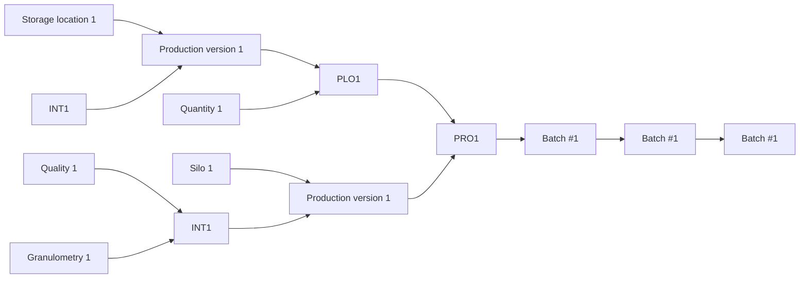
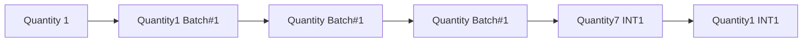
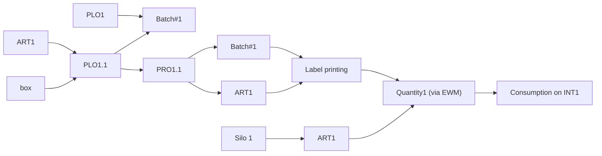
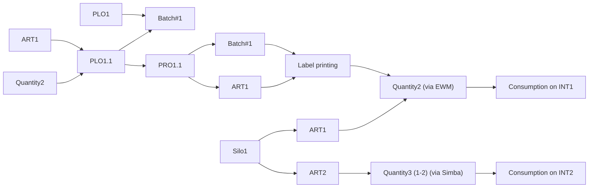
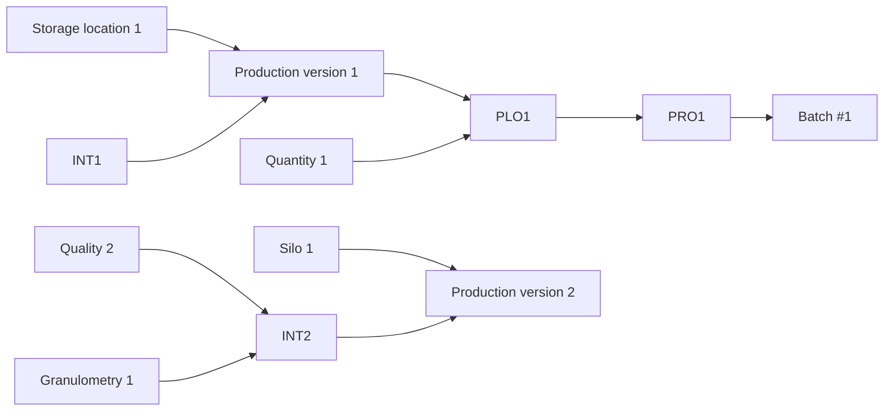
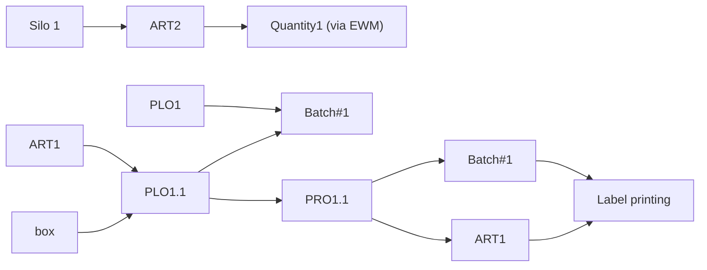

1.0 Ideal process – Scheduling and production

<!-- OCR of image2.png via tesseract, mean confidence 96.4 -->

| PLO: Planned | PRO: Process |
| Order | Order |

<!-- image1.png: Flow traced from the image by image processing (shapes, connector lines and arrowheads). DRAFT -- on rendered process slides it recovers about 60% of the arrows, and about 1 in 5 of the arrows it draws is wrong; dashed arrows are missed. Check it against the original. The box labels below are read by OCR. -->

<!-- labels read from the image via tesseract -->

eee

Production

OMP

version 1

SAP

PRO1

Batch #1

MES

Production

Batch #1

version 1

Granulometry 1

DCS

Silo 1

Quality 1

Batch #1

1.1 Ideal process – Bulk production declaration

<!-- image3.png: Flow traced from the image by image processing (shapes, connector lines and arrowheads). DRAFT -- on rendered process slides it recovers about 60% of the arrows, and about 1 in 5 of the arrows it draws is wrong; dashed arrows are missed. Check it against the original. The box labels below are read by OCR. -->

<!-- labels read from the image via tesseract -->

OMP

Quantity1 INT1

SAP

Batch#1

Quantity1 INT1

Quantity1 Batch#1

MES

DCS

Quantity 1

Quantity1 Batch#1

<!-- OCR of image2.png via tesseract, mean confidence 96.4 -->

| PLO: Planned | PRO: Process |
| Order | Order |

1.2 Ideal process – Packaging

<!-- image4.png: Flow traced from the image by image processing (shapes, connector lines and arrowheads). DRAFT -- on rendered process slides it recovers about 60% of the arrows, and about 1 in 5 of the arrows it draws is wrong; dashed arrows are missed. Check it against the original. The box labels below are read by OCR. -->

<!-- labels read from the image via tesseract -->

OMP

| Qua

SAP

Label printing

Quantity1 (via EWM)

Consumption on INT1

MES

DCS

<!-- OCR of image2.png via tesseract, mean confidence 96.4 -->

| PLO: Planned | PRO: Process |
| Order | Order |

2.2 Partial downgrading of a silo after production – Packaging and loading

<!-- image5.png: Flow traced from the image by image processing (shapes, connector lines and arrowheads). DRAFT -- on rendered process slides it recovers about 60% of the arrows, and about 1 in 5 of the arrows it draws is wrong; dashed arrows are missed. Check it against the original. The box labels below are read by OCR. -->

<!-- labels read from the image via tesseract -->

OMP

Quantity2 (via EWM)

SAP

L= }

Label printing

Consumption on INT1

Quantity3 (1-2) (via Simba)

Consumption on INT2

MES

DCS

<!-- OCR of image2.png via tesseract, mean confidence 96.4 -->

| PLO: Planned | PRO: Process |
| Order | Order |

2.0 and 2.1 equal to 1.0 and 1.1

3.0 Full silo downgrading during production – Scheduling and production

<!-- image6.png: Flow traced from the image by image processing (shapes, connector lines and arrowheads). DRAFT -- on rendered process slides it recovers about 60% of the arrows, and about 1 in 5 of the arrows it draws is wrong; dashed arrows are missed. Check it against the original. The box labels below are read by OCR. -->

<!-- labels read from the image via tesseract -->

Production

OMP

version 1

PLO1

SAP

PRO1

Batch #1

MES

Production

Batch #1

version 2

Granulometry

Batch #1

<!-- OCR of image2.png via tesseract, mean confidence 96.4 -->

| PLO: Planned | PRO: Process |
| Order | Order |

3.1 Full silo downgrading during production – Production declaration

<!-- OCR of image2.png via tesseract, mean confidence 96.4 -->

| PLO: Planned | PRO: Process |
| Order | Order |

Same as 1.1 since we have a PRO where to declare production

3.2 Full silo downgrading during production – Packaging

<!-- image7.png: Flow traced from the image by image processing (shapes, connector lines and arrowheads). DRAFT -- on rendered process slides it recovers about 60% of the arrows, and about 1 in 5 of the arrows it draws is wrong; dashed arrows are missed. Check it against the original. The box labels below are read by OCR. -->

<!-- labels read from the image via tesseract -->

OMP

SAP

+! Label printing

Quantity1 (via C=} EWM)

Consumption — on INT1

MES

DCS

<!-- OCR of image2.png via tesseract, mean confidence 96.4 -->

| PLO: Planned | PRO: Process |
| Order | Order |

INT Structure - SODA ASH (to be reviewed since BIB, real INT, and SL have the same article)

<!-- OCR of image8.png via tesseract, mean confidence 94.1 -->

| 31851: SL |  |
| 31851 (ROAB): SL - To BICAR Structure |  |
| 31851 | WAGONS |
| 135731 | BIAB |
| 150393 | 30156 |
| 162672 | 150391 |
| 184428 202666 | 153707 |
| 163083 |  |

Only 1 batch per time

INT structure - BICAR

<!-- tables in image9.png read by image processing + tesseract -->

|

31851 (ROAB): SL

|

32043: BIR 0/SO @INT

41295

177803

| 321276 _

304203

304237 168524 170104

| 254859. |

182651

166909

203070

| 32042.1: BIR 0/13 @INT | 32042.2: BIR 0/13 @INT |
|---|---|
| FOOD 0/13 | TEC 0/13 |

| $8307.1: BIR 0/13+ @INT | $8307.2: BIR 0/13+ @INT |
|---|---|
| FOOD | TEC 0/13+ |

| 32044.1: BIR 13/27 @INT | 32044.2: BIR 13/27 @INT |
|---|---|
| FOOD | TEC 13/27 |

| 32046.1: BIR 27/SO @INT | 32046.2: BIR 27/SO @INT | 32046.3: BIR 27/SO @INT | 32046.4: BIR 27/SO @INT |
|---|---|---|---|
| FOOD | 27/50 | TEC 27/50 | MELTRON 27/50 |

| 47301.1: BIR 0/sO COMBINE @INT | 47301.2: BIR 0/SO COMBINE @INT | 47301.3: BIR 0/SO COMBINE @INT |
|---|---|---|
| FOOD 0/50 | ZOO 0/50 | TEC 0/50 |

| 31859 | 180924 |
|---|---|
| 182206 |  |
| 166494 |  |
| 322871 |  |
| SI9993 |  |

| 322961 | 204455. |
|---|---|
| 317731 |  |
| 203075 |  |

Max 12 simultaneous batches

  

INT structure - CASO

<!-- tables in image10.png read by image processing + tesseract -->

| 47091 (ROAA | CaCl2 lia ¢ | DINT |
|---|---|---|
| 47091 (ROAC | CaCl2 liq ¢ | DINT |
| oe ee re |  | es es |
| FOOD FOOD FCC FCC Feed TEC | TEC | 45663: Caso 20425: CASO 25930: CASO ROAD TEC solution TEC FCC @INT SOLUTION SOLUTION 3S%-37% °R 3S%-37% °R |
| tT \| NON LT tT \| NON LT NON LT LT | NON LT | DC 6 DC 1 RS72 NON LT TEC TEC FCC |

| FOOD | FOOD |
|---|---|
| LT | NON LT |

| FCC | FCC |
|---|---|
| LT | NON LT |

| TEC | TEC |
|---|---|
| LT | NON LT |

Max 5 simultaneous batches

  

Open questions

1. The silos level will be on SAP? How frequent it will be updated?
2. How we will manage the filling/empting process?
3. Downgrading
4. Full silo during production
5. Last tons in the silo (normally sent to a truck)
4. What if we produce in a different day compared to the scheduled one? What happen to the batch created during scheduling and which batch # we will use for production declaration?
5. INT structure detail: what if we have to comunicate with production a specific INT product but the capability of the process is very low (high probability of downgrading)?  

  