# Imagine Design Workshop  Plan to Produce | P2P-WS021/I2D-WS059

# Manufacturing Execution I  in SAP (Packaged) Process Orders &amp; EWM Production Integration

18/06/2025

# Agenda

<!-- image26.png read by Qwen3-VL (local vision model) -->

| Topic | Content | Presented by |
|---|---|---|
| Process Order creation and release | Complete Process Order | M-090-020 |
|  | Create Orders (Planned/Process) | M-090-030 |
|  | Release Process Order | M-100-050 |
|  | Plan Production Line Changes (Change Overs/Clean Outs) | M-100-220 |
|  | Batch Determination for the Raw Material | M-100-280 |
| Manage BOM inventory | Check for Material Availability | M-090-010 |
|  | Expedite missing materials | M-090-040 |
|  | Schedule Consumable Material Requirements | M-090-090 |
| Execution of operations plan | Confirm Process Order operation/Phase | M-100-010 |
|  | Backflush Raw Materials | M-100-020 |
|  | Issue Materials for next phase | M-100-030 |
|  | Order Closure | M-100-070 |
|  | Consume Material/Re-order Material | M-100-120 |
|  | Reject Component Material | M-100-240 |
| Production receipt of bulk/Production receipt of packed product | Perform final confirmation | M-100-040 |
| Material quantities reconciliation | Correct the errors in goods movement | M-100-060 |
| Production receipt of packed product | Print Production Labels | M-100-080 |
|  | Build Pallet | M-100-100 |
| Defective production management | Rework Material | M-140-030 |
|  | Blend | M-140-120 |
| System Demo |  |  |

# Workshop Goals  after agenda

We would expect the following outputs and deliverables coming from the workshops:

|   # | Workshop Topics                       | Output                                                                                     | Location links / format                                      |
|-----|---------------------------------------|--------------------------------------------------------------------------------------------|--------------------------------------------------------------|
|   1 | Review process design                 | Update Celonis process model Fiori apps (Executables) Swim lanes w/ roles in process model | L3 Sub-Process in Celonis L4 Process Steps in Celonis        |
|   2 | Key design decisions                  | Create KDD                                                                                 | KDD log in Jira + KDD Template in Google Drive               |
|   3 | Fit/Gap analysis                      | List of Fits/Gaps identified                                                               | Fit & Gap Identification in Jira Build Backlog  Gap template |
|   4 | Functional Integration considerations | Create KDD for Integrations                                                                | KDD log in Jira KDD Template in Google Drive                 |

# Workshop Agenda

Manufacturing Execution in SAP Packaged Process Orders and EWM Production Integration

1. Process Order creation and release
2. Staging for production with EWM
3. Manage BOM inventory
4. Execution of operations plan
5. Production receipt of bulk/Production receipt of packed product
6. Material quantities reconciliation
7. Production receipt of packed product
8. Defective production management
9. System Demo

<!-- no readable text in image20.jpg (OCR confidence 44.5) -->

# Workshop Agenda

Manufacturing Execution in SAP Packaged Process Orders and EWM Production Integration

1. Process Order creation and release
2. Manage BOM inventory
3. Execution of operations plan
4. Production receipt of bulk/Production receipt of packed product
5. Material quantities reconciliation
6. Production receipt of packed product
7. Defective production management
8. System Demo

# Create Process Orders - M-090-030  

This process involves generating process orders based on production plans and schedules. A process order specifies the details of the production job, including materials, resources, and timelines required to produce a specific quantity of products.

<!-- Flow read from the image by the local vision model. DRAFT -- on this corpus it recovers about half the arrows and about a third of the arrows it draws are wrong, so check every one against the image before relying on it. The box labels below are read by OCR and are reliable. -->

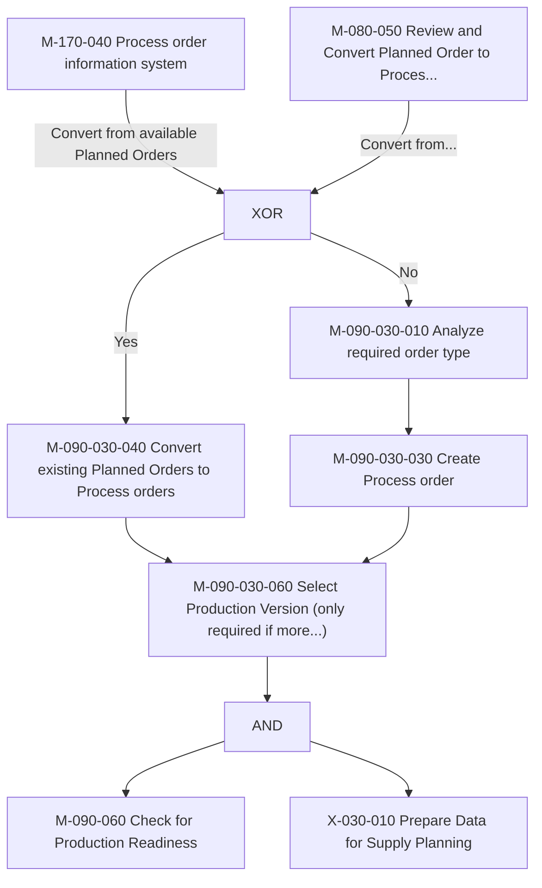

<!-- labels read from the image via tesseract -->

| M-090-030-010

M-090-030-030

Process order information

| Analyze required order type

———_> Create Process order

system

Convert from available

No

Planned Orders

Convert from... XOR

Review and Convert Planned Order to Proces...

Check for Production Readiness

Yes

| M-090-030-040

M-090-030-060

Convert existing Planned Orders

Select Production > Version (only required if more...

AND

Prepare Data for Supply Planning

to Process orders

# Process Orders - Creation (Planned order to Process order)

# 

<!-- image12.png read by Qwen3-VL (local vision model) -->

SAP Stock/Requirements List as of 09:41 hrs

Menu ▼ Show Overview Tree Refresh Filter On Send Mail to MRP Controller

Material: 9000018C
Description: Chemical Concentrate
MRP Area: OC01 Chemical - Plant (Mfg US)
Plant: OC01 MRP type: ND Material Type: OHAN
Ex. manuf.: Unit: L

Page 5 / 5

| A... | Date       | MRP e... | MRP element data | Rescheduling... | E... | Receipt/Reqmt | Available Qty | Pro... | Stor... |
|------|------------|----------|------------------|-----------------|------|----------------|---------------|---------|----------|
|      | 13.06.2025 | PrcOrd   | 000001001028/YBM2/Re | 07             | 10.000 | 1,025.500 | 0001 | OCIN     |
|      | 13.06.2025 | PrcOrd   | 000001001030/YBM2/Re | 07             | 10.000 | 1,035.500 | 0001 | OCIN     |
|      | 13.06.2025 | PrcOrd   | 000001001031/YBM2/Re | 07             | 10.000 | 1,045.500 | 0001 | OCIN     |
|      | 13.06.2025 | PrcOrd   | 000001001032/YBM2     | 07             | 10.000 | 1,055.500 | 0001 | OCIN     |
|      | 13.06.2025 | OrdRes   | 201              |                 | 0.150- | 1,055.350 |           | OCIN     |
|      | 13.06.2025 | OrdRes   | 201              |                 | 0.150- | 1,055.200 |           | OCIN     |
|      | 25.06.2025 | PldOrd   | 0000057788/STCK*   |                 | 50.000 | 1,105.200 | 0001 | OCIN     |
|      | 25.06.2025 | PldOrd   | 0000057789/STCK*   |                 | 100.000 | 1,205.200 | 0001 | OCIN     |

Planned orders are converted to process orders in SAP PP-PI to initiate detailed scheduling, resource allocation, and shop floor execution.

This conversion enables material availability checks, batch management, and real-time production tracking.

<!-- image8.png read by Qwen3-VL (local vision model) -->

SAP Collective Conversion of Planned Orders: List

Menu ▼ Selection Parameters On/Off Planned Orders

Sort with Field Selection ↑ ↓ ↔ ✏️ □ Convert Planned Order Stock/Requirements List MRP List

Planned Orders

| Re... | Opening Date | Planned Order | Start Date | Material | Order Quantity | Un... | Pro... | Process Order | End Date | Stock Segment | Description |
|:------|:-------------|:--------------|:-----------|:---------|:--------------|:------|:-------|:-------------|:---------|:-------------|:------------|
| ✓     | 25.06.2025   | 57788         | 25.06.2025 | 90000186 | 50.000        | L     | YBM2   | 1001036      | 25.06.2025 |               | Chemical Con |
|        | 25.06.2025   | 57789         | 25.06.2025 | 9000186  | 100.000       | L     | YBM2   |              | 25.06.2025 |               | Chemical Con |

<!-- OCR of image11.png via tesseract, mean confidence 95.7 -->

@ Planned order 57788 was converted to process order 1001036

# Process Orders - Creation

System Status: Key displaying the current status of the process order

Order Type: Key differentiating orders according to their use.

Total Quantity: The quantity of the process order.

Dates &amp; Scheduling: Based on the scheduling type, the end and start date of the process order are determined.

Scheduling Margin Key for Floats: Key that the system uses to determine the floats required for scheduling an order.

<!-- image25.png read by Qwen3-VL (local vision model) -->

Process Order: 1000427
Material: 213 Epoxy Hardener
System Status: TECO CNF DLV PRC BASC BCRQ GMPS MACM*
Type: PI05
Plant: OC01

| General Data | Assignment | Goods Receipt | Control | Dates/Quantities | Master Data | Administr. | Items | SAP Event Mgmt |
|---|---|---|---|---|---|---|---|---|

**Quantities**

| Total Qty: | 110.000 | L | Short/Exc. Rec.: | 0.000 |
|---|---|---|---|---|
| Scrap: | 0.000 | 0.00% | | |
| Delivered: | 110.000 | | | |

**Dates/Times**

| Basic Dates | Scheduled | Confirmed |
|---|---|---|
| End: | 03.05.2024 | 00:00:00 | 03.05.2024 | 00:00:00 | 03.05.2024 | 00:00:00 |
| Start: | 03.05.2024 | 00:00:00 | 03.05.2024 | 00:00:00 | 03.05.2024 | 00:00:00 |
| Release: | 03.05.2024 | 03.05.2024 | | | | |

**Scheduling**

| Type: | Forwards |
|---|---|
| Reduction: | No reduction carried out |
| Note: | No scheduling note |
| Priority: | __ |

**Floats**

| Sched. Margin Key: | |
|---|---|
| Float before prod.: | 0 Workdays |
| Float after product: | 0 Workdays |
| Release period: | 0 Workdays |

# Process Orders - Creation

<!-- image4.png read by Qwen3-VL (local vision model) -->

Process Order: 1000427
Material: 213 Epoxy Hardener
System Status: TECO CNF DLV PRC BASC BCRO GMPs MACM*

General Data Assignment Goods Receipt Control Dates/Quantities Master Data Administr. Items SAP Event M

**Responsibility**

| MRP controller: | 030 | MRP Cntrl (Buying) |
| --- | --- | --- |
| Prod. Supervisor: |  |  |
| Prod. Sched. Profile: | YB0010 | MTS Process Manufacturing |

**Assignments**

| Planning Plant: | OC01 | MRP Area: | OC01 |
| --- | --- | --- | --- |
| Planned Order: | 1010 | Profit Center: | CHEM1000 |
| Campaign: |  | Business Area: |  |
| BOM Explosion Number: |  | Revision Level: |  |
| Run Schedule Header: |  | Reservation: | 2799 |
| Sequence Number: | 0 | Inspection Lot: | 0 |
| WBS Element: |  | Object Class: | PRODT |

**Sales Order**

| Sales Order: | 0 | 0 |
| --- | --- | --- |

MRP Controller: Number of the responsible MRP controller

Production Scheduling Profile: Profile that you can use to

- specify that certain business transactions are carried out in parallel in a production order / process order (you can, for example, create and release an order at the same time, or release an order and print the shop papers)
- trigger an automatic goods receipt
- specify an overall profile for capacity leveling

Assignments:

The most important assignments are the planned order and the sales order. This happens automatically.

# Process Orders - Creation

<!-- OCR of image10.png via tesseract, mean confidence 86.3 -->

Process Order: 1000427

Material: 213

Epoxy Hardener

System Status: TECO CNF DLV PRC BASC BCRQ GMPS MACM*

General Data

Assignment

Goods Receipt

Control

Dates/Quantities

Master Data

Administr.

Items

Control

Stock Type : Quality inspection

Goods Receipt:

GR Proc. Time

Workdays

Goods Receipt, Non-Valuated:

Final | Deli verv

Tolerances

Underdelivery 0.0 Sette teeta

Overdelivery 0.0 Sette teeta

Unlimited Overdelivery:

Receipt

Location Sette teeta

Batch: 0000000479 — —

Distribution Sette teeta

Stk Seg.

Inbound Delivery

Goods Recipient

Unloading Point

Stock Type: Specifies the stock to which the material is posted upon goods receipt (or from which it is posted upon goods issue). 

Batch: Assigns the production to that particular batch.

# Process Orders - Creation

<!-- image9.png read by Qwen3-VL (local vision model) -->

Process Order: 1000427
Material: 213
Epoxy Hardener
System Status: TECO CNF DLV PRC BASC BCRO GMPs MACM*

General Data Assignment Goods Receipt Control Dates/Quantities **Master Data** Administr. Item

## Production Version

| Production Vers.: | ZBLN |
|---|---|
| Explosion Date: | 03.05.2024 |

## Master Recipe

| Recipe Group: | ZBLEND |
|---|---|
| Recipe: | 1 |
| Usage: | 1 |
| Change Number: |  |
| Valid from: | 26.03.2024 |
| Planner Group: |  |

## Bill of Material

| Bill of Material: | 00000106 |
|---|---|
| Alternative: | 1 |
| Usage: | 1 |
| Change Number: |  |
| Valid from: | 21.03.2024 |
| Status: | 1 |

## Resource Network

| Resource Network: |  |
|---|---|
| Plant: |  |

The Master Data View indicates the production version, master recipe, bill of material, and, if present, the resource network that are assigned to the process order.

# Process Orders - Creation

The material list includes all the materials that will be used during the production process.

<!-- image7.png read by Qwen3-VL (local vision model) -->

Header Operations Material Quantity Calculation Services for Object ▼

Process Order: 1000427

Material: 213 Epoxy Hardener

Type: PI05

Plant: OC01

Entry: 1 of: 2

Material List

| Item | Material | Material Description | Lo... | Requirement Quantity | Un... | Ite... | Re... | Stor... | Req. Segment | Stock Segment | Batch | Co... | Bac... | Bul... | Ph... | Ite... | B... | Fi... | Ac... |
| :--- | :--- | :--- | :--- | :--- | :--- | :--- | :--- | :--- | :--- | :--- | :--- | :--- | :--- | :--- | :--- | :--- | :--- | :--- | :--- |
| 0010 | 10000150 | Ancamide |  | 55.000 | L | L | X | OCST |  |  | 0000000477 |  |  |  |  |  | X |  |  |
| 0020 | 10000151 | Water |  | 55.000 | L | L | X | OCST |  |  | 0000000478 |  |  |  |  |  | X |  |  |

# Process Orders - Creation

Batch determination in SAP PP is the automated selection of the right batch of material during production, based on predefined criteria like expiration date or quality. This ensures traceability, quality control, and regulatory compliance by making sure the correct materials are used in each production process.

<!-- image17.png read by Qwen3-VL (local vision model) -->

Process Order Edit Goto Material System Help

Display Process Order: Material List

Process Order 1001025
Material 90000186 Chemical Concentrate
Type YBM2
Plant OC01

Entry 1 of 3

Material List

| Item | Material | Material Description | L... | Requirement Quantity | U... | It... | St... | Req. Segment | Stock Segment | Batch | Co... | Ba... | Bul... | P... | It... | B... | F... | Plant | Act... | Su... | P... | D... | S... | Re... |
| :--- | :--- | :--- | :--- | :--- | :--- | :--- | :--- | :--- | :--- | :--- | :--- | :--- | :--- | :--- | :--- | :--- | :--- | :--- | :--- | :--- | :--- | :--- | :--- | :--- |
| 0010 | 10000014 | Chemical AI | L... | 0.000 | L | X | OCIN |  |  |  |  |  |  |  |  |  |  | OC01 | 0020 | ✓ | 0010 |  | 25. |  |
| 0010 | 10000014 | Chemical AI | L... | 33.334 | L | X | OCIN |  |  |  |  |  |  |  |  |  |  | OC01 | 0020 | ✓ | 0010 |  | 25. |  |
| 0020 | 10000012 | Chemical Base | L... | 66.667 | L | X | OCIN |  |  |  |  |  |  |  |  |  |  | OC01 | 0020 | ✓ | 0010 |  | 25. |  |

# Process Orders - Creation

The operations include all the activities and phases that will be executed during the production process.

- Phases are the main steps in the process order.
- Activities are the tasks or resource usages within each phase.
- Each phase can have multiple activities assigned to it.

<!-- image13.png read by Qwen3-VL (local vision model) -->

Header Material List XSteps Services for Object ▼

Process Order: 1000427

Material: 213 Epoxy Hardener

Type: PI05

Plant: OC01

Entry: 1 of: 2

OperationOverview

| Acti... | Ph... | Supe... | Ct... | Resource | Cont... | Standard... | Short text | Lo... | System Status | User Status | Latest start d... | Latest st... | Latest finish ... | Latest |
|---|---|---|---|---|---|---|---|---|---|---|---|---|---|---|
| 0010 |  | 0010 |  | BLEND | YPI1 |  | Blending for OC01 |  | CNF REL TECO |  | 03.05.2024 | 00:00:00 | 03.05.2024 | 00:00:00 |
| 0020 | ✓ | 0010 |  | BLEND | YPI1 |  | Blending for OC01 |  | CNF REL TECO |  | 03.05.2024 | 00:00:00 | 03.05.2024 | 00:00:00 |

# Plan Production Line Changes (Change Overs/Clean Outs)- M-100-220

In SAP PP, planning production line changes involves updating the production plan to reflect new products, processes, or schedules. This typically includes modifying the bill of materials (BOM) and recipe, adjusting production versions, and updating master data. The changes are then incorporated into the production schedule, ensuring that future orders use the revised setup.

<!-- OCR of image22.png via tesseract, mean confidence 78.3 -->

M-200-220010

Perform and Record Process Setting Change

Pian Production Line Changes

# Release Process Order  -  M-100-050  

This process involves authorizing a process order to begin production. It involves several steps and checks to ensure that all necessary prerequisites are met before production can begin. This includes checking material availability, capacity, and ensuring that all required documents and approvals are in place

<!-- image15.png read by Qwen3-VL (local vision model) -->

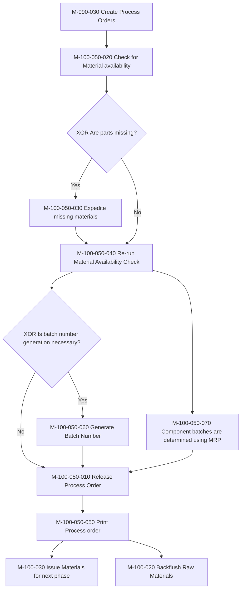

<!-- image18.png read by Qwen3-VL (local vision model) -->

SAP Manage Process Orders

Standard *

Order: Product: Plant: Order Type: MRP Controller: Production Supervisor: Status:

Search

Scheduled Start Date: Scheduled End Date: Processing Status: Quality Status: Component Availability Status: Quantity Status:

Go Adapt Filters (1)

Process Orders (35)

|  | Order | Product | Quantity | Scheduled Start | Scheduled End | Status | Issues |
|---|---|---|---|---|---|---|---|
|  | 1000301 | 201<br>CHEMICAL REFINED BASE OIL | 300.000 L | Fri, Mar 8, 2024, 00:00 | Fri, Mar 8, 2024, 00:00 | Created |  |
|  | 1000302 | 201<br>CHEMICAL REFINED BASE OIL | 100.000 L | Sun, Mar 10, 2024, 00:00 | Sun, Mar 10, 2024, 00:00 | Created |  |
|  | 1000403 | 90000130<br>Chemical Product-MTS | 10 EA | Thu, Apr 18, 2024, 00:00 | Thu, Apr 18, 2024, 00:00 | Created |  |
|  | 1000404 | 90000130<br>Chemical Product-MTS | 10 EA | Thu, Apr 18, 2024, 00:00 | Thu, Apr 18, 2024, 00:00 | Created |  |
|  | 1000405 | 90000130<br>Chemical Product-MTS | 10 EA | Thu, Apr 18, 2024, 00:00 | Thu, Apr 18, 2024, 00:00 | Created |  |
|  | 1000426 | 90000130<br>Chemical Product-MTS | 10 EA | Thu, Apr 18, 2024, 00:00 | Thu, Apr 18, 2024, 00:00 | Created |  |
|  | 1000414 | 201<br>CHEMICAL REFINED BASE OIL | 1,000.000 L | Fri, Apr 26, 2024, 00:00 | Fri, Apr 26, 2024, 00:00 | Created |  |
|  | 1000418 | 90000186<br>Chemical Concentrate | 5.000 L | Mon, Apr 29, 2024, 00:00 | Mon, Apr 29, 2024, 00:00 | Created |  |

# Process Orders - Release

<!-- OCR of image19.png via tesseract, mean confidence 83.2 -->

By Manage Process Orders

# Print Production Labels -  M-100-080  

This process involves printing labels for products or materials used in production. Forms and labels are essential for various business transactions, including order confirmations, delivery notes, and production labels. Labels typically include information such as product codes, batch numbers, and quantities, ensuring proper identification and traceability.

<!-- Flow read from the image by the local vision model. DRAFT -- on this corpus it recovers about half the arrows and about a third of the arrows it draws are wrong, so check every one against the image before relying on it. The box labels below are read by OCR and are reliable. -->

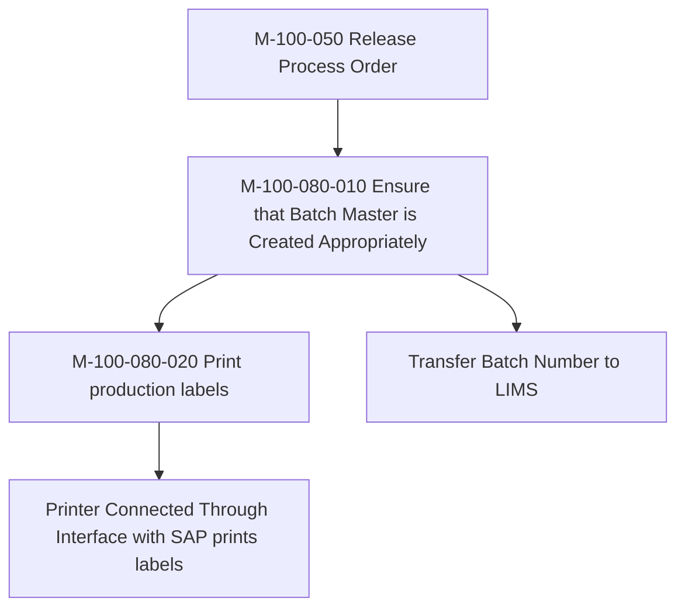

<!-- labels read from the image via tesseract -->

Transfer Batch Number to LIMS

M-100-080-010

M-100-080-020

Printer Connected Through Interface with SAP prints labels

Ensure that Batch Master is Created

Release Process Order

Print production labels

Appropriately

# Print Shopfloor Forms via Change Process Order App 

<!-- OCR of image28.png via tesseract, mean confidence 84.9 -->

< French Pastries

*# @

@

English

French

FRENCH

PASTRIES

Macarons are delicate French pastries known for their crisp shell and soft, chewy interior. These colorful treats are often filled with butter cream, ganache, or jam.

Wee

Each macaron consists of two meringue-based cookies sandwiched together, creating a perfect balance of texture and flavor.

aed ~~

poe

Gara)

ater. oe a

<!-- image27.png read by Qwen3-VL (local vision model) -->

# Change Process Order

**Process Order:** 200003887  
**Material:** 110000000099  
**AT-000/18T-2S NATURAL Test**  
**System Status:** REL MSPT DLV PRC BASC BCRO GMPS SETC  
**Type:** ZI01  
**Plant:** 1001

---

## General Data

### Quantities

| Field          | Value     | Unit |
|----------------|-----------|------|
| *Total Qty:*   | 2.499     | KG   |
| Scrap          |           | 0.00 % |
| Delivered      | 2.499     |      |

### Short/Exc. Rec.: 0

---

## Dates/Times

| Category       | Basic Dates       | Scheduled       | Confirmed       |
|----------------|-------------------|-----------------|-----------------|
| End            | 01.02.2024        | 31.01.2024      | 31.01.2024      |
| Start          | 31.01.2024        | 31.01.2024      |                 |
| Release        | 31.01.2024        |                 | 31.01.2024      |

---

## Scheduling

---

## Floats

---

**Save** | **Cancel**

---

**2024-02-01 13:18:18**

Process Orders can be printed via COR2 or Change Process Order App

# Complete Process Order - M-090-020

The process order workflow ensures seamless transition from order creation to execution, facilitating efficient production management and communication.

Key steps include creating, scheduling, and releasing orders, followed by printing shop floor papers and conducting daily production meetings for alignment.

<!-- OCR of image21.png via tesseract, mean confidence 73.6 -->

WHO Print Shop Floor Paper

Cronte Process Orders

Conduct Dally Production

Process Orders

# Workshop Agenda

Manufacturing Execution in SAP Packaged Process Orders and EWM Production Integration

1. Process Order creation and release
2. Staging for production with EWM
3. Manage BOM inventory
4. Execution of operations plan
5. Production receipt of bulk/Production receipt of packed product
6. Material quantities reconciliation
7. Production receipt of packed product
8. Defective production management
9. System Demo

# Objective of the Session

 

Approach for the workshop: 

1. Quick recap on P2P integration with EWM models (Process manufacturing)
2. End to End process flow including staging, consumption and production receipt
3. Detailed discussion on each L4’s

1. Master data objects : Production supply area, Control cycles, assignment of production supply area to warehouse bin
2. Bulk and Finished goods - Process manufacturing with EWM integration
3. Identify gaps in standard process

<!-- OCR of image31.png via tesseract, mean confidence 82.7 -->

| | Level 4 processes 8.1.3 Production Integration

Level 3

# L3 Chemical Core Process Flow Diagram  Recap Process Order integration with EWM

<!-- Flow read from the image by the local vision model. DRAFT -- on this corpus it recovers about half the arrows and about a third of the arrows it draws are wrong, so check every one against the image before relying on it. The box labels below are read by OCR and are reliable. -->

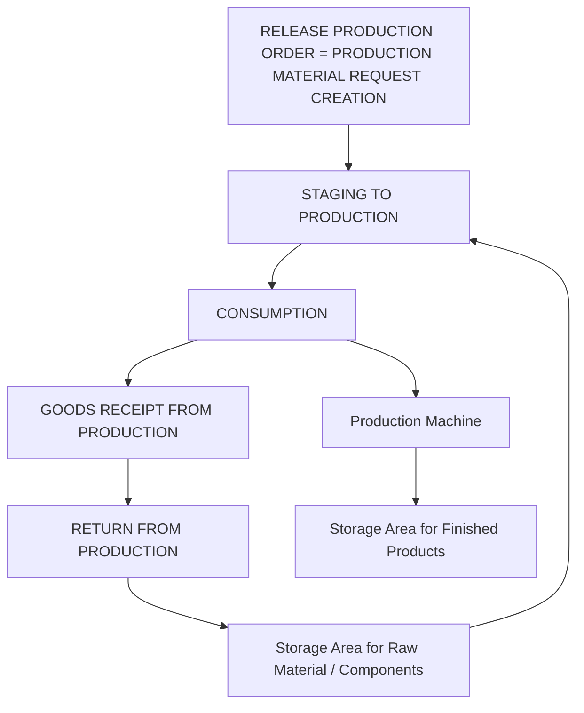

<!-- labels read from the image via tesseract -->

Process flow

1

RELEASE PRODUCTION ORDER =

PRODUCTION MATERIAL REQUEST CREATION

3. CONSUMPTION

5. RETURN FROM PRODUCTION

4. GOODS RECEIPT FROM PRODUCTION

Component

C7 1 al | hel

1 | hel

ew ew ee ee ee ee 2. STAGING TO PRODUCTION

eee eee ee ee

_ Production Supply Area

Finished Product

Storage Area for Raw Material / Components

Production Machine

Storage Area for Finished Products

# Workshop Agenda

Product and Production Master Data

Staging for production

# L3 Chemical Core Process Flow Diagram  Process Order integration with EWM

Staging for production

Automatic

Process order release

Staging  Request to EWM

Production material request

Plan stage for production

Execute production staging

Note &amp; record exceptions

Stock moved to PSA

# L3 Chemical Core Process Flow Diagram  Process Order integration with EWM

Staging for production

Automatic

Process order release

Staging  Request to EWM

Production material request

Plan stage for production

Execute production staging

Note &amp; record exceptions

Stock moved to PSA

# L3 Chemical Core Process Flow Diagram  Process Order integration with EWM

Plan stage for production

Production material request

Execute staging for production manual or automatic(via BG job)

Staging warehouse order created

Stock movement rules, Batch selection(Cross)

Single order staging

Cross order staging

Validate Staging warehouse order

1.GT Single order is only in scope

Generate pick list

Execute production staging

# L4 Documentation &amp; Actions

FIT/GAPs:

|   N° | Fit/GAP             | Description                                                            |
|------|---------------------|------------------------------------------------------------------------|
|    1 | Single order        | Single order staging                                                   |
|    2 | Batch determination | Batch determination at production order(Single order can only be used) |

Action:

| N°   | Description   | Owner   | Due Date   | Next steps   |
|------|---------------|---------|------------|--------------|
|      |               |         |            |              |
|      |               |         |            |              |

# Workshop Agenda

Manufacturing Execution in SAP Packaged Process Orders and EWM Production Integration

1. Process Order creation and release
2. Staging for production with EWM
3. Manage BOM inventory
4. Consumption for production with EWM
5. Execution of operations plan
6. Production receipt of bulk/Production receipt of packed product
7. Material quantities reconciliation
8. Production receipt of packed product
9. Defective production management
10. System Demo

# Check for Material Availability - M-090-010  

A material availability check in a process order ensures that all required components and materials are available in the necessary quantities before production begins. This check is crucial for smooth production execution, preventing delays and disruptions caused by missing materials.

<!-- Flow read from the image by the local vision model. DRAFT -- on this corpus it recovers about half the arrows and about a third of the arrows it draws are wrong, so check every one against the image before relying on it. The box labels below are read by OCR and are reliable. -->

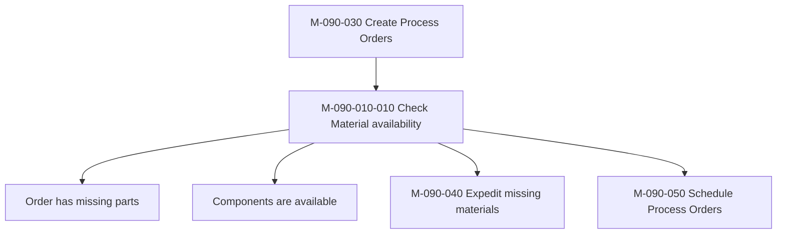

<!-- labels read from the image via tesseract -->

Order has missing parts

Components are available

M-090-010-010

Create Process Orders

Check Material availability

Expedite missing materials

Schedule Process Orders

# L3 –  Check for Material Availability

Process

order

- Controls the scope of check during the order processing.
- The Scope of check: The checking rule, in conjunction with the checking group, determines the scope of the availability check for every business operation.
- The following elements can be defined in the scope of availability check during order processing
- Stock
- Safety Stock
- Stock in Transfer
- Blocked Stock
- Quality Inspection
- Factors such as Replenishment lead time (RLT), Release Orders, Planned Orders etc.

<!-- no readable text in image45.png (OCR confidence 0.0) -->

Requirements

qty/date

<!-- no readable text in image43.png (OCR confidence 0.0) -->

<!-- no readable text in image38.png (OCR confidence 0.0) -->

<!-- image -->

Availability check:

 Checks whether all the materials required to perform an operation or manufacture the product are/will be available

Check result

- Confirmed quantity
- Missing part record
- Status MSPT (material shortage)

-

ATP Quantity

=

Warehouse stock + Inbound Quantity

Outward Quantity

# Process Orders: Material Availability Check 

<!-- image30.png read by Qwen3-VL (local vision model) -->

Process Order 1000926
Material 201
System Status CRTD MSPT PRC CSER BASC BCRQ SETC SETM

**General Data** Assignment Goods Receipt Control Dates/Quantities Master

Quantities
Total Qty 100.000 L
Scrap 0.00 %
Delivered 0.000

**Availability Check**

Non-Availability of Material
for order 1000926

Further Processing:

Log
Missing Parts List
Miss. Parts Overview
Cancel

**Availability Check**

No. of Components Checked: 3
Missing Parts: 1
Overall commitment date could not be determined

| Material | Plant | Locat... | Requirement Quantity | Requirements date | Conf./Allocated qty | Committed date | Material Description |
|----------|-------|----------|----------------------|-------------------|---------------------|----------------|----------------------|
| 10000072 | OC01 | OCW1 | 1,000.000 | 17.03.2025 | 0.000 | 31.12.9999 | Chemical Component |

The material availability check is a critical process that verifies whether all necessary raw materials and components are available in inventory before releasing or executing a production or process order. This check helps identify any shortages early, allowing planners to resolve issues—such as ordering missing materials or rescheduling production—so that manufacturing can proceed smoothly without interruption

# Expedite missing materials - M-090-040  

This process involves taking actions to quickly obtain materials that are not available but are required for production. It includes activities such as expediting purchase orders, reallocating materials from other locations, or finding alternative suppliers.

<!-- image32.png read by Qwen3-VL (local vision model) -->

Missing materials?

M-090-010
Check for Material Availability

XOR

Yes

M-090-040-010
Identify missing /short materials

M-090-040-020
Check for material substitution

P-070-050
Create Requisition

M-090-030
Create Process Orders

No

M-100-050
Release Process Order

# Schedule Consumable Material Requirements - M-090-090  

In SAP, consumable materials refer to items that are purchased for immediate consumption rather than for inventory or resale. These materials are typically used in operations, maintenance, or production processes and are not tracked as stock items after receipt. Examples include office supplies, lubricants, cleaning agents, and spare parts.

Key Characteristics of Consumable Materials:-

1. Not Managed in Inventory
2. Expensed at Receipt
3. No Material Master Needed (Optional)

# Workshop Agenda

Manufacturing Execution in SAP Packaged Process Orders and EWM Production Integration

1. Process Order creation and release
2. Staging for production with EWM
3. Manage BOM inventory
4. Execution of operations plan
5. Production receipt of bulk/Production receipt of packed product
6. Material quantities reconciliation
7. Production receipt of packed product
8. Defective production management
9. System Demo

# Backflush Raw Materials  -  M-100-020  

This process involves backflushing, it is an automated process in SAP PP where raw materials are issued to a process order at the time of confirmation. This means that instead of manually issuing materials to the process order, the system automatically deducts the required quantities of materials from inventory based on the Bill of Materials (BOM) when the process order is confirmed.

<!-- image53.png read by Qwen3-VL (local vision model) -->

| M-100-280 | Batch Determination for the Raw Material |
| --- | --- |
| M-100-020-010 | Automatic goods issue of components |
| M-100-020-020 | Backflush components for every phase |
| M-100-010 | Confirm Process Order operation/Phase |
| L-060-030 | Pick, Load and transfer / Goods Issue Process |

# Backflush Indicator Settings

- The system checks the backflush indicator in the following order:  Material Master &lt; Work Center &lt; Recipe&lt; Production/Process Order 
- If the indicator is set in the recipe, it takes precedence over the material master and work center settings for that specific recipe. 
- If the indicator is not set in the recipe, the system checks the material master and work center settings. 

# Illustration to maintain Backflush Indicator in Master Recipe

<!-- image41.png read by Qwen3-VL (local vision model) -->

12:45

French Pastries
PDF reader

English
French

FRENCH PASTRIES

Macarons are delicate French pastries known for their crisp shell and soft, chewy interior. These colorful treats are often filled with butter cream, ganache, or jam.

Each macaron consists of two meringue-based cookies sandwiched together, creating a perfect balance of texture and flavor.

CHAPTER ONE
CHAPTER TWO

<!-- image52.png read by Qwen3-VL (local vision model) -->

SAP Display Master Recipe: Recipe

Menu ▼ Other Recipe Check Recipe Group XSteps

Recipe Group: 50000002 Deletion Flag: Long Text Exists:

Recipe: 1 CHM-FG-MTO 68

Plant: OC01 Chemical - Plant (Mfg US)

Recipe Header Operations Materials Administrative Data

Material: 90000131 Plant: OC01 BOM

Prod. Version: 0001 CHM-FG-MTO

Base quantity: 1,000.000 L

Material Component Assignments

| Material | Op... | Ph... | Sup... | Operation Desc. | Quantity | C.. Ba... | Item Text |
| :--- | :--- | :--- | :--- | :--- | :--- | :--- | :--- |
| 10000070 | 0020 | ✓ | 0010 | Blending | 970.000 | L | Chemical Component - Base 1 |
| 10000071 | 0020 | ✓ | 0010 | Blending | 25.000 | L | Chemical Component - Bulk Additive |
| 10000072 | 0020 | ✓ | 0010 | Blending | 5.000 | L | Chemical Component |

Entry: 1 of: 3

# Illustration to maintain Backflush Indicator in Process Order

<!-- image41.png read by Qwen3-VL (local vision model) -->

12:45

French Pastries
PDF reader

English
French

FRENCH PASTRIES

Macarons are delicate French pastries known for their crisp shell and soft, chewy interior. These colorful treats are often filled with butter cream, ganache, or jam.

Each macaron consists of two meringue-based cookies sandwiched together, creating a perfect balance of texture and flavor.

CHAPTER ONE
CHAPTER TWO

<!-- image37.png read by Qwen3-VL (local vision model) -->

SAP Change Process Order: Material List

Menu ▾ Scheduling of Order Determine Costs Generate Control Recipe Material Capacity WM Material Staging Header Operations Material Quantity Calculation Services for Object ▾

Find

Process Order: 1000041

Material: 90000131 Motor Cycle Oil

Type: YBM2

Plant: OC01

Entry: 1 of: 3

Material List

| Item | Material | Material Description | Lo... | Requirement Quantity | Un... | Ite... | Re... | Stor... | Req. Segment | Stock Segment | Batch | Co... | Bac... | Bul... | P... |
| :--- | :--- | :--- | :--- | :--- | :--- | :--- | :--- | :--- | :--- | :--- | :--- | :--- | :--- | :--- | :--- |
| 0010 | 10000070 | Chemical Component - Base 1 |  | 970.000 | L | L | X | OCST |  |  | 000000032 |  | ✓ |  |  |
| 0020 | 10000071 | Chemical Component - Bulk Add... |  | 25.000 | L | L | X | OCST |  |  | 000000033 |  | ✓ |  |  |
| 0030 | 10000072 | Chemical Component |  | 5.000 | L | L | X | OCIN |  |  | 000000034 |  | ✓ |  |  |
| 0040 |  |  |  |  |  |  |  | X |  |  |  |  |  |  |  |
| 0050 |  |  |  |  |  |  | X |  |  |  |  |  |  |  |  |
| 0060 |  |  |  |  |  |  | X |  |  |  |  |  |  |  |  |

# Issue Materials for Next Phase - M-100-030  

This process involves  issuing the required materials for the next phase of production i.e. making sure the required materials are available for the upcoming phase. This ensures that the production process can continue smoothly without interruptions due to material shortages.

<!-- image29.png read by Qwen3-VL (local vision model) -->

| M-100-280 | |
|---|---|
| Batch Determination for the Raw Material |

| M-100-030-010 | |
|---|---|
| Enter material, plants and components for process order |

| M-100-030-020 | |
|---|---|
| Post goods movement for Process order |

| M-100-010 | |
|---|---|
| Confirm Process Order operation/Phase |

| L-060-030 | |
|---|---|
| Pick, Load and transfer / Goods Issue Process |

# Goods Issue of component for Order

Batch : 1

Mat. RAW1

Stor. Loc. 0001

<!-- no readable text in image36.png (OCR confidence 0.0) -->

<!-- no readable text in image49.png (OCR confidence 0.0) -->

It is defined as physical outbound movements of goods or materials from the warehouse. In SAP PP, goods issue takes place when the raw material is consumed to produce material as per Process order. When goods are issued, the system decreases the inventory of components at the storage location in the Production Planning system. Movement type 261 is used for goods issue. 

Process:-

First, three raw material batches are consumed by the same process order. The good issue with movement type 261 is posted for each batch.

Goods Issue  1

Movement Type 261

Mat. Document 50000000195/2

Quantity 100.00 KG

Production Order

700011

GBT-FINISH1

<!-- no readable text in image33.png (OCR confidence 44.4) -->

<!-- image -->

Batch 2

Mat. RAW2

Stor. Loc. 0001

<!-- image -->

Goods Issue   2

Movement Type 261

Mat. Document 50000000195/3 Quantity 99.00 KG

<!-- image -->

Goods Issue  3

Batch 3

Mat. RAW3

Stor. Loc. 0001

<!-- image -->

Movement Type 261

Mat. Document 50000000195/4

Quantity 1.00 KG

Legend

 Mat.    -   Material

 Stor. Loc. -  Storage Location

# Illustration to Issue Materials via Confirm Process Order Phase App

<!-- image41.png read by Qwen3-VL (local vision model) -->

12:45

French Pastries
PDF reader

English
French

FRENCH PASTRIES

Macarons are delicate French pastries known for their crisp shell and soft, chewy interior. These colorful treats are often filled with butter cream, ganache, or jam.

Each macaron consists of two meringue-based cookies sandwiched together, creating a perfect balance of texture and flavor.

CHAPTER ONE
CHAPTER TWO

<!-- image46.png read by Qwen3-VL (local vision model) -->

SAP Enter Time Ticket for Process Order

Menu ▼ Other Confirmation Goods Movements Actual Data

Order: 200007374 Material: 11000820220D
Material Desc.: VERSAFLEX™ G2718 N
Phase: 0120 production
Resource: US3 / Plant: 1005 US Line 3
Confirm.type: Automatic final confirmation ▼ Clear open reservations

Qty/Runtime Variance

| To Be Confirmed | Unit | Σ Conf. to Date | Σ Pl. t/b Conf. | Unit |
|-----------------|------|-----------------|-----------------|------|
| Yield:          |      | 0               | 10.200 KG       |      |
| Scrap:          |      | 0               | 0.000           |      |
| Reason for Var.:|      |                 |                 |      |

Activities

| Activity   | To Be Conf. | Unit | R | Σ Conf. to Date | Σ Pl. t/b Conf. | Unit |
|------------|-------------|------|---|-----------------|-----------------|------|
| Change Over|             |      |   | 0.000           | 0.0             | HR   |
| Runtime    |             |      |   | 0.000           | 0.15            | HR   |

Save Enter Cancel

Enter Order &amp; Phase details &amp; then click on Goods Movement 

# Illustration to Issue Materials via Confirm Process Order Phase App

<!-- image41.png read by Qwen3-VL (local vision model) -->

12:45

French Pastries
PDF reader

English
French

FRENCH PASTRIES

Macarons are delicate French pastries known for their crisp shell and soft, chewy interior. These colorful treats are often filled with butter cream, ganache, or jam.

Each macaron consists of two meringue-based cookies sandwiched together, creating a perfect balance of texture and flavor.

CHAPTER ONE
CHAPTER TWO

<!-- image60.png read by Qwen3-VL (local vision model) -->

SAP Confirmation of Process Order En... All Search

Menu

Process Order: 200003754 Plant: 1001 Status:

Material: 110000000099

Batch Determination Stock Determination

Goods Movements: 00630 View PACK_OUT

| Material | Quantity | Un... | Plant | Stor... | Req. Segment | Stock Segment | Batch | T... | Valuation Type | Item | De... | M... | De... | Rea... |
| :--- | :--- | :--- | :--- | :--- | :--- | :--- | :--- | :--- | :--- | :--- | :--- | :--- | :--- | :--- |
| 110000000099 | 3.000 | KG | 1001 | FG |  |  | 1000002706 |  |  |  | S | 101 |  |  |

Enter Material, Quantity, UoM, Batch &amp; other details to Issue Materials to the Operation/ Phase

# Workshop Agenda

Manufacturing Execution in SAP Packaged Process Orders and EWM Production Integration

1. Process Order creation and release
2. Staging for production with EWM
3. Manage BOM inventory
4. Consumption for production with EWM
5. Execution of operations plan
6. Production receipt of bulk/Production receipt of packed product
7. Material quantities reconciliation
8. Production receipt of packed product
9. Defective production management
10. System Demo

# Objective of the Session

 

Approach for the workshop: 

1. Quick recap on P2P integration with EWM models (Process manufacturing)
2. End to End process flow including staging, consumption and production receipt
3. Detailed discussion on each L4’s

1. Master data objects : Production supply area, Control cycles, assignment of production supply area to warehouse bin
2. Bulk and Finished goods - Process manufacturing with EWM integration
3. Identify gaps in standard process

<!-- OCR of image31.png via tesseract, mean confidence 82.7 -->

| | Level 4 processes 8.1.3 Production Integration

Level 3

# L3 Chemical Core Process Flow Diagram  Recap Process Order integration with EWM

Consumption for production

<!-- Flow read from the image by the local vision model. DRAFT -- on this corpus it recovers about half the arrows and about a third of the arrows it draws are wrong, so check every one against the image before relying on it. The box labels below are read by OCR and are reliable. -->

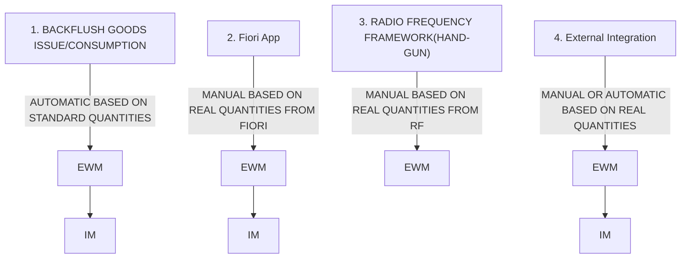

<!-- labels read from the image via tesseract -->

1. BACKFLUSH GOODS ISSUE/CONSUMPTION

| 3. RADIO FREQUENCY FRAMEWORK(HAND-GUN)

e AUTOMATIC BASED ON STANDARD QUANTITIES

e MANUAL BASED ON REAL QUANTITIES FROM RF

Confirm Production Order Operation

_ Ee

1063900 ned Produc

[sx ]

Cc my Eq

ewe ew eee ee ee eee eee 2. Fiori App

KH KH

(Fi Logo ee ew ew ew ew ew ew ee eK Toe

4. External Integration e MANUAL OR AUTOMATIC BASED ON REAL QUANTITIES

e MANUAL BASED ON REAL QUANTITIES FROM FIORI

SAP

by Prodection Warehowse

Post Consum ption

eG» GY

Ba ge

Post Goods Move-

te MOE,

SOLVAY

# Workshop Agenda

Product and Production Master Data

Consumption for production

# L3 Chemical Core Process Flow Diagram  Process Order integration with EWM

Consumption for production

Backflush consumption	

Manual consumption 	

Consumption triggered by MES

Perform Manual consumption per process order

MES or external system

Process order

confirmation 

Stock available in PSA

Stock available in PSA

Confirmation update in EWM

Goods movement update in S/4 HANA

Goods movement update in S/4 HANA

API

Stock available in PSA

1. /SCWM/MFG\_CONSUME\_ITEMS\_EXT

2. /SCWM/MFG\_REVERSE\_ITEMS\_EXT

3. /SCWM/MFG\_CONSUME\_HU\_EXT

4. /SCWM/MFG\_REVERSE\_HU\_EXT

5. /SCWM/MFG\_READ\_STOCK\_EXT

6. /SCWM/MFG\_STAGE\_EXT

Auto consumption of components

Process order update

Process order

confirmation 

EWM/IM

*Custom development

EWM

EWM/IM

# L3 Chemical Core Process Flow Diagram  Process Order integration with EWM

Consumption for production

Backflush consumption	

Manual consumption	

Consumption triggered by MES

Perform Manual consumption per process order

MES or external system

Process order

confirmation 

Stock available in PSA

Stock available in PSA

Confirmation update in EWM

Goods movement update in S/4 HANA

Goods movement update in S/4 HANA

API

Stock available in PSA

1. /SCWM/MFG\_CONSUME\_ITEMS\_EXT

2. /SCWM/MFG\_REVERSE\_ITEMS\_EXT

3. /SCWM/MFG\_CONSUME\_HU\_EXT

4. /SCWM/MFG\_REVERSE\_HU\_EXT

5. /SCWM/MFG\_READ\_STOCK\_EXT

6. /SCWM/MFG\_STAGE\_EXT

Auto consumption of components

Process order update

Process order

confirmation 

EWM/IM

*Custom development

EWM

EWM/IM

# L3 Chemical Core Process Flow Diagram  Process Order integration with EWM

Consumption for production

RF/Fiori

Stock available in PSA

Goto path: 

03-Outbound process 

05-Consumption

01-Consumption by MO

App: Consumption for production

Process order update

Enter process order number

Goods movement(261) update in process order

Scan/Enter the HU/Prod 

Scan/Enter the qty to be consumed(Full/partial)-Next

Consumption posted

# L4 Documentation &amp; Actions

FIT/GAPs:

|   N° | Fit/GAP   | Description   |
|------|-----------|---------------|
|    1 |           |               |
|      |           |               |

Action:

| N°   | Description   | Owner   | Due Date   | Next steps   |
|------|---------------|---------|------------|--------------|
|      |               |         |            |              |
|      |               |         |            |              |

# Confirm Process Order Operation/Phase  - M-100-010  

This process involves confirming the completion of specific operations or phases within a process order. It includes recording the actual time taken, quantities produced, and any deviations from the planned activities. It is used to monitor the progress of process orders. Using order confirmation,  we can  automatically issue goods (backflushing).

<!-- Flow read from the image by the local vision model. DRAFT -- on this corpus it recovers about half the arrows and about a third of the arrows it draws are wrong, so check every one against the image before relying on it. The box labels below are read by OCR and are reliable. -->

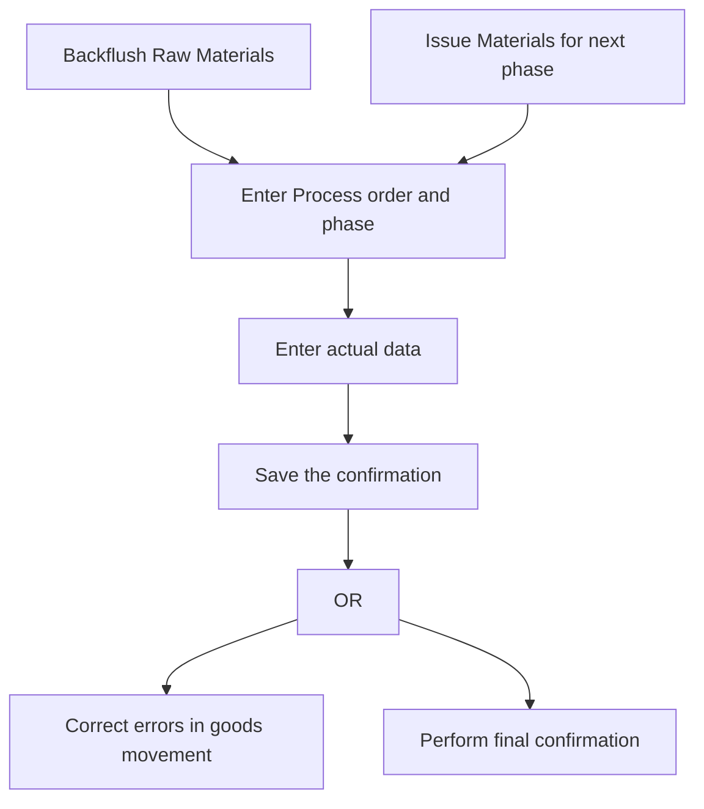

<!-- labels read from the image via tesseract -->

M-100-010-040

Perform in-

Backflush Raw

Materials

process inspection

M-100-010-010

M-100-010-020

M-100-010-030

Issue Materials for next phase

Enter Process order and phase

Enter actual data

Save the confirmation

OR

Correct errors in goods movement

Perform final

confirmation

# Confirm Process Order Operation/Phase 

<!-- image41.png read by Qwen3-VL (local vision model) -->

12:45

French Pastries
PDF reader

English
French

FRENCH PASTRIES

Macarons are delicate French pastries known for their crisp shell and soft, chewy interior. These colorful treats are often filled with butter cream, ganache, or jam.

Each macaron consists of two meringue-based cookies sandwiched together, creating a perfect balance of texture and flavor.

CHAPTER ONE
CHAPTER TWO

<!-- image46.png read by Qwen3-VL (local vision model) -->

SAP Enter Time Ticket for Process Order

Menu ▼ Other Confirmation Goods Movements Actual Data

Order: 200007374 Material: 11000820220D
Material Desc.: VERSAFLEX™ G2718 N
Phase: 0120 production
Resource: US3 / Plant: 1005 US Line 3
Confirm.type: Automatic final confirmation ▼ Clear open reservations

Qty/Runtime Variance

| To Be Confirmed | Unit | Σ Conf. to Date | Σ Pl. t/b Conf. | Unit |
|-----------------|------|-----------------|-----------------|------|
| Yield:          |      | 0               | 10.200 KG       |      |
| Scrap:          |      | 0               | 0.000           |      |
| Reason for Var.:|      |                 |                 |      |

Activities

| Activity   | To Be Conf. | Unit | R | Σ Conf. to Date | Σ Pl. t/b Conf. | Unit |
|------------|-------------|------|---|-----------------|-----------------|------|
| Change Over|             |      |   | 0.000           | 0.0             | HR   |
| Runtime    |             |      |   | 0.000           | 0.15            | HR   |

Save Enter Cancel

Enter Order &amp; Phase details &amp; then click on Goods Movement 

# Reject Component -  M-100-240  

This process involves rejecting the component materials. This ensures that the production process doesn’t consume components which are not required.

<!-- Flow read from the image by the local vision model. DRAFT -- on this corpus it recovers about half the arrows and about a third of the arrows it draws are wrong, so check every one against the image before relying on it. The box labels below are read by OCR and are reliable. -->

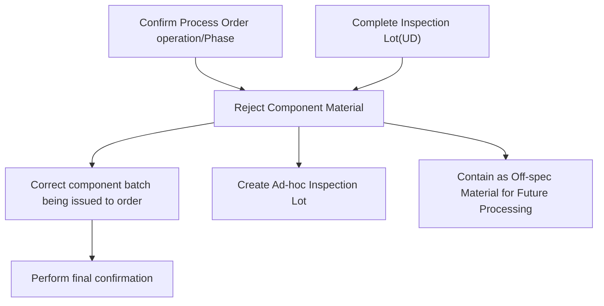

<!-- labels read from the image via tesseract -->

M-100-240-010

M-100-240-020

Confirm Process Order operation/Phase

Reject Component Material

Correct component batch being issued to order

Perform final confirmation

Complete Inspection Lot(UD)

Create Ad-hoc Inspection Lot

Contain as Off- spec Material for Future Processing

# Illustration to Reject Components

<!-- OCR of image70.png via tesseract, mean confidence 84.9 -->

< French Pastries

*# @

@

English

French

FRENCH

PASTRIES

Macarons are delicate French pastries known for their crisp shell and soft, chewy interior. These colorful treats are often filled with butter cream, ganache, or jam.

Wee

Each macaron consists of two meringue-based cookies sandwiched together, creating a perfect balance of texture and flavor.

aed ~~

poe

Gara)

ater. oe a

<!-- image54.png read by Qwen3-VL (local vision model) -->

SAP Manage Process Orders

Standard

Orders by Processing Status

| Delay in End | Delay in Release | Delay in Operation |
|--------------|------------------|--------------------|
| 80           | 34               | 9                  |

Orders by Quality Status

| Without Quality Issue | With Quality Issue |
|------------------------|--------------------|
| 103                   | 26                 |

Orders by Component Availability Status

| Not Checked | Missing |
|-------------|---------|
| 108         | 21      |

Orders by Quantity Issues

| Without Quantity Issue | With Quantity Issue |
|------------------------|---------------------|
| 114                   | 15                  |

Adapt Filters (2) Go

Process Orders (129)

| | Order | Material | Quantity | Scheduled Start Date | Scheduled End Date | Status | Operations in Progress | Issues |
|---|---|---|---|---|---|---|---|---|
| | 1000360 | SG24 | 1.000 CCM | 03.03.2020 12:00:00 AM | 03.03.2020 06:00:00 AM | Released | 0010 | Operation 1 |
| | 1001298 | SG24 | 1.000 CCM | 03.03.2020 12:00:00 AM | 03.03.2020 06:05:01 AM | Released | 0010 | Operation 10 |
| | 1002020 | AS_PROCESS_MILK_A | 1,000.000 L | 03.03.2020 12:00:00 AM | 03.03.2020 11:59:59 PM | Partially delivered | 0030 | |
| | 1005191 | SG2_CP | 1,000.000 CCM | 03.03.2020 01:45:00 PM | 03.03.2020 04:00:00 PM | Released | 0010 | Mixing Operation |
| | 1005335 | RB-FG29 | 12.000 BT | 03.03.2020 11:59:59 PM | 03.03.2020 11:59:59 PM | Confirmed | 0010 | |
| | 1005671 | SG2200 | 10,000.000 KG | 27.02.2020 06:00:00 AM | 03.03.2020 10:00:00 AM | Partially confirmed | 0050 | Drying |
| | 1005681 | SG2200 | 10,000.000 KG | 27.02.2020 06:00:00 AM | 03.03.2020 10:00:00 AM | Delivered | | |

Switch to Search

# Illustration to Reject Components

<!-- OCR of image28.png via tesseract, mean confidence 84.9 -->

< French Pastries

*# @

@

English

French

FRENCH

PASTRIES

Macarons are delicate French pastries known for their crisp shell and soft, chewy interior. These colorful treats are often filled with butter cream, ganache, or jam.

Wee

Each macaron consists of two meringue-based cookies sandwiched together, creating a perfect balance of texture and flavor.

aed ~~

poe

Gara)

ater. oe a

<!-- image65.png read by Qwen3-VL (local vision model) -->

SAP Manage Process Orders

Standard*

| Search | Order: | Product: | Plant: | Order Type: | MRP Controller: | Production Supervisor: |
|---|---|---|---|---|---|---|
| | | | | | | |

Status: Created X

Scheduled Start Date:  
Scheduled End Date:  
Processing Status:  
Quality Status:  
Component Availability Status:  
Quantity Status:  

Go Adapt Filters (1)

Process Orders (188)

| Edit Order | Check Components | Release | Confirm Order | Technically Complete | Logs |  |  |  |  |
|---|---|---|---|---|---|---|---|---|---|

|  | Order | Product | Quantity | Scheduled Start | Scheduled End | Status | Issues |  |
|---|---|---|---|---|---|---|---|---|
|  | 1000301 | 201<br>CHEMICAL REFINED BASE OIL | 300.000 L | Fri, Mar 8, 2024, 00:00 | Fri, Mar 8, 2024, 00:00 | Created |  |  |
|  | 1000302 | 201<br>CHEMICAL REFINED BASE OIL | 100.000 L | Sun, Mar 10, 2024, 00:00 | Sun, Mar 10, 2024, 00:00 | Created |  |  |
|  | 1000403 | 90000130<br>Chemical Product-MTS | 10 EA | Thu, Apr 18, 2024, 00:00 | Thu, Apr 18, 2024, 00:00 | Created |  |  |
|  | 1000404 | 90000130<br>Chemical Product-MTS | 10 EA | Thu, Apr 18, 2024, 00:00 | Thu, Apr 18, 2024, 00:00 | Created |  |  |
|  | 1000405 | 90000130<br>Chemical Product-MTS | 10 EA | Thu, Apr 18, 2024, 00:00 | Thu, Apr 18, 2024, 00:00 | Created |  |  |
|  | 1000426 | 90000130<br>Chemical Product-MTS | 10 EA | Thu, Apr 18, 2024, 00:00 | Thu, Apr 18, 2024, 00:00 | Created |  |  |
|  | 1000414 | 201<br>CHEMICAL REFINED BASE OIL | 1,000.000 L | Fri, Apr 26, 2024, 00:00 | Fri, Apr 26, 2024, 00:00 | Created |  |  |
|  | 1000418 | 90000186 | 5.000 |  |  |  |  |  |

# Illustration to Reject Components

<!-- OCR of image28.png via tesseract, mean confidence 84.9 -->

< French Pastries

*# @

@

English

French

FRENCH

PASTRIES

Macarons are delicate French pastries known for their crisp shell and soft, chewy interior. These colorful treats are often filled with butter cream, ganache, or jam.

Wee

Each macaron consists of two meringue-based cookies sandwiched together, creating a perfect balance of texture and flavor.

aed ~~

poe

Gara)

ater. oe a

<!-- OCR of image69.png via tesseract, mean confidence 90.2 -->

SAP4

<

Change Process Order: Header - General Data ~

Menuv

| Release

Scheduling of Order

Determine Costs

Material

Capacity | | Operations

Material List

XSteps

Services for Object v

=} Print

Exit

Process Order: 1000403

(7

Type: YBM2

Material: 90000130

Chemical Product-MTS

Plant: OCO1

System Status: CRTD PRC BCRQ MACM SETC

General Data

Assignment

Goods Receipt

Control

Dates/Quantities

Master Data

Administr.

Items

SAP Event Mgmt

Quantities

* Total Qty:

EA

Short/Exc. Rec.: 0

Scrap

0.00

%

Delivered

Dates/Times

Basic Dates

Confirmed

Scheduled

End 18.04.2024

24:00:00

18.04.2024

00:00:00

Start 18.04.2024

00:00:00

18.04.2024

00:00:00

00:00:00

Release: 18.04.2024

Scheduling

Floats

* Type Forwards

Sched. Margin Key:

Reduction : No reduction carried out

Float before prod.:

Workdays

# Illustration to Reject Component via Manage Process Order App

<!-- OCR of image70.png via tesseract, mean confidence 84.9 -->

< French Pastries

*# @

@

English

French

FRENCH

PASTRIES

Macarons are delicate French pastries known for their crisp shell and soft, chewy interior. These colorful treats are often filled with butter cream, ganache, or jam.

Wee

Each macaron consists of two meringue-based cookies sandwiched together, creating a perfect balance of texture and flavor.

aed ~~

poe

Gara)

ater. oe a

<!-- image57.png read by Qwen3-VL (local vision model) -->

SAP Change Process Order: Material List

Menu ▼ Scheduling of Order Determine Costs Generate Control Recipe Material Capacity WM Material Staging Header Operations Material Quantity Calculation Services for Object ▼

Process Order: 1000041

Material: 90000131 Motor Cycle Oil

Type: YBM2

Plant: OC01

Entry: 1 of: 3

Material List Delete Material

| Item | Material | Material Description | Lo... | Requirement Quantity | Un... | Ite... | Re... | Stor... | Req. Segment | Stock Segment | Batch |
| :--- | :--- | :--- | :--- | :--- | :--- | :--- | :--- | :--- | :--- | :--- | :--- |
| 0010 | 10000070 | Chemical Component - Base 1 |  | 970.000 | L | L | X | OCST |  |  | 0000000032 |
| 0020 | 10000071 | Chemical Component - Bulk Add... |  | 25.000 | L | L | X | OCST |  |  | 0000000033 |
| 0030 | 10000072 | Chemical Component |  | 5.000 | L | L | X | OCIN |  |  | 0000000034 |
| 0040 |  |  |  |  |  |  | X |  |  |  |  |

Select the material check box and click on Delete Material button

# Workshop Agenda

Manufacturing Execution in SAP Packaged Process Orders and EWM Production Integration

1. Process Order creation and release
2. Staging for production with EWM
3. Manage BOM inventory
4. Execution of operations plan
5. Production receipt of bulk/Production receipt of packed product
6. Material quantities reconciliation
7. Production receipt of packed product
8. Defective production management
9. System Demo

# Perform Final Confirmation -  M-100-040  

# 

This process involves performing final confirmation after production based on the batch number from the production order or automatically.

<!-- Flow read from the image by the local vision model. DRAFT -- on this corpus it recovers about half the arrows and about a third of the arrows it draws are wrong, so check every one against the image before relying on it. The box labels below are read by OCR and are reliable. -->

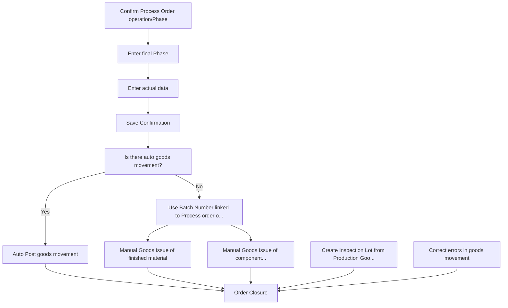

<!-- labels read from the image via tesseract -->

Correct errors in

goods movement

Is there auto goods

movement?

M-100-040-010

00-040-020

M

0-040-4

Is there auto...

Y ac

M-100-040-050

Confirm Process

> Save

Auto Post goods

Order

Enter final Phase

Enter actual data

Confirmation

movement

operation/Phase

No

M-100-( N40 J -0 8)

M-100-040-060

M-100-070

Use Batch

Manual Goods

Number linked to

Issue of finished

Order Closure

Process order o...

material

M-100-040 U U )

M-130-050

7

Manual Goods

Create Inspection Lot from

Issue of

component...

Production Goo...

# Illustration to Perform Final Confirmation via Confirm Process Order Phase

<!-- OCR of image70.png via tesseract, mean confidence 84.9 -->

< French Pastries

*# @

@

English

French

FRENCH

PASTRIES

Macarons are delicate French pastries known for their crisp shell and soft, chewy interior. These colorful treats are often filled with butter cream, ganache, or jam.

Wee

Each macaron consists of two meringue-based cookies sandwiched together, creating a perfect balance of texture and flavor.

aed ~~

poe

Gara)

ater. oe a

<!-- image56.png read by Qwen3-VL (local vision model) -->

# Enter Time Ticket for Process Order

**Menu** ▼

**Other Confirmation** | **Goods Movements** | **Actual Data**

---

**Order:** 200007367

**Material:** 11000820190D

**Material Descr.:** VERSAFLEX™ G2705 N *'@#5%&8(0_+=[{">*

---

**Phase:** 0110

**Resource:** US7 / 

**Plant:** 1005 US Line 7

**Confirm.type:** Automatic final confirmation ▼

**Clear open reservations** □

---

## Qty/Runtime Variance

| To Be Confirmed | Unit | Σ Conf. to Date | Σ Pl. t/b Conf. | Unit |
|-----------------|------|-----------------|-----------------|------|
| Yield:          |      | 0               | 17.600 KG       |      |
| Scrap:          |      | 0               | 0.000           |      |
| Reason for Var.:|      |                 |                 |      |

---

## Activities

| Activity     | To Be Conf. | Unit | R | Σ Conf. to Date | Σ Pl. t/b Conf. | Unit |
|--------------|-------------|------|---|-----------------|-----------------|------|
| Change Over  |             |      |   | 1.000           | 1.0             | HR   |
| Runtime      |             |      |   | 2.000           | 2.0             | HR   |

---

**Save** | **Enter** | **Cancel**

Enter Order details then click on Goods Movement

# Illustration to Perform Final Confirmation via Confirm Process Order Phase

<!-- OCR of image70.png via tesseract, mean confidence 84.9 -->

< French Pastries

*# @

@

English

French

FRENCH

PASTRIES

Macarons are delicate French pastries known for their crisp shell and soft, chewy interior. These colorful treats are often filled with butter cream, ganache, or jam.

Wee

Each macaron consists of two meringue-based cookies sandwiched together, creating a perfect balance of texture and flavor.

aed ~~

poe

Gara)

ater. oe a

<!-- image63.png read by Qwen3-VL (local vision model) -->

SAP Enter Confirmation for Production Order: Goods Movements

Menu ▼

Process Order: 200007367 Plant: 1005 Status: PCNF REL

Material: 11000820190D

Material Descr.: VERSAFLEX™ G2705 N *!@#$%^&()_+-={}|"<>"

Phase: 0310

Confirmation: 51590 Resource: QC_CHECK

Batch Determination Stock Determination

Entry:

Goods Movements Overview

| Material | Quantity | Un... | Plant | Loc... | Req. Segment | Stock Segment | Batch | Valuation Type | De... | M... | S... | Supplier | War... | EWM Storage Bin |
|----------|----------|-------|-------|--------|--------------|---------------|-------|----------------|-------|-------|-------|----------|---------|-----------------|
| 11000820190D | 1 | KG | 1005 | FLR |  |  | 1000032128 | S | 101 |  |  |  | 1005 | GR-ZONE |

Post goods movements

Post Enter Cancel

Material Number, Batch, Movement Type, Warehouse details are auto populated.

Enter Quantity, UoM, Receiving Storage Location, etc. as required, then click on Post.

<!-- OCR of image55.png via tesseract, mean confidence 96.4 -->

Confirmation saved (Goods movements: 1, failed: 0) View Details

Success message will be displayed on bottom right corner after posting the goods movement

# Workshop Agenda

Manufacturing Execution in SAP Packaged Process Orders and EWM Production Integration

1. Process Order creation and release
2. Staging for production with EWM
3. Manage BOM inventory
4. Execution of operations plan
5. Production receipt of bulk/Production receipt of packed product
6. Material quantities reconciliation
7. Production receipt of packed product
8. Defective production management
9. System Demo

# Illustration to COGI Errors  - 

# Postprocessing of Error Records from Automatic Goods Movements

# 

<!-- image59.png read by Qwen3-VL (local vision model) -->

| Stat. | Material | Material Description | Plant | Loc. | Batch | MvT | Qty in UEn | UEn | ID | Msg. | Created On | Erase Date | Nu.. | PuM Entry Quantity | PU.. |
|---|---|---|---|---|---|---|---|---|---|---|---|---|---|---|---|
| 10000070 | Chemical Component - Base 1 | OC01 | OCST | 000000062 | 261 | 97.000 | L | M7 | 184 | 21.07.2023 | 21.07.2023 | 1 | | | |
| 10000071 | Chemical Component - Bulk Additive | OC01 | OCST | 000000063 | 261 | 2.500 | L | M7 | 184 | 21.07.2023 | 21.07.2023 | 1 | | | |
| 10000072 | Chemical Component | OC01 | OCIN | 000000034 | 261 | 0.500 | L | M7 | 184 | 11.09.2023 | 11.09.2023 | 1 | | | |
| 10000070 | Chemical Component - Base 1 | OC01 | OCST | 000000032 | 261 | 97.000 | L | M7 | 184 | 11.09.2023 | 11.09.2023 | 1 | | | |
| 10000071 | Chemical Component - Bulk Additive | OC01 | OCST | 000000033 | 261 | 2.500 | L | M7 | 184 | 11.09.2023 | 11.09.2023 | 1 | | | |
| 10000070 | Chemical Component - Base 1 | OC01 | OCST | 000000032 | 261 | 320.000 | L | M7 | 018 | 12.09.2023 | 12.09.2023 | 1 | | | |
| 10000101 | Chemical Component - Base 1 | OC01 | OCST | 000000062 | 261 | 3.480.000 | L | M7 | 018 | 01.11.2023 | 01.11.2023 | 3 | | | |
| 10000101 | Chemical Component - Base 1 | OC01 | OC | 000000062 | 261 | 110.000 | L | VL | 295 | 13.03.2024 | 13.03.2024 | 1 | | | |
| 10000070 | Chemical Component - Base 1 | OC01 | OC | 000000062 | 261 | 3.000.000 | L | VL | 295 | 13.03.2024 | 13.03.2024 | 3 | | | |
| 10000072 | Chemical Component - Base 1 | OC01 | OC | 000000246 | 261 | 33.000 | L | VL | 295 | 21.03.2024 | 21.03.2024 | 3 | | | |
| 10000070 | Chemical Component - Base 1 | OC01 | OC | 000000245 | 261 | 1.200 | L | VL | 295 | 21.03.2024 | 21.03.2024 | 4 | | | |
| 10000070 | Chemical Component - Base 1 | OC01 | OC | 000000217 | 261 | 11.000 | L | VL | 295 | 22.03.2024 | 22.03.2024 | 1 | | | |
| 10000070 | Chemical Component - Base 1 | OC01 | OC | 000000062 | 261 | 16.000 | L | VL | 295 | 22.03.2024 | 22.03.2024 | 2 | | | |
| 10000070 | Chemical Component - Base 1 | OC01 | OC | 000000062 | 261 | 13.200 | L | VL | 295 | 22.03.2024 | 22.03.2024 | 1 | | | |
| 10000070 | Chemical Component - Base 1 | OC01 | OC | 000000165 | 261 | 11.000 | L | VL | 295 | 22.03.2024 | 22.03.2024 | 1 | | | |
| 10000070 | Chemical Component - Base 1 | OC01 | OC | 000000246 | 261 | 11.000 | L | VL | 295 | 27.03.2024 | 27.03.2024 | 1 | | | |
| 10000070 | Chemical Component - Base 1 | OC01 | OC | 000000246 | 261 | 77.000 | L | VL | 561 | 27.03.2024 | 27.03.2024 | 7 | | | |
| 10000070 | Chemical Component - Base 1 | OC01 | OC | 000000062 | 261 | 11.000 | L | VL | 561 | 27.03.2024 | 27.03.2024 | 1 | | | |
| 10000072 | Chemical Component | OC01 | OC | 000000034 | 261 | 0.300 | L | VL | 561 | 27.03.2024 | 27.03.2024 | 2 | | | |
| 10000072 | Chemical Component | OC01 | OC | 000000245 | 261 | 1.800 | L | VL | 561 | 27.03.2024 | 27.03.2024 | 3 | | | |
| 10000070 | Chemical Component - Base 1 | OC01 | OC | 000000216 | 261 | 18.000 | L | VL | 561 | 27.03.2024 | 27.03.2024 | 6 | | | |
| 10000070 | Chemical Component - Base 1 | OC01 | OC | 000000017 | 261 | 0.600 | L | VL | 561 | 27.03.2024 | 27.03.2024 | 2 | | | |
| 227 | Benzene | OC01 | OC | 000000378 | 261 | 11.000 | L | VL | 295 | 19.04.2024 | 19.04.2024 | 2 | | | |
| 228 | Propylene | OC01 | OC | 000000377 | 261 | 11.000 | L | VL | 295 | 19.04.2024 | 19.04.2024 | 2 | | | |
| 231 | Acetone Bulk | OC01 | OC | 000000346 | 261 | 100.000 | L | VL | 513 | 23.04.2024 | 23.04.2024 | 1 | | | |
| 239 | Drum 200 L | OC01 | OC | 000000062 | 261 | 1 | EA | L9 | 513 | 23.04.2024 | 23.04.2024 | 1 | | | |
| 182 | Full Synthetic 5W-20 (Bulk) | OC01 | OCFG | 000000062 | 101 | 1 | EA | M7 | 022 | 01.08.2024 | 01.08.2024 | 1 | | | |
| 395 | LABSA 96% 210 KG Drum | OC01 | OC | 000000773 | 101 | 1 | EA | /SP... | 012 | 06.12.2025 | 06.12.2025 | 1 | | | |
| 227 | Benzene | OC01 | OC | 000000062 | 261 | 6.667 | L | VL | 012 | 13.06.2025 | 13.06.2025 | 1 | | | |

COGI in SAP is used to manage and correct errors from failed automatic goods movements during production, such as backflushing. When a posting fails, the error is logged in COGI, allowing users to review, fix, and reprocess the movement. This ensures production and inventory data remain accurate.

# Illustration to COGI Errors  - 

# Postprocessing of Error Records from Automatic Goods Movements

# 

<!-- no readable text in image66.png (OCR confidence 62.9) -->

1.Access COGI 

2.View Error List.

3.Analyze Error Details.

4.Correct the Error.

5.Reprocess the error.

<!-- image61.png read by Qwen3-VL (local vision model) -->

SAP 17.06.2025 Goods Movements with Errors: Summarized Records

Menu ▼ Change details Refresh Delete Display errors Individual Records Stock Material

| Status | Material | Material Description | Plant | Loca... | Batch | M/T | Qty in UnE | EUn | AppAr | Msg. | Created On |
|---|---|---|---|---|---|---|---|---|---|---|---|
| 227 | Benzene | OC01 | OCW1 | 261 | 33.334 L | /SPE/... | 012 | 17.06.2025 |

# Workshop Agenda

Manufacturing Execution in SAP Packaged Process Orders and EWM Production Integration

1. Process Order creation and release
2. Staging for production with EWM
3. Manage BOM inventory
4. Execution of operations plan
5. Production receipt of bulk/Production receipt of packed product
6. Material quantities reconciliation
7. Production receipt of packed product
8. Defective production management
9. System Demo

# Objective of the Session

 

Approach for the workshop: 

1. Quick recap on P2P integration with EWM models (Process manufacturing)
2. End to End process flow including staging, consumption and production receipt
3. Detailed discussion on each L4’s

1. Master data objects : Production supply area, Control cycles, assignment of production supply area to warehouse bin
2. Bulk and Finished goods - Process manufacturing with EWM integration
3. Identify gaps in standard process

<!-- OCR of image31.png via tesseract, mean confidence 82.7 -->

| | Level 4 processes 8.1.3 Production Integration

Level 3

# L3 Chemical Core Process Flow Diagram  Recap Process Order integration with EWM

Production receipt or goods receipt from production process flow

<!-- Flow read from the image by the local vision model. DRAFT -- on this corpus it recovers about half the arrows and about a third of the arrows it draws are wrong, so check every one against the image before relying on it. The box labels below are read by OCR and are reliable. -->

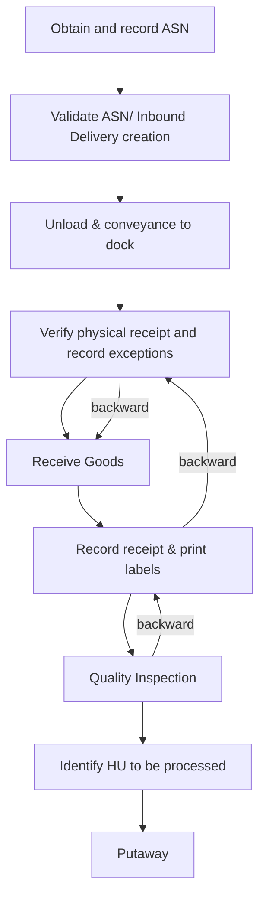

<!-- labels read from the image via tesseract -->

pee oe oe ae oe oe oe oe

ee ee ee ee se

Validate ASN/ Inbound Delivery creation

Unload & Verify physical receipt conveyance to dock and record exceptions

Identify HU to be processed

Putaway

Se Oe OS OS OS OS OO

Receive Goods

Record receipt & print labels

Quality Inspection

Obtain and record ASN

<!-- no readable text in image77.png (OCR confidence 0.0) -->

<!-- OCR of image64.png via tesseract, mean confidence 95.4 -->

©

<!-- no readable text in image72.png (OCR confidence 0.0) -->

<!-- no readable text in image67.png (OCR confidence 0.0) -->

<!-- no readable text in image71.png (OCR confidence 0.0) -->

<!-- no readable text in image89.png (OCR confidence 0.0) -->

<!-- no readable text in image88.png (OCR confidence 0.0) -->

<!-- OCR of image75.png via tesseract, mean confidence 95.6 -->

Inbound Delivery creation

<!-- OCR of image74.png via tesseract, mean confidence 95.6 -->

print labels

Automatic

Automatic

<!-- no readable text in image73.png (OCR confidence 0.0) -->

<!-- no readable text in image78.png (OCR confidence 40.6) -->

<!-- image -->

<!-- image -->

packing based on packaging specification 

Automatic

# Workshop Agenda

Product and Production Master Data

Goods receipt from production (or)

Production receipt

# L3 Chemical Core Process Flow Diagram  Process Order integration with EWM

Production receipt or goods receipt from production

Auto Post Goods Receipt against Process Order

Manual Post Goods Receipt against Process Order

Process order

confirmation 

Auto GR at operation confirmation

Process order

confirmation 

Manual GR posting from MIGO against process order

Inbound delivery auto created

Inbound delivery auto created

Goods movement update in S/4 HANA

Goods movement update in S/4 HANA

Inbound delivery in EWM against process order

Packing in Handling units and labels

Inbound delivery in EWM against process order

Packing in Handling units and labels

Post goods receipt

Post goods receipt

Quality management after receipt

Putaway execution

Putaway location determination

Quality management after receipt

Putaway execution

Putaway location determination

# L3 Chemical Core Process Flow Diagram  Process Order integration with EWM

Production receipt or goods receipt from production

Auto Post Goods Receipt against Process Order

Manual Post Goods Receipt against Process Order

Process order

confirmation 

Auto GR at operation confirmation

Process order

confirmation 

Manual GR posting from MIGO against process order

Inbound delivery auto created

Inbound delivery auto created

Goods movement update in S/4 HANA

Goods movement update in S/4 HANA

Inbound delivery in EWM against process order

Packing in Handling units and labels

Inbound delivery in EWM against process order

Packing in Handling units and labels

Record exceptions &amp; Post goods receipt

Record exceptions &amp; Post goods receipt

Quality management after receipt

Putaway execution

Putaway location determination

Quality management after receipt

Putaway execution

Putaway location determination

# L3 Chemical Core Process Flow Diagram  Process Order integration with EWM

Packing in Handling units using packaging specification  Automatic packing

A packaging specification is master data. The packaging specification defines all the necessary packing levels for a product in order, for example, to put away or transport the product. 

For a product, a packaging specification mainly describes in which quantities you can pack the product into which packaging materials in which sequence.

<!-- image80.png read by Qwen3-VL (local vision model) -->

# PACKAGING SPECIFICATION

## HEADER

### CONTENTS

- PRODUCT
  - or
  - Packaging Specification

---

### LEVEL 1: AUX PACKAGING

- **Element Group-1**
  - **Element 1**: Pack Mat. Work Step
    - 
    - 

---

### LEVEL 2: CARTON PACKAGING

- **Element Group-2**
  - **Element 2**: Pack Mat. Work Step
    - 
    - 

---

### LEVEL 3: PALLET PACKAGING

- **Element Group-3**
  - **Element 3**: Pack Mat. Work Step
    - 
    - 

# L4 Documentation &amp; Actions

FIT/GAPs:

|   N° | Fit/GAP   | Description   |
|------|-----------|---------------|
|    1 |           |               |
|      |           |               |

Action:

| N°   | Description   | Owner   | Due Date   | Next steps   |
|------|---------------|---------|------------|--------------|
|      |               |         |            |              |
|      |               |         |            |              |

# L3 Chemical Core Process Flow Diagram  Process Order integration with EWM

Production receipt or goods receipt from production

Auto Post Goods Receipt against Process Order

Manual Post Goods Receipt against Process Order

Process order

confirmation 

Auto GR at operation confirmation

Process order

confirmation 

Manual GR posting from MIGO against process order

Inbound delivery auto created

Inbound delivery auto created

Goods movement update in S/4 HANA

Goods movement update in S/4 HANA

Inbound delivery in EWM against process order

Packing in Handling units and labels

Inbound delivery in EWM against process order

Packing in Handling units and labels

Record exceptions &amp; Post goods receipt

Record exceptions &amp; Post goods receipt

Quality management after receipt

Putaway execution

Putaway location determination

Quality management after receipt

Putaway execution

Putaway location determination

# L3 Chemical Core Process Flow Diagram  Process Order integration with EWM

Records exception &amp; post goods receipt

EDI/Manual

Update Inbound delivery quantity

Notify production facility of the discrepancy

Yes

If required, Physical receipt and records exceptions

Damaged/Missing?

Verify or correct packing list

No

Determine quality requirements

Receive goods

Process order update

Determine Putaway requirements

Goods movement(101) update

# L3 Chemical Core Process Flow Diagram  Process Order integration with EWM

Records exception &amp; post goods receipt

EDI/Manual

Update Inbound delivery quantity

Notify production facility of the discrepancy

Yes

If required, Physical receipt and records exceptions

Damaged/Missing?

Verify or correct packing list

No

Determine quality requirements

Receive goods

Process order update

Determine Putaway requirements

Goods movement(101) update

# L4 Documentation &amp; Actions

FIT/GAPs:

|   N° | Fit/GAP   | Description   |
|------|-----------|---------------|
|    1 |           |               |
|      |           |               |

Action:

| N°   | Description   | Owner   | Due Date   | Next steps   |
|------|---------------|---------|------------|--------------|
|      |               |         |            |              |
|      |               |         |            |              |

# L3 Chemical Core Process Flow Diagram  Process Order integration with EWM

Production receipt or goods receipt from production

Auto Post Goods Receipt against Process Order

Manual Post Goods Receipt against Process Order

Process order

confirmation 

Auto GR at operation confirmation

Process order

confirmation 

Manual GR posting from MIGO against process order

Inbound delivery auto created

Inbound delivery auto created

Goods movement update in S/4 HANA

Goods movement update in S/4 HANA

Inbound delivery in EWM against process order

Packing in Handling units and labels

Inbound delivery in EWM against process order

Packing in Handling units and labels

Record exceptions &amp; Post goods receipt

Record exceptions &amp; Post goods receipt

Quality management after receipt

Putaway execution

Putaway location determination

Quality management after receipt

Putaway execution

Putaway location determination

# L3 Chemical Core Process Flow Diagram  Process Order integration with EWM

Putaway location determination

Quality requirements/Results

Putaway strategies/Rules

Confirm work instruction to direct receipt qty to primary location

Creates putaway warehouse tasks to direct material to primary location

Primary location available?

Yes

Identify Handling units to be processed

Post goods receipt

System creates a work instruction to direct the receipt qty to a primary location

No

Create work instruction to direct receipt qty to secondary or reserved location

Creates putaway warehouse tasks to direct material to secondary or reserved location

# L3 Chemical Core Process Flow Diagram  Process Order integration with EWM

Stock placement strategies

<!-- Flow read from the image by the local vision model. DRAFT -- on this corpus it recovers about half the arrows and about a third of the arrows it draws are wrong, so check every one against the image before relying on it. The box labels below are read by OCR and are reliable. -->

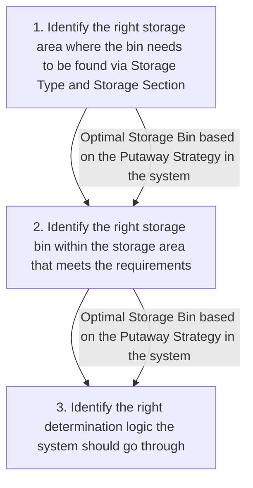

<!-- labels read from the image via tesseract -->

Optimal Storage Bin based on the Putaway Strategy in the system

|

2

3

Identify the right storage area where the bin needs to be found via Storage Type and Storage Section ee ee

Identify the right storage bin within the storage area that meets the requirements

Identify the right determination logic the system should go through

SI a

Ta te a a a Te a nnn

# L3 Chemical Core Process Flow Diagram  Process Order integration with EWM

Stock placement strategies

<!-- Flow read from the image by the local vision model. DRAFT -- on this corpus it recovers about half the arrows and about a third of the arrows it draws are wrong, so check every one against the image before relying on it. The box labels below are read by OCR and are reliable. -->

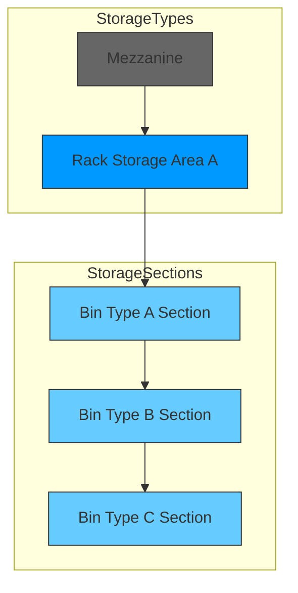

<!-- labels read from the image via tesseract -->

Sequence of Storage Type that the system needs to find a bin

STORAGE TYPES

STORAGE SECTIONS

Fast Moving Section

Bin Type A Section

Wit

torage Type Sequence

Medium Moving Section

Bin Type B Section

of storage section the

system needs 0 find a bin

Within the found storage section of the storage type, the system will find a bin that meets the requirements

Bin Type C Section

<!-- image94.png read by Qwen3-VL (local vision model) -->

1. Empty Bin
System only looks for empty bins

2. Addition to Existing Stock
System only looks for partially occupied bins
a. Mixed Stock allowed
b. Mixed Batches allowed

3. Empty Bin / Addition to Stock
System looks for empty bins and if none available, it looks for partially occupied bins
a. Standard Fixed Bin
b. Dynamic Fixed Bin
c. Near Fixed Bin

4. Manual
System determines the storage type and the operator the correct storage bin

5. General Storage
Only one storage bin for each section with mixed storage and addition to stock

6. Bulk Storage
System divides storage space in blocks and rows without capacity check

7. Pallet Storage
Available spots in an area determined by HU type of the pallet

<!-- image79.png read by Qwen3-VL (local vision model) -->

The system determines the right storage area search and right storage bin depending on:

- Warehouse
- Plant
- Stock Type
- Product
- Hazard Rating
- UoM
- Process

<!-- OCR of image90.png via tesseract, mean confidence 95.5 -->

1,

Identify the right storage area where the bin needs to be found via Storage Type and Storage Section

<!-- OCR of image85.png via tesseract, mean confidence 95.8 -->

2.

Identify the right storage bin within the storage area that meets the requirements

<!-- OCR of image76.png via tesseract, mean confidence 95.2 -->

3.

Identify the right determination logic the system should go through

# L4 Documentation &amp; Actions

FIT/GAPs:

|   N° | Fit/GAP   | Description   |
|------|-----------|---------------|
|    1 |           |               |
|      |           |               |

Action:

| N°   | Description   | Owner   | Due Date   | Next steps   |
|------|---------------|---------|------------|--------------|
|      |               |         |            |              |
|      |               |         |            |              |

# L3 Chemical Core Process Flow Diagram  Process Order integration with EWM

Production receipt or goods receipt from production

Auto Post Goods Receipt against Process Order

Manual Post Goods Receipt against Process Order

Process order

confirmation 

Auto GR at operation confirmation

Process order

confirmation 

Manual GR posting from MIGO against process order

Inbound delivery auto created

Inbound delivery auto created

Goods movement update in S/4 HANA

Goods movement update in S/4 HANA

Inbound delivery in EWM against process order

Packing in Handling units and labels

Inbound delivery in EWM against process order

Packing in Handling units and labels

Record exceptions &amp; Post goods receipt

Record exceptions &amp; Post goods receipt

Quality management after receipt

Putaway execution

Putaway location determination

Quality management after receipt

Putaway execution

Putaway location determination

# L3 Chemical Core Process Flow Diagram  Process Order integration with EWM

Putaway execution

Determine putaway requirements

Identify handling units to be processed

Review handling units warehouse tasks

Attach necessary documents to handling unit(If necessary)

Move Handling unit to the appropriate area as per the warehouse task

Update putaway completion in inbound delivery

# L3 Chemical Core Process Flow Diagram  Process Order integration with EWM

Putaway execution

<!-- OCR of image87.png via tesseract, mean confidence 73.5 -->

SARA

Inbound Clerk

S/4HANA

# L4 Documentation &amp; Actions

FIT/GAPs:

|   N° | Fit/GAP   | Description   |
|------|-----------|---------------|
|    1 |           |               |
|      |           |               |

Action:

| N°   | Description   | Owner   | Due Date   | Next steps   |
|------|---------------|---------|------------|--------------|
|      |               |         |            |              |
|      |               |         |            |              |

# L3 Chemical Core Process Flow Diagram  Process Order integration with EWM

Production receipt or goods receipt from production

Auto Post Goods Receipt against Process Order

Manual Post Goods Receipt against Process Order

Process order

confirmation 

Auto GR at operation confirmation

Process order

confirmation 

Manual GR posting from MIGO against process order

Inbound delivery auto created

Inbound delivery auto created

Goods movement update in S/4 HANA

Goods movement update in S/4 HANA

Inbound delivery in EWM against process order

Packing in Handling units and labels

Inbound delivery in EWM against process order

Packing in Handling units and labels

Record exceptions &amp; Post goods receipt

Record exceptions &amp; Post goods receipt

Quality management after receipt

Putaway execution

Putaway location determination

Quality management after receipt

Putaway execution

Putaway location determination

# L3 Chemical Core Process Flow Diagram  Process Order integration with EWM

Determine quality requirements

Create work instruction to direct HU to Quality hold area

Determine putaway requirements

Receive goods

Create work instruction to direct the portion of receipt quality hold area

# L4 Documentation &amp; Actions

FIT/GAPs:

|   N° | Fit/GAP   | Description   |
|------|-----------|---------------|
|    1 |           |               |
|      |           |               |

Action:

| N°   | Description   | Owner   | Due Date   | Next steps   |
|------|---------------|---------|------------|--------------|
|      |               |         |            |              |
|      |               |         |            |              |

# L3 Chemical Core Process Flow Diagram  Process Order integration with EWM

Return to stock from production

Process order

TECO

Plan Return to Stock from Production

Excess Stock available in PSA

Execute movement back to Stock

# L4 Documentation &amp; Actions

FIT/GAPs:

|   N° | Fit/GAP   | Description   |
|------|-----------|---------------|
|    1 |           |               |
|      |           |               |

Action:

| N°   | Description   | Owner   | Due Date   | Next steps   |
|------|---------------|---------|------------|--------------|
|      |               |         |            |              |
|      |               |         |            |              |

# L3 Chemical Core Process Flow Diagram  Process Order integration with EWM

Master data

Production supply area(PSA)

Control cycles

PSA assignment to PSA bin

You do not assign a storage bin to a production supply area (PSA) directly, instead you define the storage bin in which you want to stage a particular product or product group within a PSA.

Designated location on the shop floor where materials are staged for use in production.

The control cycle defines the relationship between the demand source and the supply source.

<!-- image86.png read by Qwen3-VL (local vision model) -->

| Plant | OC01 | Chemical - Plant (Mfg US) |
| --- | --- | --- |
| Supply Area | PSA01 | EWM PSA 1 |
| Storage Location | OC#2 | EWM Storage |
| Responsible |  |  |
| (Auto) Unloading Point |  |  |
| Unloading Point |  |  |
| Loading Point |  |  |
| Factory Calendar (Consumer) |  |  |
| Shift Grouping (Consumer) |  |  |
| Shift Sequence (Consumer) |  |  |
| Pull Interval [Days] |  |  |
| Pull Interval [h:min] |  |  |

<!-- image84.png read by Qwen3-VL (local vision model) -->

# Display Control Cycle 27: Data Screen (WM)

## Supply Area

| Control Cycle | |
| --- | --- |
| Material | B27 |
| Plant | OC01 Chemical - Plant (Mfg US) |
| Supply Area | PSA02 PSA02-OCW1-EWM |

## Control Cycle Data

| Number of Containers | 0 |
| --- | --- |
| Container Quantity | 0.000 L |
| Maximum Empty Containers | 0 |

## Destination

| Storage Location | OCW1 EWM FG |
| --- | --- |
| Warehouse Number | OC1 EWM: Chemical Industries |
| Staging Indicator | 5 EWM Staging |
| Storing Position | |

## Source

| Issuing Plant | OC01 Chemical - Plant (Mfg US) |
| --- | --- |
| Storage Location | OCW1 EWM FG |
| Warehouse Number | OC1 EWM: Chemical Industries |

## Destination Bin Assignment

| Warehouse Number | OC01 Warehouse Chemical Industries |
| --- | --- |
| Destination Bin | |
| Storage Type | |
| **Assign by Entitled/Product** | |

<!-- image82.png read by Qwen3-VL (local vision model) -->

# Change View "PSA Assignment to Bin by Entitled/Product": Det

| Warehouse No. | OC01 |
| --- | --- |
| Disposal Party | FOC01 Chemical - Plant (Mfg US) / Houston CA |
| Supply Area | PSA02 /OC01 PSA02- OCW1-EWM |
| Product Group |  |
| Product | 227 Benzene |

## PSA Assignment to Bin by Entitled/Product

| Storage Bin | PROD_STAG2 |
| --- | --- |
| Allow Multi. Bins |  |
| Stag. Det. Outb. |  |
| Staging Method | 2 Cross-Order Staging |
| MES-Relevant |  |
| Qty Calc. Type | 3 Calculation Based on PMRs |
| Qty Classific. |  |
| No. Containers | 0 |
| Min. No. Cont. | 0 |
| Replmt Qty | 0.000 |
| Min.Prd.Qty PSA |  |
| Unit |  |
| Staging WPT | ¥220 |
| Clear PSA WPT |  |

# Workshop Agenda

Manufacturing Execution in SAP Packaged Process Orders and EWM Production Integration

1. Process Order creation and release
2. Staging for production with EWM
3. Manage BOM inventory
4. Execution of operations plan
5. Production receipt of bulk/Production receipt of packed product
6. Material quantities reconciliation
7. Production receipt of packed product
8. Defective production management
9. System Demo

# Blend - M-140-120

The blend process in SAP PP-PI involves combining different materials to achieve the desired product specifications. This step ensures the quality and consistency of the final product.

<!-- OCR of image93.png via tesseract, mean confidence 93.7 -->

M-140-120-010

Determine Best Alternative for

Reclassify Material

Blend

Use of Off-spec...

Create Process

Orders

# Rework Material - M-140-030

The rework process in SAP PP-PI involves addressing off-spec materials by processing rework orders to bring them up to the required standards, ensuring minimal waste and optimized resource usage.

<!-- OCR of image98.png via tesseract, mean confidence 94.7 -->

M-140-030-010

Determine Best Alternative for

Process Rework

Reclassify Material

Use of Off-spec...

# Order Closure -  M-100-070  

This process involves recording the completion of all production activities associated with a process order &amp; marking it as Technically Complete. This denotes the end of production activities &amp; transfers the order to Finance team for Final Closure after their audit.

<!-- Flow read from the image by the local vision model. DRAFT -- on this corpus it recovers about half the arrows and about a third of the arrows it draws are wrong, so check every one against the image before relying on it. The box labels below are read by OCR and are reliable. -->

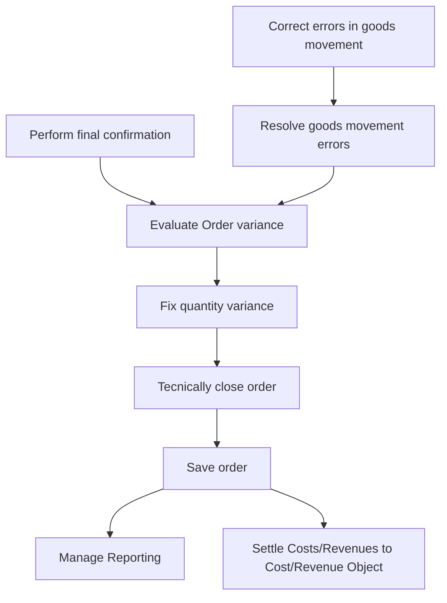

<!-- labels read from the image via tesseract -->

M-100-070-010

M-100-070-020

M-100-070-030

M-100-070-040

Perform final

Evaluate Order

Fix quantity variance

Technically close order

Manage Reporting

confirmation

variance

Save order

M-100-070-050

Settle

Correct errors in

Resolve goods movement errors

Costs/Revenues to Cost/Revenue Object

goods movement

# Illustration to Technically Complete Orders

<!-- OCR of image70.png via tesseract, mean confidence 84.9 -->

< French Pastries

*# @

@

English

French

FRENCH

PASTRIES

Macarons are delicate French pastries known for their crisp shell and soft, chewy interior. These colorful treats are often filled with butter cream, ganache, or jam.

Wee

Each macaron consists of two meringue-based cookies sandwiched together, creating a perfect balance of texture and flavor.

aed ~~

poe

Gara)

ater. oe a

<!-- image54.png read by Qwen3-VL (local vision model) -->

SAP Manage Process Orders

Standard

Orders by Processing Status

| Delay in End | Delay in Release | Delay in Operation |
|--------------|------------------|--------------------|
| 80           | 34               | 9                  |

Orders by Quality Status

| Without Quality Issue | With Quality Issue |
|------------------------|--------------------|
| 103                   | 26                 |

Orders by Component Availability Status

| Not Checked | Missing |
|-------------|---------|
| 108         | 21      |

Orders by Quantity Issues

| Without Quantity Issue | With Quantity Issue |
|------------------------|---------------------|
| 114                   | 15                  |

Adapt Filters (2) Go

Process Orders (129)

| | Order | Material | Quantity | Scheduled Start Date | Scheduled End Date | Status | Operations in Progress | Issues |
|---|---|---|---|---|---|---|---|---|
| | 1000360 | SG24 | 1.000 CCM | 03.03.2020 12:00:00 AM | 03.03.2020 06:00:00 AM | Released | 0010 | Operation 1 |
| | 1001298 | SG24 | 1.000 CCM | 03.03.2020 12:00:00 AM | 03.03.2020 06:05:01 AM | Released | 0010 | Operation 10 |
| | 1002020 | AS_PROCESS_MILK_A | 1,000.000 L | 03.03.2020 12:00:00 AM | 03.03.2020 11:59:59 PM | Partially delivered | 0030 | |
| | 1005191 | SG2_CP | 1,000.000 CCM | 03.03.2020 01:45:00 PM | 03.03.2020 04:00:00 PM | Released | 0010 | Mixing Operation |
| | 1005335 | RB-FG29 | 12.000 BT | 03.03.2020 11:59:59 PM | 03.03.2020 11:59:59 PM | Confirmed | 0010 | |
| | 1005671 | SG2200 | 10,000.000 KG | 27.02.2020 06:00:00 AM | 03.03.2020 10:00:00 AM | Partially confirmed | 0050 | Drying |
| | 1005681 | SG2200 | 10,000.000 KG | 27.02.2020 06:00:00 AM | 03.03.2020 10:00:00 AM | Delivered | | |

Switch to Search

# Illustration to Technically Complete Orders

<!-- OCR of image28.png via tesseract, mean confidence 84.9 -->

< French Pastries

*# @

@

English

French

FRENCH

PASTRIES

Macarons are delicate French pastries known for their crisp shell and soft, chewy interior. These colorful treats are often filled with butter cream, ganache, or jam.

Wee

Each macaron consists of two meringue-based cookies sandwiched together, creating a perfect balance of texture and flavor.

aed ~~

poe

Gara)

ater. oe a

<!-- image100.png read by Qwen3-VL (local vision model) -->

SAP Manage Process Orders

Standard*

Order: Product: Plant: Order Type: MRP Controller: Production Supervisor:

Search

Status: Scheduled Start Date: Scheduled End Date: Processing Status: Quality Status: Component Availability Status: Quantity Status:

Delivered X

Go Adapt Filters (1)

Process Orders (52)

Edit Order Check Components Release Confirm Order Technically Complete Logs

| Order | Product | Quantity | Scheduled Start | Scheduled End | Status | Issues |
| :--- | :--- | :--- | :--- | :--- | :--- | :--- |
| 1000041 | 90000131<br>Motor Cycle Oil | 1,000.000 L | Wed, Jun 7, 2023, 00:00 | Wed, Jun 7, 2023, 00:00 | Delivered | ⏱️ ⚠️ 📦 🛠️ 🚗 |
| 1000060 | 90000130<br>Chemical Product-MTS | 1,000.000 L | Fri, Jul 7, 2023, 00:00 | Fri, Jul 7, 2023, 00:00 | Delivered | ⏱️ ⚠️ 📦 🛠️ 🚗 |
| 1000080 | 90000131<br>Motor Cycle Oil | 100.000 L | Fri, Jul 21, 2023, 00:00 | Fri, Jul 21, 2023, 00:00 | Delivered | ⏱️ ⚠️ 📦 🛠️ 🚗 |
| 1000100 | 90000131<br>Motor Cycle Oil | 100.000 L | Fri, Jul 28, 2023, 00:00 | Fri, Jul 28, 2023, 00:00 | Delivered | ⏱️ ⚠️ 📦 🛠️ 🚗 |
| 1000101 | 90000131<br>Motor Cycle Oil | 100.000 L | Fri, Jul 28, 2023, 00:00 | Fri, Jul 28, 2023, 00:00 | Delivered | ⏱️ ⚠️ 📦 🛠️ 🚗 |
| 1000120 | 90000131<br>Motor Cycle Oil | 100.000 L | Tue, Aug 8, 2023, 00:00 | Tue, Aug 8, 2023, 00:00 | Delivered | ⏱️ ⚠️ 📦 🛠️ 🚗 |
| 1000164 | 90000130<br>Chemical Product-MTS | 10.000 L | Mon, Aug 28, 2023, 00:00 | Mon, Aug 28, 2023, 00:00 | Delivered | ⏱️ ⚠️ 📦 🛠️ 🚗 |
| 1000142 | 90000130<br>Chemical Product-MTS | 540.000 L | Thu, Aug 24, 2023, 04:21 | Thu, Aug 31, 2023, 00:00 | Delivered | ⏱️ ⚠️ 📦 🛠️ 🚗 |
| 1000171 | 90000130<br>Chemical Product-MTS | 10.000 L | Tue, Sep 5, 2023, 00:00 | Tue, Sep 5, 2023, 00:00 | Delivered | ⏱️ ⚠️ 📦 🛠️ 🚗 |
| 1000172 | 90000131<br>Motor Cycle Oil | 100.000 L | Mon, Sep 11, 2023, 00:00 | Mon, Sep 11, 2023, 00:00 | Delivered | ⏱️ ⚠️ 📦 🛠️ 🚗 |

1. Enter required filters and search for orders.
2. Select the orders and click on Technically Complete. 

# X Sheets illustration

<!-- OCR of image96.png via tesseract, mean confidence 92.4 -->

Order Released

X Sheet created

Operator executes & Records Data

Data Saved in SAP

Order —) Completed

<!-- image99.png read by Qwen3-VL (local vision model) -->

| Feature | PI Sheets | X Sheets |
| --- | --- | --- |
| Definition | Electronic instructions for shop floor operations, used to guide and record production activities | Enhanced, modern version of PI Sheets with improved usability and flexibility |
| Technology | Based on SAP’s traditional PP-PI process instruction framework. | Built on SAP’s newer UI technologies (e.g., SAPUI5/Fiori), offering a web-based interface. |
| User Interface | Classic SAP GUI, less intuitive. | Modern, user-friendly, responsive design. |
| Customization | Customizable, but changes can be complex. | Easier to configure and adapt to specific needs. |
| Integration | Integrates with SAP PP-PI and MES systems. | Integrates more easily with other SAP S/4HANA modules and external systems. |
| Adoption | Widely used in traditional SAP environments. | Increasingly adopted in S/4HANA and digital manufacturing setups |

X Sheets are modern, web-based electronic work instructions in SAP S/4HANA for process industries. They provide an intuitive, mobile-friendly interface for operators to manage and record production activities, offering greater usability and integration than traditional PI Sheets.​

# Site Visit Inputs – Exception Processes 

Inputs from Site Visits:

| MCG Entity   | Short Description   | Detailed Description   |
|--------------|---------------------|------------------------|

Any site-specific 

exception processes?

# Workshop Agenda

Manufacturing Execution in SAP Packaged Process Orders and EWM Production Integration

1. Process Order creation and release
2. Staging for production with EWM
3. Manage BOM inventory
4. Execution of operations plan
5. Production receipt of bulk/Production receipt of packed product
6. Material quantities reconciliation
7. Production receipt of packed product
8. Defective production management
9. System Demo

# System Demo

1. Convert Planned Order to Process Order

2. Create and Manage Process Orders

3. Release Process Order

4. Stage and Issue Materials

5. Production Execution

6. Confirm Process Order

7. Post Goods Receipt

8. Order Closure

# Workshop Agenda

Product and Production Master Data

Staging for production

# L3 Chemical Core Process Flow Diagram  Process Order integration with EWM

Staging for production

Automatic

Process order release

Staging  Request to EWM

Production material request

Plan stage for production

Execute production staging

Note &amp; record exceptions

Stock moved to PSA

# L3 Chemical Core Process Flow Diagram  Process Order integration with EWM

Staging for production

Automatic

Process order release

Staging  Request to EWM

Production material request

Plan stage for production

Execute production staging

Note &amp; record exceptions

Stock moved to PSA

# L3 Chemical Core Process Flow Diagram  Process Order integration with EWM

Plan stage for production

Production material request

Execute staging for production manual or automatic(via BG job)

Staging warehouse order created

Stock movement rules

Single order staging

Cross order staging

Validate Staging warehouse order

Generate pick list

Execute production staging

# L4 Documentation &amp; Actions

FIT/GAPs:

|   N° | Fit/GAP   | Description   |
|------|-----------|---------------|
|    1 |           |               |
|      |           |               |

Action:

| N°   | Description   | Owner   | Due Date   | Next steps   |
|------|---------------|---------|------------|--------------|
|      |               |         |            |              |
|      |               |         |            |              |

# Workshop Agenda

Product and Production Master Data

Staging for production

# L3 Chemical Core Process Flow Diagram  Process Order integration with EWM

Staging for production

Automatic

Process order release

Staging  Request to EWM

Production material request

Plan stage for production

Execute production staging

Note &amp; record exceptions

Stock moved to PSA

# L3 Chemical Core Process Flow Diagram  Process Order integration with EWM

Staging for production

Automatic

Process order release

Staging  Request to EWM

Production material request

Plan stage for production

Execute production staging

Note &amp; record exceptions

Stock moved to PSA

# L3 Chemical Core Process Flow Diagram  Process Order integration with EWM

Plan stage for production

Production material request

Execute staging for production manual or automatic(via BG job)

Staging warehouse order created

Stock movement rules

Single order staging

Cross order staging

Validate Staging warehouse order

Generate pick list

Execute production staging

# L4 Documentation &amp; Actions

FIT/GAPs:

|   N° | Fit/GAP   | Description   |
|------|-----------|---------------|
|    1 |           |               |
|      |           |               |

Action:

| N°   | Description   | Owner   | Due Date   | Next steps   |
|------|---------------|---------|------------|--------------|
|      |               |         |            |              |
|      |               |         |            |              |

# L3 Chemical Core Process Flow Diagram  Process Order integration with EWM

Execute production staging

Automatic

Process order release

Staging  Request to EWM

Production material request

Plan stage for production

Execute production staging

Note &amp; record exceptions

Stock moved to PSA

# L3 Chemical Core Process Flow Diagram  Process Order integration with EWM

Execute production staging

Generate pick list

Scan staging WO/Process order on RF

Scan source verification fields on RF

Scan destination verification fields on RF

Note &amp; Record  exceptions

Stock moved from Source bin to destination(PSA)

# L4 Documentation &amp; Actions

FIT/GAPs:

|   N° | Fit/GAP   | Description   |
|------|-----------|---------------|
|    1 |           |               |
|      |           |               |

Action:

| N°   | Description   | Owner   | Due Date   | Next steps   |
|------|---------------|---------|------------|--------------|
|      |               |         |            |              |
|      |               |         |            |              |

# L3 Chemical Core Process Flow Diagram  Process Order integration with EWM

Staging for production

Automatic

Process order release

Staging  Request to EWM

Production material request

Plan stage for production

Execute production staging

Note &amp; record exceptions

Stock moved to PSA

# L3 Chemical Core Process Flow Diagram  Process Order integration with EWM

Record and manage exception

Yes

Perform pick denial

Adjust pick qty using exception codes

Any discrepancy with bin/stock?

Alternate stock exists?

Perform physical picking 

No

Yes

Staging cannot be proceeded

Pick the required stock from system suggested source location

Move the stock to the system suggested destination

No

PSA

# L4 Documentation &amp; Actions

FIT/GAPs:

|   N° | Fit/GAP   | Description   |
|------|-----------|---------------|
|    1 |           |               |
|      |           |               |

Action:

| N°   | Description   | Owner   | Due Date   | Next steps   |
|------|---------------|---------|------------|--------------|
|      |               |         |            |              |
|      |               |         |            |              |

# Workshop Agenda

Product and Production Master Data

Consumption for production

# L3 Chemical Core Process Flow Diagram  Recap Process Order integration with EWM

Consumption for production

<!-- Flow read from the image by the local vision model. DRAFT -- on this corpus it recovers about half the arrows and about a third of the arrows it draws are wrong, so check every one against the image before relying on it. The box labels below are read by OCR and are reliable. -->


<!-- labels read from the image via tesseract -->

1. BACKFLUSH GOODS ISSUE/CONSUMPTION

| 3. RADIO FREQUENCY FRAMEWORK(HAND-GUN)

e AUTOMATIC BASED ON STANDARD QUANTITIES

e MANUAL BASED ON REAL QUANTITIES FROM RF

Confirm Production Order Operation

_ Ee

1063900 ned Produc

[sx ]

Cc my Eq

ewe ew eee ee ee eee eee 2. Fiori App

KH KH

(Fi Logo ee ew ew ew ew ew ew ee eK Toe

4. External Integration e MANUAL OR AUTOMATIC BASED ON REAL QUANTITIES

e MANUAL BASED ON REAL QUANTITIES FROM FIORI

SAP

by Prodection Warehowse

Post Consum ption

eG» GY

Ba ge

Post Goods Move-

te MOE,

SOLVAY

# L3 Chemical Core Process Flow Diagram  Process Order integration with EWM

Consumption for production

Backflush consumption	

Manual consumption	

Consumption triggered by MES

Perform Manual consumption per process order

MES or external system

Process order

confirmation 

Stock available in PSA

Stock available in PSA

Confirmation update in EWM

Goods movement update in S/4 HANA

Goods movement update in S/4 HANA

API

Stock available in PSA

1. /SCWM/MFG\_CONSUME\_ITEMS\_EXT

2. /SCWM/MFG\_REVERSE\_ITEMS\_EXT

3. /SCWM/MFG\_CONSUME\_HU\_EXT

4. /SCWM/MFG\_REVERSE\_HU\_EXT

5. /SCWM/MFG\_READ\_STOCK\_EXT

6. /SCWM/MFG\_STAGE\_EXT

Auto consumption of components

Process order update

Process order

confirmation 

EWM/IM

*Custom development

EWM

EWM/IM

# L3 Chemical Core Process Flow Diagram  Process Order integration with EWM

Consumption for production

Backflush consumption	

Manual consumption	

Consumption triggered by MES

Perform Manual consumption per process order

MES or external system

Process order

confirmation 

Stock available in PSA

Stock available in PSA

Confirmation update in EWM

Goods movement update in S/4 HANA

Goods movement update in S/4 HANA

API

Stock available in PSA

1. /SCWM/MFG\_CONSUME\_ITEMS\_EXT

2. /SCWM/MFG\_REVERSE\_ITEMS\_EXT

3. /SCWM/MFG\_CONSUME\_HU\_EXT

4. /SCWM/MFG\_REVERSE\_HU\_EXT

5. /SCWM/MFG\_READ\_STOCK\_EXT

6. /SCWM/MFG\_STAGE\_EXT

Auto consumption of components

Process order update

Process order

confirmation 

EWM/IM

*Custom development

EWM

EWM/IM

# L3 Chemical Core Process Flow Diagram  Process Order integration with EWM

Consumption for production

RF/Fiori

Stock available in PSA

Goto path: 

03-Outbound process 

05-Consumption

01-Consumption by MO

App: Consumption for production

Process order update

Enter process order number

Goods movement(261) update in process order

Scan/Enter the HU/Prod 

Scan/Enter the qty to be consumed(Full/partial)-Next

Consumption posted

# L4 Documentation &amp; Actions

FIT/GAPs:

|   N° | Fit/GAP   | Description   |
|------|-----------|---------------|
|    1 |           |               |
|      |           |               |

Action:

| N°   | Description   | Owner   | Due Date   | Next steps   |
|------|---------------|---------|------------|--------------|
|      |               |         |            |              |
|      |               |         |            |              |

# Workshop Agenda

Product and Production Master Data

Goods receipt from production (or)

Production receipt

# L3 Chemical Core Process Flow Diagram  Recap Process Order integration with EWM

Production receipt or goods receipt from production process flow

<!-- Flow read from the image by the local vision model. DRAFT -- on this corpus it recovers about half the arrows and about a third of the arrows it draws are wrong, so check every one against the image before relying on it. The box labels below are read by OCR and are reliable. -->


<!-- labels read from the image via tesseract -->

pee oe oe ae oe oe oe oe

ee ee ee ee se

Validate ASN/ Inbound Delivery creation

Unload & Verify physical receipt conveyance to dock and record exceptions

Identify HU to be processed

Putaway

Se Oe OS OS OS OS OO

Receive Goods

Record receipt & print labels

Quality Inspection

Obtain and record ASN

<!-- no readable text in image77.png (OCR confidence 0.0) -->

<!-- OCR of image64.png via tesseract, mean confidence 95.4 -->

©

<!-- no readable text in image72.png (OCR confidence 0.0) -->

<!-- no readable text in image67.png (OCR confidence 0.0) -->

<!-- no readable text in image71.png (OCR confidence 0.0) -->

<!-- no readable text in image89.png (OCR confidence 0.0) -->

<!-- no readable text in image88.png (OCR confidence 0.0) -->

<!-- OCR of image75.png via tesseract, mean confidence 95.6 -->

Inbound Delivery creation

<!-- OCR of image74.png via tesseract, mean confidence 95.6 -->

print labels

Automatic

Automatic

<!-- no readable text in image73.png (OCR confidence 0.0) -->

<!-- no readable text in image78.png (OCR confidence 40.6) -->

<!-- image -->

<!-- image -->

packing based on packaging specification 

Automatic

# L3 Chemical Core Process Flow Diagram  Process Order integration with EWM

Production receipt or goods receipt from production

Auto Post Goods Receipt against Process Order

Manual Post Goods Receipt against Process Order

Process order

confirmation 

Auto GR at operation confirmation

Process order

confirmation 

Manual GR posting from MIGO against process order

Inbound delivery auto created

Inbound delivery auto created

Goods movement update in S/4 HANA

Goods movement update in S/4 HANA

Inbound delivery in EWM against process order

Packing in Handling units and labels

Inbound delivery in EWM against process order

Packing in Handling units and labels

Post goods receipt

Post goods receipt

Quality management after receipt

Putaway execution

Putaway location determination

Quality management after receipt

Putaway execution

Putaway location determination

# Workshop Agenda

Product and Production Master Data

Goods receipt from production (or)

Production receipt

# L3 Chemical Core Process Flow Diagram  Recap Process Order integration with EWM

Production receipt or goods receipt from production process flow

<!-- Flow read from the image by the local vision model. DRAFT -- on this corpus it recovers about half the arrows and about a third of the arrows it draws are wrong, so check every one against the image before relying on it. The box labels below are read by OCR and are reliable. -->


<!-- labels read from the image via tesseract -->

pee oe oe ae oe oe oe oe

ee ee ee ee se

Validate ASN/ Inbound Delivery creation

Unload & Verify physical receipt conveyance to dock and record exceptions

Identify HU to be processed

Putaway

Se Oe OS OS OS OS OO

Receive Goods

Record receipt & print labels

Quality Inspection

Obtain and record ASN

<!-- no readable text in image77.png (OCR confidence 0.0) -->

<!-- OCR of image64.png via tesseract, mean confidence 95.4 -->

©

<!-- no readable text in image72.png (OCR confidence 0.0) -->

<!-- no readable text in image67.png (OCR confidence 0.0) -->

<!-- no readable text in image71.png (OCR confidence 0.0) -->

<!-- no readable text in image89.png (OCR confidence 0.0) -->

<!-- no readable text in image88.png (OCR confidence 0.0) -->

<!-- OCR of image75.png via tesseract, mean confidence 95.6 -->

Inbound Delivery creation

<!-- OCR of image74.png via tesseract, mean confidence 95.6 -->

print labels

Automatic

Automatic

<!-- no readable text in image73.png (OCR confidence 0.0) -->

<!-- no readable text in image78.png (OCR confidence 40.6) -->

<!-- image -->

<!-- image -->

packing based on packaging specification 

Automatic

# L3 Chemical Core Process Flow Diagram  Process Order integration with EWM

Production receipt or goods receipt from production

Auto Post Goods Receipt against Process Order

Manual Post Goods Receipt against Process Order

Process order

confirmation 

Auto GR at operation confirmation

Process order

confirmation 

Manual GR posting from MIGO against process order

Inbound delivery auto created

Inbound delivery auto created

Goods movement update in S/4 HANA

Goods movement update in S/4 HANA

Inbound delivery in EWM against process order

Packing in Handling units and labels

Inbound delivery in EWM against process order

Packing in Handling units and labels

Post goods receipt

Post goods receipt

Quality management after receipt

Putaway execution

Putaway location determination

Quality management after receipt

Putaway execution

Putaway location determination

# L3 Chemical Core Process Flow Diagram  Process Order integration with EWM

Production receipt or goods receipt from production

Auto Post Goods Receipt against Process Order

Manual Post Goods Receipt against Process Order

Process order

confirmation 

Auto GR at operation confirmation

Process order

confirmation 

Manual GR posting from MIGO against process order

Inbound delivery auto created

Inbound delivery auto created

Goods movement update in S/4 HANA

Goods movement update in S/4 HANA

Inbound delivery in EWM against process order

Packing in Handling units and labels

Inbound delivery in EWM against process order

Packing in Handling units and labels

Record exceptions &amp; Post goods receipt

Record exceptions &amp; Post goods receipt

Quality management after receipt

Putaway execution

Putaway location determination

Quality management after receipt

Putaway execution

Putaway location determination

# L3 Chemical Core Process Flow Diagram  Process Order integration with EWM

Packing in Handling units using packaging specification  Automatic packing

A packaging specification is master data. The packaging specification defines all the necessary packing levels for a product in order, for example, to put away or transport the product. 

For a product, a packaging specification mainly describes in which quantities you can pack the product into which packaging materials in which sequence.

<!-- image80.png read by Qwen3-VL (local vision model) -->

# PACKAGING SPECIFICATION

## HEADER

### CONTENTS

- PRODUCT
  - or
  - Packaging Specification

---

### LEVEL 1: AUX PACKAGING

- **Element Group-1**
  - **Element 1**: Pack Mat. Work Step
    - 
    - 

---

### LEVEL 2: CARTON PACKAGING

- **Element Group-2**
  - **Element 2**: Pack Mat. Work Step
    - 
    - 

---

### LEVEL 3: PALLET PACKAGING

- **Element Group-3**
  - **Element 3**: Pack Mat. Work Step
    - 
    - 

# L4 Documentation &amp; Actions

FIT/GAPs:

|   N° | Fit/GAP   | Description   |
|------|-----------|---------------|
|    1 |           |               |
|      |           |               |

Action:

| N°   | Description   | Owner   | Due Date   | Next steps   |
|------|---------------|---------|------------|--------------|
|      |               |         |            |              |
|      |               |         |            |              |

# L3 Chemical Core Process Flow Diagram  Process Order integration with EWM

Production receipt or goods receipt from production

Auto Post Goods Receipt against Process Order

Manual Post Goods Receipt against Process Order

Process order

confirmation 

Auto GR at operation confirmation

Process order

confirmation 

Manual GR posting from MIGO against process order

Inbound delivery auto created

Inbound delivery auto created

Goods movement update in S/4 HANA

Goods movement update in S/4 HANA

Inbound delivery in EWM against process order

Packing in Handling units and labels

Inbound delivery in EWM against process order

Packing in Handling units and labels

Record exceptions &amp; Post goods receipt

Record exceptions &amp; Post goods receipt

Quality management after receipt

Putaway execution

Putaway location determination

Quality management after receipt

Putaway execution

Putaway location determination

# Workshop Agenda

Product and Production Master Data

Goods receipt from production (or)

Production receipt

# L3 Chemical Core Process Flow Diagram  Recap Process Order integration with EWM

Production receipt or goods receipt from production process flow

<!-- Flow read from the image by the local vision model. DRAFT -- on this corpus it recovers about half the arrows and about a third of the arrows it draws are wrong, so check every one against the image before relying on it. The box labels below are read by OCR and are reliable. -->


<!-- labels read from the image via tesseract -->

pee oe oe ae oe oe oe oe

ee ee ee ee se

Validate ASN/ Inbound Delivery creation

Unload & Verify physical receipt conveyance to dock and record exceptions

Identify HU to be processed

Putaway

Se Oe OS OS OS OS OO

Receive Goods

Record receipt & print labels

Quality Inspection

Obtain and record ASN

<!-- no readable text in image77.png (OCR confidence 0.0) -->

<!-- OCR of image64.png via tesseract, mean confidence 95.4 -->

©

<!-- no readable text in image72.png (OCR confidence 0.0) -->

<!-- no readable text in image67.png (OCR confidence 0.0) -->

<!-- no readable text in image71.png (OCR confidence 0.0) -->

<!-- no readable text in image89.png (OCR confidence 0.0) -->

<!-- no readable text in image88.png (OCR confidence 0.0) -->

<!-- OCR of image75.png via tesseract, mean confidence 95.6 -->

Inbound Delivery creation

<!-- OCR of image74.png via tesseract, mean confidence 95.6 -->

print labels

Automatic

Automatic

<!-- no readable text in image73.png (OCR confidence 0.0) -->

<!-- no readable text in image78.png (OCR confidence 40.6) -->

<!-- image -->

<!-- image -->

packing based on packaging specification 

Automatic

# L3 Chemical Core Process Flow Diagram  Process Order integration with EWM

Production receipt or goods receipt from production

Auto Post Goods Receipt against Process Order

Manual Post Goods Receipt against Process Order

Process order

confirmation 

Auto GR at operation confirmation

Process order

confirmation 

Manual GR posting from MIGO against process order

Inbound delivery auto created

Inbound delivery auto created

Goods movement update in S/4 HANA

Goods movement update in S/4 HANA

Inbound delivery in EWM against process order

Packing in Handling units and labels

Inbound delivery in EWM against process order

Packing in Handling units and labels

Post goods receipt

Post goods receipt

Quality management after receipt

Putaway execution

Putaway location determination

Quality management after receipt

Putaway execution

Putaway location determination

# L3 Chemical Core Process Flow Diagram  Process Order integration with EWM

Production receipt or goods receipt from production

Auto Post Goods Receipt against Process Order

Manual Post Goods Receipt against Process Order

Process order

confirmation 

Auto GR at operation confirmation

Process order

confirmation 

Manual GR posting from MIGO against process order

Inbound delivery auto created

Inbound delivery auto created

Goods movement update in S/4 HANA

Goods movement update in S/4 HANA

Inbound delivery in EWM against process order

Packing in Handling units and labels

Inbound delivery in EWM against process order

Packing in Handling units and labels

Record exceptions &amp; Post goods receipt

Record exceptions &amp; Post goods receipt

Quality management after receipt

Putaway execution

Putaway location determination

Quality management after receipt

Putaway execution

Putaway location determination

# L3 Chemical Core Process Flow Diagram  Process Order integration with EWM

Packing in Handling units using packaging specification  Automatic packing

A packaging specification is master data. The packaging specification defines all the necessary packing levels for a product in order, for example, to put away or transport the product. 

For a product, a packaging specification mainly describes in which quantities you can pack the product into which packaging materials in which sequence.

<!-- image80.png read by Qwen3-VL (local vision model) -->

# PACKAGING SPECIFICATION

## HEADER

### CONTENTS

- PRODUCT
  - or
  - Packaging Specification

---

### LEVEL 1: AUX PACKAGING

- **Element Group-1**
  - **Element 1**: Pack Mat. Work Step
    - 
    - 

---

### LEVEL 2: CARTON PACKAGING

- **Element Group-2**
  - **Element 2**: Pack Mat. Work Step
    - 
    - 

---

### LEVEL 3: PALLET PACKAGING

- **Element Group-3**
  - **Element 3**: Pack Mat. Work Step
    - 
    - 

# L4 Documentation &amp; Actions

FIT/GAPs:

|   N° | Fit/GAP   | Description   |
|------|-----------|---------------|
|    1 |           |               |
|      |           |               |

Action:

| N°   | Description   | Owner   | Due Date   | Next steps   |
|------|---------------|---------|------------|--------------|
|      |               |         |            |              |
|      |               |         |            |              |

# L3 Chemical Core Process Flow Diagram  Process Order integration with EWM

Production receipt or goods receipt from production

Auto Post Goods Receipt against Process Order

Manual Post Goods Receipt against Process Order

Process order

confirmation 

Auto GR at operation confirmation

Process order

confirmation 

Manual GR posting from MIGO against process order

Inbound delivery auto created

Inbound delivery auto created

Goods movement update in S/4 HANA

Goods movement update in S/4 HANA

Inbound delivery in EWM against process order

Packing in Handling units and labels

Inbound delivery in EWM against process order

Packing in Handling units and labels

Record exceptions &amp; Post goods receipt

Record exceptions &amp; Post goods receipt

Quality management after receipt

Putaway execution

Putaway location determination

Quality management after receipt

Putaway execution

Putaway location determination

# L3 Chemical Core Process Flow Diagram  Process Order integration with EWM

Records exception &amp; post goods receipt

EDI/Manual

Update Inbound delivery quantity

Notify production facility of the discrepancy

Yes

If required, Physical receipt and records exceptions

Damaged/Missing?

Verify or correct packing list

No

Determine quality requirements

Receive goods

Process order update

Determine Putaway requirements

Goods movement(101) update

# L3 Chemical Core Process Flow Diagram  Process Order integration with EWM

Records exception &amp; post goods receipt

EDI/Manual

Update Inbound delivery quantity

Notify production facility of the discrepancy

Yes

If required, Physical receipt and records exceptions

Damaged/Missing?

Verify or correct packing list

No

Determine quality requirements

Receive goods

Process order update

Determine Putaway requirements

Goods movement(101) update

# L4 Documentation &amp; Actions

FIT/GAPs:

|   N° | Fit/GAP   | Description   |
|------|-----------|---------------|
|    1 |           |               |
|      |           |               |

Action:

| N°   | Description   | Owner   | Due Date   | Next steps   |
|------|---------------|---------|------------|--------------|
|      |               |         |            |              |
|      |               |         |            |              |

# L3 Chemical Core Process Flow Diagram  Process Order integration with EWM

Production receipt or goods receipt from production

Auto Post Goods Receipt against Process Order

Manual Post Goods Receipt against Process Order

Process order

confirmation 

Auto GR at operation confirmation

Process order

confirmation 

Manual GR posting from MIGO against process order

Inbound delivery auto created

Inbound delivery auto created

Goods movement update in S/4 HANA

Goods movement update in S/4 HANA

Inbound delivery in EWM against process order

Packing in Handling units and labels

Inbound delivery in EWM against process order

Packing in Handling units and labels

Record exceptions &amp; Post goods receipt

Record exceptions &amp; Post goods receipt

Quality management after receipt

Putaway execution

Putaway location determination

Quality management after receipt

Putaway execution

Putaway location determination

# L3 Chemical Core Process Flow Diagram  Process Order integration with EWM

Putaway location determination

Quality requirements/Results

Putaway strategies/Rules

Confirm work instruction to direct receipt qty to primary location

Creates putaway warehouse tasks to direct material to primary location

Primary location available?

Yes

Identify Handling units to be processed

Post goods receipt

System creates a work instruction to direct the receipt qty to a primary location

No

Create work instruction to direct receipt qty to secondary or reserved location

Creates putaway warehouse tasks to direct material to secondary or reserved location

# L3 Chemical Core Process Flow Diagram  Process Order integration with EWM

Stock placement strategies

<!-- Flow read from the image by the local vision model. DRAFT -- on this corpus it recovers about half the arrows and about a third of the arrows it draws are wrong, so check every one against the image before relying on it. The box labels below are read by OCR and are reliable. -->


<!-- labels read from the image via tesseract -->

Optimal Storage Bin based on the Putaway Strategy in the system

|

2

3

Identify the right storage area where the bin needs to be found via Storage Type and Storage Section ee ee

Identify the right storage bin within the storage area that meets the requirements

Identify the right determination logic the system should go through

SI a

Ta te a a a Te a nnn

# L3 Chemical Core Process Flow Diagram  Process Order integration with EWM

Stock placement strategies

<!-- Flow read from the image by the local vision model. DRAFT -- on this corpus it recovers about half the arrows and about a third of the arrows it draws are wrong, so check every one against the image before relying on it. The box labels below are read by OCR and are reliable. -->


<!-- labels read from the image via tesseract -->

Optimal Storage Bin based on the Putaway Strategy in the system

|

2

3

Identify the right storage area where the bin needs to be found via Storage Type and Storage Section ee ee

Identify the right storage bin within the storage area that meets the requirements

Identify the right determination logic the system should go through

SI a

Ta te a a a Te a nnn

# L3 Chemical Core Process Flow Diagram  Process Order integration with EWM

Stock placement strategies

<!-- Flow read from the image by the local vision model. DRAFT -- on this corpus it recovers about half the arrows and about a third of the arrows it draws are wrong, so check every one against the image before relying on it. The box labels below are read by OCR and are reliable. -->


<!-- labels read from the image via tesseract -->

Sequence of Storage Type that the system needs to find a bin

STORAGE TYPES

STORAGE SECTIONS

Fast Moving Section

Bin Type A Section

Wit

torage Type Sequence

Medium Moving Section

Bin Type B Section

of storage section the

system needs 0 find a bin

Within the found storage section of the storage type, the system will find a bin that meets the requirements

Bin Type C Section

<!-- image94.png read by Qwen3-VL (local vision model) -->

1. Empty Bin
System only looks for empty bins

2. Addition to Existing Stock
System only looks for partially occupied bins
a. Mixed Stock allowed
b. Mixed Batches allowed

3. Empty Bin / Addition to Stock
System looks for empty bins and if none available, it looks for partially occupied bins
a. Standard Fixed Bin
b. Dynamic Fixed Bin
c. Near Fixed Bin

4. Manual
System determines the storage type and the operator the correct storage bin

5. General Storage
Only one storage bin for each section with mixed storage and addition to stock

6. Bulk Storage
System divides storage space in blocks and rows without capacity check

7. Pallet Storage
Available spots in an area determined by HU type of the pallet

<!-- image79.png read by Qwen3-VL (local vision model) -->

The system determines the right storage area search and right storage bin depending on:

- Warehouse
- Plant
- Stock Type
- Product
- Hazard Rating
- UoM
- Process

<!-- OCR of image90.png via tesseract, mean confidence 95.5 -->

1,

Identify the right storage area where the bin needs to be found via Storage Type and Storage Section

<!-- OCR of image85.png via tesseract, mean confidence 95.8 -->

2.

Identify the right storage bin within the storage area that meets the requirements

<!-- OCR of image76.png via tesseract, mean confidence 95.2 -->

3.

Identify the right determination logic the system should go through

# L4 Documentation &amp; Actions

FIT/GAPs:

|   N° | Fit/GAP   | Description   |
|------|-----------|---------------|
|    1 |           |               |
|      |           |               |

Action:

| N°   | Description   | Owner   | Due Date   | Next steps   |
|------|---------------|---------|------------|--------------|
|      |               |         |            |              |
|      |               |         |            |              |

# L3 Chemical Core Process Flow Diagram  Process Order integration with EWM

Production receipt or goods receipt from production

Auto Post Goods Receipt against Process Order

Manual Post Goods Receipt against Process Order

Process order

confirmation 

Auto GR at operation confirmation

Process order

confirmation 

Manual GR posting from MIGO against process order

Inbound delivery auto created

Inbound delivery auto created

Goods movement update in S/4 HANA

Goods movement update in S/4 HANA

Inbound delivery in EWM against process order

Packing in Handling units and labels

Inbound delivery in EWM against process order

Packing in Handling units and labels

Record exceptions &amp; Post goods receipt

Record exceptions &amp; Post goods receipt

Quality management after receipt

Putaway execution

Putaway location determination

Quality management after receipt

Putaway execution

Putaway location determination

# L3 Chemical Core Process Flow Diagram  Process Order integration with EWM

Putaway execution

Determine putaway requirements

Identify handling units to be processed

Review handling units warehouse tasks

Attach necessary documents to handling unit(If necessary)

Move Handling unit to the appropriate area as per the warehouse task

Update putaway completion in inbound delivery

# L3 Chemical Core Process Flow Diagram  Process Order integration with EWM

Putaway execution

<!-- OCR of image87.png via tesseract, mean confidence 73.5 -->

SARA

Inbound Clerk

S/4HANA

# L4 Documentation &amp; Actions

FIT/GAPs:

|   N° | Fit/GAP   | Description   |
|------|-----------|---------------|
|    1 |           |               |
|      |           |               |

Action:

| N°   | Description   | Owner   | Due Date   | Next steps   |
|------|---------------|---------|------------|--------------|
|      |               |         |            |              |
|      |               |         |            |              |

# L3 Chemical Core Process Flow Diagram  Process Order integration with EWM

Production receipt or goods receipt from production

Auto Post Goods Receipt against Process Order

Manual Post Goods Receipt against Process Order

Process order

confirmation 

Auto GR at operation confirmation

Process order

confirmation 

Manual GR posting from MIGO against process order

Inbound delivery auto created

Inbound delivery auto created

Goods movement update in S/4 HANA

Goods movement update in S/4 HANA

Inbound delivery in EWM against process order

Packing in Handling units and labels

Inbound delivery in EWM against process order

Packing in Handling units and labels

Record exceptions &amp; Post goods receipt

Record exceptions &amp; Post goods receipt

Quality management after receipt

Putaway execution

Putaway location determination

Quality management after receipt

Putaway execution

Putaway location determination

# L3 Chemical Core Process Flow Diagram  Process Order integration with EWM

Determine quality requirements

Create work instruction to direct HU to Quality hold area

Determine putaway requirements

Receive goods

Create work instruction to direct the portion of receipt quality hold area

# L4 Documentation &amp; Actions

FIT/GAPs:

|   N° | Fit/GAP   | Description   |
|------|-----------|---------------|
|    1 |           |               |
|      |           |               |

Action:

| N°   | Description   | Owner   | Due Date   | Next steps   |
|------|---------------|---------|------------|--------------|
|      |               |         |            |              |
|      |               |         |            |              |

# L3 Chemical Core Process Flow Diagram  Process Order integration with EWM

Return to stock from production

Process order

TECO

Plan Return to Stock from Production

Excess Stock available in PSA

Execute movement back to Stock

# L4 Documentation &amp; Actions

FIT/GAPs:

|   N° | Fit/GAP   | Description   |
|------|-----------|---------------|
|    1 |           |               |
|      |           |               |

Action:

| N°   | Description   | Owner   | Due Date   | Next steps   |
|------|---------------|---------|------------|--------------|
|      |               |         |            |              |
|      |               |         |            |              |

# L3 Chemical Core Process Flow Diagram  Process Order integration with EWM

Master data

Production supply area(PSA)

Control cycles

PSA assignment to PSA bin

You do not assign a storage bin to a production supply area (PSA) directly, instead you define the storage bin in which you want to stage a particular product or product group within a PSA.

Designated location on the shop floor where materials are staged for use in production.

The control cycle defines the relationship between the demand source and the supply source.

<!-- image86.png read by Qwen3-VL (local vision model) -->

| Plant | OC01 | Chemical - Plant (Mfg US) |
| --- | --- | --- |
| Supply Area | PSA01 | EWM PSA 1 |
| Storage Location | OC#2 | EWM Storage |
| Responsible |  |  |
| (Auto) Unloading Point |  |  |
| Unloading Point |  |  |
| Loading Point |  |  |
| Factory Calendar (Consumer) |  |  |
| Shift Grouping (Consumer) |  |  |
| Shift Sequence (Consumer) |  |  |
| Pull Interval [Days] |  |  |
| Pull Interval [h:min] |  |  |

<!-- image84.png read by Qwen3-VL (local vision model) -->

# Display Control Cycle 27: Data Screen (WM)

## Supply Area

| Control Cycle | |
| --- | --- |
| Material | B27 |
| Plant | OC01 Chemical - Plant (Mfg US) |
| Supply Area | PSA02 PSA02-OCW1-EWM |

## Control Cycle Data

| Number of Containers | 0 |
| --- | --- |
| Container Quantity | 0.000 L |
| Maximum Empty Containers | 0 |

## Destination

| Storage Location | OCW1 EWM FG |
| --- | --- |
| Warehouse Number | OC1 EWM: Chemical Industries |
| Staging Indicator | 5 EWM Staging |
| Storing Position | |

## Source

| Issuing Plant | OC01 Chemical - Plant (Mfg US) |
| --- | --- |
| Storage Location | OCW1 EWM FG |
| Warehouse Number | OC1 EWM: Chemical Industries |

## Destination Bin Assignment

| Warehouse Number | OC01 Warehouse Chemical Industries |
| --- | --- |
| Destination Bin | |
| Storage Type | |
| **Assign by Entitled/Product** | |

<!-- image82.png read by Qwen3-VL (local vision model) -->

# Change View "PSA Assignment to Bin by Entitled/Product": Det

| Warehouse No. | OC01 |
| --- | --- |
| Disposal Party | FOC01 Chemical - Plant (Mfg US) / Houston CA |
| Supply Area | PSA02 /OC01 PSA02- OCW1-EWM |
| Product Group |  |
| Product | 227 Benzene |

## PSA Assignment to Bin by Entitled/Product

| Storage Bin | PROD_STAG2 |
| --- | --- |
| Allow Multi. Bins |  |
| Stag. Det. Outb. |  |
| Staging Method | 2 Cross-Order Staging |
| MES-Relevant |  |
| Qty Calc. Type | 3 Calculation Based on PMRs |
| Qty Classific. |  |
| No. Containers | 0 |
| Min. No. Cont. | 0 |
| Replmt Qty | 0.000 |
| Min.Prd.Qty PSA |  |
| Unit |  |
| Staging WPT | ¥220 |
| Clear PSA WPT |  |

# Summary of Previous Discussion

| Type                 | Previous discussion points   |
|----------------------|------------------------------|
| Key Design Decisions |                              |
| Key Design Decisions |                              |
| Key Design Decisions |                              |
| Key Design Decisions |                              |
| Initial Gaps         | /                            |
| Initial Gaps         |                              |
| Initial Gaps         |                              |
| Initial Gaps         |                              |
| Other                | /                            |
| Other                |                              |
| Other                |                              |
| Other                |                              |

<!-- no readable text in image101.png (OCR confidence 47.4) -->

<!-- no readable text in image97.png (OCR confidence 60.1) -->

<!-- no readable text in image102.png (OCR confidence 30.3) -->

# Action Items and Parking Lot

Action items

Parking lot Items

Please refer to the following document to find the action items:

Please refer to the following document to find the parking lot items:

# Present related Business Requirements

| Are there any Business Requirements we should keep in mind when discussing and designing processes within this topic?   | Are there any Business Requirements we should keep in mind when discussing and designing processes within this topic?   |
|-------------------------------------------------------------------------------------------------------------------------|-------------------------------------------------------------------------------------------------------------------------|
| Type of Business Requirements                                                                                           | Explanation                                                                                                             |
|                                                                                                                         |                                                                                                                         |
|                                                                                                                         |                                                                                                                         |
|                                                                                                                         |                                                                                                                         |
|                                                                                                                         |                                                                                                                         |
|                                                                                                                         |                                                                                                                         |
|                                                                                                                         |                                                                                                                         |

# Thank you

<!-- no readable text in image6.jpg (OCR confidence 45.3) -->

## Process flows

_Recovered from the PowerPoint connector shapes, which record which box each arrow joins._

### Slide 25

```mermaid
flowchart LR
    n612["Process order release"]
    n614["Production material request"]
    n617["Plan stage for production"]
    n618["Execute production staging"]
    n619["Note &amp; record exceptions"]
    n623["Stock moved to PSA"]
    n612 --> n614
    n614 --> n617
    n617 --> n618
    n619 --> n618
    n618 --> n623
```

### Slide 26

```mermaid
flowchart LR
    n634["Process order release"]
    n636["Production material request"]
    n639["Plan stage for production"]
    n640["Execute production staging"]
    n641["Note &amp; record exceptions"]
    n645["Stock moved to PSA"]
    n634 --> n636
    n636 --> n639
    n639 --> n640
    n641 --> n640
    n640 --> n645
```

### Slide 27

```mermaid
flowchart LR
    n658["Execute staging for production manual or automatic(via BG job)"]
    n661["Staging warehouse order created"]
    n663["Validate Staging warehouse order"]
    n664["Generate pick list"]
    n659["Single order staging"]
    n660["Cross order staging"]
    n662["Stock movement rules, Batch selection (Cross)"]
    n665["Execute production staging"]
    n657["Production material request"]
    n658 --> n661
    n661 --> n663
    n663 --> n664
    n659 --> n658
    n660 --> n658
    n662 --> n661
    n664 --> n665
    n657 --> n658
```

### Slide 48

```mermaid
flowchart LR
    n971["Stock available in PSA"]
    n972["Auto consumption of components"]
    n980["Stock available in PSA"]
    n981["Perform Manual consumption per process order"]
    n978["Process order update"]
    n985["Process order confirmation"]
    n987["MES or external system"]
    n989["API"]
    n990["1. /SCWM/MFG_CONSUME_ITEMS_EXT 2. /SCWM/MFG_REVERSE_ITEMS_EXT 3. /SCWM/MFG_CONSUME_HU_EXT 4. /SCWM/MFG_REVERSE_HU_EXT 5. /SCWM/MFG_READ_STOCK_EXT 6. /SCWM/MFG_STAGE_EXT"]
    n994["Stock available in PSA"]
    n967["Manual consumption"]
    n996["EWM/IM"]
    n968["Consumption triggered by MES"]
    n993["*Custom development"]
    n977["Goods movement update in S/4 HANA"]
    n969["Process order confirmation"]
    n971 --> n972
    n980 --> n981
    n981 --> n978
    n978 --> n985
    n987 --> n989
    n989 --> n990
    n994 --> n987
    n967 --> n996
    n968 --> n993
    n977 --> n971
    n969 --> n972
```

### Slide 49

```mermaid
flowchart LR
    n1013["Stock available in PSA"]
    n1014["Auto consumption of components"]
    n1022["Stock available in PSA"]
    n1023["Perform Manual consumption per process order"]
    n1020["Process order update"]
    n1027["Process order confirmation"]
    n1029["MES or external system"]
    n1031["API"]
    n1032["1. /SCWM/MFG_CONSUME_ITEMS_EXT 2. /SCWM/MFG_REVERSE_ITEMS_EXT 3. /SCWM/MFG_CONSUME_HU_EXT 4. /SCWM/MFG_REVERSE_HU_EXT 5. /SCWM/MFG_READ_STOCK_EXT 6. /SCWM/MFG_STAGE_EXT"]
    n1036["Stock available in PSA"]
    n1019["Goods movement update in S/4 HANA"]
    n1011["Process order confirmation"]
    n1013 --> n1014
    n1022 --> n1023
    n1023 --> n1020
    n1020 --> n1027
    n1029 --> n1031
    n1031 --> n1032
    n1036 --> n1029
    n1019 --> n1013
    n1011 --> n1014
```

### Slide 50

```mermaid
flowchart LR
    n1049["Stock available in PSA"]
    n1051["RF/Fiori"]
    n1050["Goto path: 03-Outbound process 05-Consumption 01-Consumption by MO"]
    n1052["App: Consumption for production"]
    n1053["Enter process order number"]
    n1054["Scan/Enter the HU/Prod Scan/Enter the qty to be consumed(Full/partial)-Next"]
    n1055["Consumption posted"]
    n1063["Process order update"]
    n1049 --> n1051
    n1051 --> n1050
    n1051 --> n1052
    n1050 --> n1053
    n1052 --> n1053
    n1053 --> n1054
    n1054 --> n1055
    n1052 --> n1063
```

### Slide 70

```mermaid
flowchart LR
    n1342["Auto GR at operation confirmation"]
    n1341["Process order confirmation"]
    n1345["Inbound delivery auto created"]
    n1347["Inbound delivery in EWM against process order"]
    n1349["Packing in Handling units and labels"]
    n1350["Putaway location determination"]
    n1351["Putaway execution"]
    n1355["Process order confirmation"]
    n1356["Manual GR posting from MIGO against process order"]
    n1358["Inbound delivery auto created"]
    n1360["Inbound delivery in EWM against process order"]
    n1362["Packing in Handling units and labels"]
    n1365["Putaway location determination"]
    n1363["Putaway execution"]
    n1369["Quality management after receipt"]
    n1372["Quality management after receipt"]
    n1375["Post goods receipt"]
    n1376["Post goods receipt"]
    n1337["Production receipt or goods receipt from production"]
    n1352["Goods movement update in S/4 HANA"]
    n1368["Goods movement update in S/4 HANA"]
    n1342 --> n1341
    n1341 --> n1345
    n1345 --> n1347
    n1347 --> n1349
    n1350 --> n1351
    n1355 --> n1356
    n1356 --> n1358
    n1358 --> n1360
    n1360 --> n1362
    n1365 --> n1363
    n1351 --> n1369
    n1369 --> n1341
    n1363 --> n1372
    n1372 --> n1355
    n1349 --> n1375
    n1375 --> n1350
    n1362 --> n1376
    n1376 --> n1365
    n1337 --> n1372
    n1352 --> n1368
    n1362 --> n1368
```

### Slide 71

```mermaid
flowchart LR
    n1392["Auto GR at operation confirmation"]
    n1391["Process order confirmation"]
    n1395["Inbound delivery auto created"]
    n1397["Inbound delivery in EWM against process order"]
    n1399["Packing in Handling units and labels"]
    n1400["Putaway location determination"]
    n1401["Putaway execution"]
    n1405["Process order confirmation"]
    n1406["Manual GR posting from MIGO against process order"]
    n1408["Inbound delivery auto created"]
    n1410["Inbound delivery in EWM against process order"]
    n1412["Packing in Handling units and labels"]
    n1415["Putaway location determination"]
    n1413["Putaway execution"]
    n1419["Quality management after receipt"]
    n1422["Quality management after receipt"]
    n1427["Record exceptions &amp; Post goods receipt"]
    n1431["Record exceptions &amp; Post goods receipt"]
    n1387["Production receipt or goods receipt from production"]
    n1402["Goods movement update in S/4 HANA"]
    n1418["Goods movement update in S/4 HANA"]
    n1392 --> n1391
    n1391 --> n1395
    n1395 --> n1397
    n1397 --> n1399
    n1400 --> n1401
    n1405 --> n1406
    n1406 --> n1408
    n1408 --> n1410
    n1410 --> n1412
    n1415 --> n1413
    n1401 --> n1419
    n1419 --> n1391
    n1413 --> n1422
    n1422 --> n1405
    n1399 --> n1427
    n1412 --> n1431
    n1387 --> n1422
    n1402 --> n1418
    n1427 --> n1400
```

### Slide 74

```mermaid
flowchart LR
    n1463["Auto GR at operation confirmation"]
    n1462["Process order confirmation"]
    n1466["Inbound delivery auto created"]
    n1468["Inbound delivery in EWM against process order"]
    n1470["Packing in Handling units and labels"]
    n1471["Putaway location determination"]
    n1472["Putaway execution"]
    n1476["Process order confirmation"]
    n1477["Manual GR posting from MIGO against process order"]
    n1479["Inbound delivery auto created"]
    n1481["Inbound delivery in EWM against process order"]
    n1483["Packing in Handling units and labels"]
    n1486["Putaway location determination"]
    n1484["Putaway execution"]
    n1490["Quality management after receipt"]
    n1493["Quality management after receipt"]
    n1498["Record exceptions &amp; Post goods receipt"]
    n1499["Record exceptions &amp; Post goods receipt"]
    n1458["Production receipt or goods receipt from production"]
    n1473["Goods movement update in S/4 HANA"]
    n1489["Goods movement update in S/4 HANA"]
    n1463 --> n1462
    n1462 --> n1466
    n1466 --> n1468
    n1468 --> n1470
    n1471 --> n1472
    n1476 --> n1477
    n1477 --> n1479
    n1479 --> n1481
    n1481 --> n1483
    n1486 --> n1484
    n1472 --> n1490
    n1490 --> n1462
    n1484 --> n1493
    n1493 --> n1476
    n1470 --> n1498
    n1483 --> n1499
    n1458 --> n1493
    n1473 --> n1489
    n1483 --> n1489
```

### Slide 75

```mermaid
flowchart LR
    n1511["If required, Physical receipt and records exceptions"]
    n1512["Damaged/Missing?"]
    n1513["Update Inbound delivery quantity"]
    n1515["Receive goods"]
    n1514["Notify production facility of the discrepancy"]
    n1516["EDI/Manual"]
    n1517["Verify or correct packing list"]
    n1527["Determine quality requirements"]
    n1528["Determine Putaway requirements"]
    n1531["Process order update"]
    n1511 --> n1512
    n1512 --> n1513
    n1512 --> n1515
    n1513 --> n1514
    n1514 --> n1516
    n1514 --> n1517
    n1517 --> n1515
    n1515 --> n1527
    n1515 --> n1528
    n1515 --> n1531
```

### Slide 76

```mermaid
flowchart LR
    n1541["If required, Physical receipt and records exceptions"]
    n1542["Damaged/Missing?"]
    n1543["Update Inbound delivery quantity"]
    n1545["Receive goods"]
    n1544["Notify production facility of the discrepancy"]
    n1546["EDI/Manual"]
    n1547["Verify or correct packing list"]
    n1557["Determine quality requirements"]
    n1558["Determine Putaway requirements"]
    n1561["Process order update"]
    n1541 --> n1542
    n1542 --> n1543
    n1542 --> n1545
    n1543 --> n1544
    n1544 --> n1546
    n1544 --> n1547
    n1547 --> n1545
    n1545 --> n1557
    n1545 --> n1558
    n1545 --> n1561
```

### Slide 78

```mermaid
flowchart LR
    n1584["Auto GR at operation confirmation"]
    n1583["Process order confirmation"]
    n1587["Inbound delivery auto created"]
    n1589["Inbound delivery in EWM against process order"]
    n1591["Packing in Handling units and labels"]
    n1592["Putaway location determination"]
    n1593["Putaway execution"]
    n1597["Process order confirmation"]
    n1598["Manual GR posting from MIGO against process order"]
    n1600["Inbound delivery auto created"]
    n1602["Inbound delivery in EWM against process order"]
    n1604["Packing in Handling units and labels"]
    n1607["Putaway location determination"]
    n1605["Putaway execution"]
    n1611["Quality management after receipt"]
    n1614["Quality management after receipt"]
    n1619["Record exceptions &amp; Post goods receipt"]
    n1620["Record exceptions &amp; Post goods receipt"]
    n1579["Production receipt or goods receipt from production"]
    n1594["Goods movement update in S/4 HANA"]
    n1610["Goods movement update in S/4 HANA"]
    n1584 --> n1583
    n1583 --> n1587
    n1587 --> n1589
    n1589 --> n1591
    n1592 --> n1593
    n1597 --> n1598
    n1598 --> n1600
    n1600 --> n1602
    n1602 --> n1604
    n1607 --> n1605
    n1593 --> n1611
    n1611 --> n1583
    n1605 --> n1614
    n1614 --> n1597
    n1591 --> n1619
    n1604 --> n1620
    n1579 --> n1614
    n1594 --> n1610
    n1604 --> n1610
    n1619 --> n1592
    n1620 --> n1607
```

### Slide 79

```mermaid
flowchart LR
    n1633["Putaway strategies/Rules"]
    n1634["System creates a work instruction to direct the receipt qty to a primary location"]
    n1639["Primary location available?"]
    n1636["Confirm work instruction to direct receipt qty to primary location"]
    n1637["Creates putaway warehouse tasks to direct material to primary location"]
    n1638["Identify Handling units to be processed"]
    n1635["Create work instruction to direct receipt qty to secondary or reserved location"]
    n1640["Creates putaway warehouse tasks to direct material to secondary or reserved location"]
    n1651["Post goods receipt"]
    n1632["Quality requirements/Results"]
    n1633 --> n1634
    n1634 --> n1639
    n1639 --> n1636
    n1636 --> n1637
    n1637 --> n1638
    n1639 --> n1635
    n1635 --> n1640
    n1640 --> n1638
    n1651 --> n1633
    n1632 --> n1633
```

### Slide 83

```mermaid
flowchart LR
    n1697["Auto GR at operation confirmation"]
    n1696["Process order confirmation"]
    n1700["Inbound delivery auto created"]
    n1702["Inbound delivery in EWM against process order"]
    n1704["Packing in Handling units and labels"]
    n1705["Putaway location determination"]
    n1706["Putaway execution"]
    n1710["Process order confirmation"]
    n1711["Manual GR posting from MIGO against process order"]
    n1713["Inbound delivery auto created"]
    n1715["Inbound delivery in EWM against process order"]
    n1717["Packing in Handling units and labels"]
    n1720["Putaway location determination"]
    n1718["Putaway execution"]
    n1724["Quality management after receipt"]
    n1727["Quality management after receipt"]
    n1732["Record exceptions &amp; Post goods receipt"]
    n1733["Record exceptions &amp; Post goods receipt"]
    n1692["Production receipt or goods receipt from production"]
    n1707["Goods movement update in S/4 HANA"]
    n1723["Goods movement update in S/4 HANA"]
    n1697 --> n1696
    n1696 --> n1700
    n1700 --> n1702
    n1702 --> n1704
    n1705 --> n1706
    n1710 --> n1711
    n1711 --> n1713
    n1713 --> n1715
    n1715 --> n1717
    n1720 --> n1718
    n1706 --> n1724
    n1724 --> n1696
    n1718 --> n1727
    n1727 --> n1710
    n1704 --> n1732
    n1717 --> n1733
    n1692 --> n1727
    n1707 --> n1723
    n1717 --> n1723
    n1732 --> n1705
    n1733 --> n1720
```

### Slide 84

```mermaid
flowchart LR
    n1745["Determine putaway requirements"]
    n1746["Identify handling units to be processed"]
    n1747["Review handling units warehouse tasks"]
    n1748["Attach necessary documents to handling unit(If necessary)"]
    n1749["Move Handling unit to the appropriate area as per the warehouse task"]
    n1750["Update putaway completion in inbound delivery"]
    n1745 --> n1746
    n1746 --> n1747
    n1747 --> n1748
    n1748 --> n1749
    n1749 --> n1750
```

### Slide 87

```mermaid
flowchart LR
    n1784["Auto GR at operation confirmation"]
    n1783["Process order confirmation"]
    n1787["Inbound delivery auto created"]
    n1789["Inbound delivery in EWM against process order"]
    n1791["Packing in Handling units and labels"]
    n1792["Putaway location determination"]
    n1793["Putaway execution"]
    n1797["Process order confirmation"]
    n1798["Manual GR posting from MIGO against process order"]
    n1800["Inbound delivery auto created"]
    n1802["Inbound delivery in EWM against process order"]
    n1804["Packing in Handling units and labels"]
    n1807["Putaway location determination"]
    n1805["Putaway execution"]
    n1811["Quality management after receipt"]
    n1814["Quality management after receipt"]
    n1819["Record exceptions &amp; Post goods receipt"]
    n1820["Record exceptions &amp; Post goods receipt"]
    n1794["Goods movement update in S/4 HANA"]
    n1810["Goods movement update in S/4 HANA"]
    n1784 --> n1783
    n1783 --> n1787
    n1787 --> n1789
    n1789 --> n1791
    n1792 --> n1793
    n1797 --> n1798
    n1798 --> n1800
    n1800 --> n1802
    n1802 --> n1804
    n1807 --> n1805
    n1793 --> n1811
    n1811 --> n1783
    n1805 --> n1814
    n1814 --> n1797
    n1791 --> n1819
    n1804 --> n1820
    n1794 --> n1810
    n1804 --> n1810
    n1819 --> n1792
    n1820 --> n1807
```

### Slide 88

```mermaid
flowchart LR
    n1832["Receive goods"]
    n1833["Create work instruction to direct HU to Quality hold area"]
    n1834["Create work instruction to direct the portion of receipt quality hold area"]
    n1835["Determine putaway requirements"]
    n1832 --> n1833
    n1832 --> n1834
    n1833 --> n1835
    n1834 --> n1835
```

### Slide 90

```mermaid
flowchart LR
    n1856["Excess Stock available in PSA"]
    n1858["Process order TECO"]
    n1859["Plan Return to Stock from Production"]
    n1861["Execute movement back to Stock"]
    n1856 --> n1858
    n1859 --> n1861
    n1856 --> n1859
```

### Slide 104

```mermaid
flowchart LR
    n2046["Process order release"]
    n2048["Production material request"]
    n2051["Plan stage for production"]
    n2052["Execute production staging"]
    n2053["Note &amp; record exceptions"]
    n2057["Stock moved to PSA"]
    n2046 --> n2048
    n2048 --> n2051
    n2051 --> n2052
    n2053 --> n2052
    n2052 --> n2057
```

### Slide 105

```mermaid
flowchart LR
    n2068["Process order release"]
    n2070["Production material request"]
    n2073["Plan stage for production"]
    n2074["Execute production staging"]
    n2075["Note &amp; record exceptions"]
    n2079["Stock moved to PSA"]
    n2068 --> n2070
    n2070 --> n2073
    n2073 --> n2074
    n2075 --> n2074
    n2074 --> n2079
```

### Slide 106

```mermaid
flowchart LR
    n2092["Execute staging for production manual or automatic(via BG job)"]
    n2095["Staging warehouse order created"]
    n2097["Validate Staging warehouse order"]
    n2098["Generate pick list"]
    n2093["Single order staging"]
    n2094["Cross order staging"]
    n2096["Stock movement rules"]
    n2099["Execute production staging"]
    n2091["Production material request"]
    n2092 --> n2095
    n2095 --> n2097
    n2097 --> n2098
    n2093 --> n2092
    n2094 --> n2092
    n2096 --> n2095
    n2098 --> n2099
    n2091 --> n2092
```

### Slide 109

```mermaid
flowchart LR
    n2147["Process order release"]
    n2149["Production material request"]
    n2152["Plan stage for production"]
    n2153["Execute production staging"]
    n2154["Note &amp; record exceptions"]
    n2158["Stock moved to PSA"]
    n2147 --> n2149
    n2149 --> n2152
    n2152 --> n2153
    n2154 --> n2153
    n2153 --> n2158
```

### Slide 110

```mermaid
flowchart LR
    n2169["Process order release"]
    n2171["Production material request"]
    n2174["Plan stage for production"]
    n2175["Execute production staging"]
    n2176["Note &amp; record exceptions"]
    n2180["Stock moved to PSA"]
    n2169 --> n2171
    n2171 --> n2174
    n2174 --> n2175
    n2176 --> n2175
    n2175 --> n2180
```

### Slide 111

```mermaid
flowchart LR
    n2193["Execute staging for production manual or automatic(via BG job)"]
    n2196["Staging warehouse order created"]
    n2198["Validate Staging warehouse order"]
    n2199["Generate pick list"]
    n2194["Single order staging"]
    n2195["Cross order staging"]
    n2197["Stock movement rules"]
    n2200["Execute production staging"]
    n2192["Production material request"]
    n2193 --> n2196
    n2196 --> n2198
    n2198 --> n2199
    n2194 --> n2193
    n2195 --> n2193
    n2197 --> n2196
    n2199 --> n2200
    n2192 --> n2193
```

### Slide 113

```mermaid
flowchart LR
    n2224["Process order release"]
    n2226["Production material request"]
    n2229["Plan stage for production"]
    n2230["Execute production staging"]
    n2231["Note &amp; record exceptions"]
    n2235["Stock moved to PSA"]
    n2224 --> n2226
    n2226 --> n2229
    n2229 --> n2230
    n2231 --> n2230
    n2230 --> n2235
```

### Slide 114

```mermaid
flowchart LR
    n2247["Generate pick list"]
    n2248["Scan staging WO/Process order on RF"]
    n2249["Scan source verification fields on RF"]
    n2252["Scan destination verification fields on RF"]
    n2250["Note &amp; Record  exceptions"]
    n2251["Stock moved from Source bin to destination(PSA)"]
    n2247 --> n2248
    n2248 --> n2249
    n2249 --> n2252
    n2252 --> n2250
    n2250 --> n2251
```

### Slide 116

```mermaid
flowchart LR
    n2273["Process order release"]
    n2275["Production material request"]
    n2278["Plan stage for production"]
    n2279["Execute production staging"]
    n2280["Note &amp; record exceptions"]
    n2284["Stock moved to PSA"]
    n2273 --> n2275
    n2275 --> n2278
    n2278 --> n2279
    n2280 --> n2279
    n2279 --> n2284
```

### Slide 117

```mermaid
flowchart LR
    n2295["Perform physical picking"]
    n2296["Any discrepancy with bin/stock?"]
    n2300["Perform pick denial"]
    n2297["Pick the required stock from system suggested source location"]
    n2301["Adjust pick qty using exception codes"]
    n2302["Alternate stock exists?"]
    n2298["Move the stock to the system suggested destination"]
    n2303["Staging cannot be proceeded"]
    n2295 --> n2296
    n2296 --> n2300
    n2296 --> n2297
    n2300 --> n2301
    n2301 --> n2302
    n2302 --> n2295
    n2297 --> n2298
    n2302 --> n2303
```

### Slide 121

```mermaid
flowchart LR
    n2373["Stock available in PSA"]
    n2374["Auto consumption of components"]
    n2382["Stock available in PSA"]
    n2383["Perform Manual consumption per process order"]
    n2380["Process order update"]
    n2387["Process order confirmation"]
    n2389["MES or external system"]
    n2391["API"]
    n2392["1. /SCWM/MFG_CONSUME_ITEMS_EXT 2. /SCWM/MFG_REVERSE_ITEMS_EXT 3. /SCWM/MFG_CONSUME_HU_EXT 4. /SCWM/MFG_REVERSE_HU_EXT 5. /SCWM/MFG_READ_STOCK_EXT 6. /SCWM/MFG_STAGE_EXT"]
    n2396["Stock available in PSA"]
    n2369["Manual consumption"]
    n2398["EWM/IM"]
    n2370["Consumption triggered by MES"]
    n2395["*Custom development"]
    n2379["Goods movement update in S/4 HANA"]
    n2371["Process order confirmation"]
    n2373 --> n2374
    n2382 --> n2383
    n2383 --> n2380
    n2380 --> n2387
    n2389 --> n2391
    n2391 --> n2392
    n2396 --> n2389
    n2369 --> n2398
    n2370 --> n2395
    n2379 --> n2373
    n2371 --> n2374
```

### Slide 122

```mermaid
flowchart LR
    n2415["Stock available in PSA"]
    n2416["Auto consumption of components"]
    n2424["Stock available in PSA"]
    n2425["Perform Manual consumption per process order"]
    n2422["Process order update"]
    n2429["Process order confirmation"]
    n2431["MES or external system"]
    n2433["API"]
    n2434["1. /SCWM/MFG_CONSUME_ITEMS_EXT 2. /SCWM/MFG_REVERSE_ITEMS_EXT 3. /SCWM/MFG_CONSUME_HU_EXT 4. /SCWM/MFG_REVERSE_HU_EXT 5. /SCWM/MFG_READ_STOCK_EXT 6. /SCWM/MFG_STAGE_EXT"]
    n2438["Stock available in PSA"]
    n2421["Goods movement update in S/4 HANA"]
    n2413["Process order confirmation"]
    n2415 --> n2416
    n2424 --> n2425
    n2425 --> n2422
    n2422 --> n2429
    n2431 --> n2433
    n2433 --> n2434
    n2438 --> n2431
    n2421 --> n2415
    n2413 --> n2416
```

### Slide 123

```mermaid
flowchart LR
    n2451["Stock available in PSA"]
    n2453["RF/Fiori"]
    n2452["Goto path: 03-Outbound process 05-Consumption 01-Consumption by MO"]
    n2454["App: Consumption for production"]
    n2455["Enter process order number"]
    n2456["Scan/Enter the HU/Prod Scan/Enter the qty to be consumed(Full/partial)-Next"]
    n2457["Consumption posted"]
    n2465["Process order update"]
    n2451 --> n2453
    n2453 --> n2452
    n2453 --> n2454
    n2452 --> n2455
    n2454 --> n2455
    n2455 --> n2456
    n2456 --> n2457
    n2454 --> n2465
```

### Slide 127

```mermaid
flowchart LR
    n2542["Auto GR at operation confirmation"]
    n2541["Process order confirmation"]
    n2545["Inbound delivery auto created"]
    n2547["Inbound delivery in EWM against process order"]
    n2549["Packing in Handling units and labels"]
    n2550["Putaway location determination"]
    n2551["Putaway execution"]
    n2555["Process order confirmation"]
    n2556["Manual GR posting from MIGO against process order"]
    n2558["Inbound delivery auto created"]
    n2560["Inbound delivery in EWM against process order"]
    n2562["Packing in Handling units and labels"]
    n2565["Putaway location determination"]
    n2563["Putaway execution"]
    n2569["Quality management after receipt"]
    n2572["Quality management after receipt"]
    n2575["Post goods receipt"]
    n2576["Post goods receipt"]
    n2537["Production receipt or goods receipt from production"]
    n2552["Goods movement update in S/4 HANA"]
    n2568["Goods movement update in S/4 HANA"]
    n2542 --> n2541
    n2541 --> n2545
    n2545 --> n2547
    n2547 --> n2549
    n2550 --> n2551
    n2555 --> n2556
    n2556 --> n2558
    n2558 --> n2560
    n2560 --> n2562
    n2565 --> n2563
    n2551 --> n2569
    n2569 --> n2541
    n2563 --> n2572
    n2572 --> n2555
    n2549 --> n2575
    n2575 --> n2550
    n2562 --> n2576
    n2576 --> n2565
    n2537 --> n2572
    n2552 --> n2568
    n2562 --> n2568
```

### Slide 130

```mermaid
flowchart LR
    n2646["Auto GR at operation confirmation"]
    n2645["Process order confirmation"]
    n2649["Inbound delivery auto created"]
    n2651["Inbound delivery in EWM against process order"]
    n2653["Packing in Handling units and labels"]
    n2654["Putaway location determination"]
    n2655["Putaway execution"]
    n2659["Process order confirmation"]
    n2660["Manual GR posting from MIGO against process order"]
    n2662["Inbound delivery auto created"]
    n2664["Inbound delivery in EWM against process order"]
    n2666["Packing in Handling units and labels"]
    n2669["Putaway location determination"]
    n2667["Putaway execution"]
    n2673["Quality management after receipt"]
    n2676["Quality management after receipt"]
    n2679["Post goods receipt"]
    n2680["Post goods receipt"]
    n2641["Production receipt or goods receipt from production"]
    n2656["Goods movement update in S/4 HANA"]
    n2672["Goods movement update in S/4 HANA"]
    n2646 --> n2645
    n2645 --> n2649
    n2649 --> n2651
    n2651 --> n2653
    n2654 --> n2655
    n2659 --> n2660
    n2660 --> n2662
    n2662 --> n2664
    n2664 --> n2666
    n2669 --> n2667
    n2655 --> n2673
    n2673 --> n2645
    n2667 --> n2676
    n2676 --> n2659
    n2653 --> n2679
    n2679 --> n2654
    n2666 --> n2680
    n2680 --> n2669
    n2641 --> n2676
    n2656 --> n2672
    n2666 --> n2672
```

### Slide 131

```mermaid
flowchart LR
    n2696["Auto GR at operation confirmation"]
    n2695["Process order confirmation"]
    n2699["Inbound delivery auto created"]
    n2701["Inbound delivery in EWM against process order"]
    n2703["Packing in Handling units and labels"]
    n2704["Putaway location determination"]
    n2705["Putaway execution"]
    n2709["Process order confirmation"]
    n2710["Manual GR posting from MIGO against process order"]
    n2712["Inbound delivery auto created"]
    n2714["Inbound delivery in EWM against process order"]
    n2716["Packing in Handling units and labels"]
    n2719["Putaway location determination"]
    n2717["Putaway execution"]
    n2723["Quality management after receipt"]
    n2726["Quality management after receipt"]
    n2731["Record exceptions &amp; Post goods receipt"]
    n2735["Record exceptions &amp; Post goods receipt"]
    n2691["Production receipt or goods receipt from production"]
    n2706["Goods movement update in S/4 HANA"]
    n2722["Goods movement update in S/4 HANA"]
    n2696 --> n2695
    n2695 --> n2699
    n2699 --> n2701
    n2701 --> n2703
    n2704 --> n2705
    n2709 --> n2710
    n2710 --> n2712
    n2712 --> n2714
    n2714 --> n2716
    n2719 --> n2717
    n2705 --> n2723
    n2723 --> n2695
    n2717 --> n2726
    n2726 --> n2709
    n2703 --> n2731
    n2716 --> n2735
    n2691 --> n2726
    n2706 --> n2722
    n2731 --> n2704
```

### Slide 134

```mermaid
flowchart LR
    n2767["Auto GR at operation confirmation"]
    n2766["Process order confirmation"]
    n2770["Inbound delivery auto created"]
    n2772["Inbound delivery in EWM against process order"]
    n2774["Packing in Handling units and labels"]
    n2775["Putaway location determination"]
    n2776["Putaway execution"]
    n2780["Process order confirmation"]
    n2781["Manual GR posting from MIGO against process order"]
    n2783["Inbound delivery auto created"]
    n2785["Inbound delivery in EWM against process order"]
    n2787["Packing in Handling units and labels"]
    n2790["Putaway location determination"]
    n2788["Putaway execution"]
    n2794["Quality management after receipt"]
    n2797["Quality management after receipt"]
    n2802["Record exceptions &amp; Post goods receipt"]
    n2803["Record exceptions &amp; Post goods receipt"]
    n2762["Production receipt or goods receipt from production"]
    n2777["Goods movement update in S/4 HANA"]
    n2793["Goods movement update in S/4 HANA"]
    n2767 --> n2766
    n2766 --> n2770
    n2770 --> n2772
    n2772 --> n2774
    n2775 --> n2776
    n2780 --> n2781
    n2781 --> n2783
    n2783 --> n2785
    n2785 --> n2787
    n2790 --> n2788
    n2776 --> n2794
    n2794 --> n2766
    n2788 --> n2797
    n2797 --> n2780
    n2774 --> n2802
    n2787 --> n2803
    n2762 --> n2797
    n2777 --> n2793
    n2787 --> n2793
```

### Slide 137

```mermaid
flowchart LR
    n2873["Auto GR at operation confirmation"]
    n2872["Process order confirmation"]
    n2876["Inbound delivery auto created"]
    n2878["Inbound delivery in EWM against process order"]
    n2880["Packing in Handling units and labels"]
    n2881["Putaway location determination"]
    n2882["Putaway execution"]
    n2886["Process order confirmation"]
    n2887["Manual GR posting from MIGO against process order"]
    n2889["Inbound delivery auto created"]
    n2891["Inbound delivery in EWM against process order"]
    n2893["Packing in Handling units and labels"]
    n2896["Putaway location determination"]
    n2894["Putaway execution"]
    n2900["Quality management after receipt"]
    n2903["Quality management after receipt"]
    n2906["Post goods receipt"]
    n2907["Post goods receipt"]
    n2868["Production receipt or goods receipt from production"]
    n2883["Goods movement update in S/4 HANA"]
    n2899["Goods movement update in S/4 HANA"]
    n2873 --> n2872
    n2872 --> n2876
    n2876 --> n2878
    n2878 --> n2880
    n2881 --> n2882
    n2886 --> n2887
    n2887 --> n2889
    n2889 --> n2891
    n2891 --> n2893
    n2896 --> n2894
    n2882 --> n2900
    n2900 --> n2872
    n2894 --> n2903
    n2903 --> n2886
    n2880 --> n2906
    n2906 --> n2881
    n2893 --> n2907
    n2907 --> n2896
    n2868 --> n2903
    n2883 --> n2899
    n2893 --> n2899
```

### Slide 138

```mermaid
flowchart LR
    n2923["Auto GR at operation confirmation"]
    n2922["Process order confirmation"]
    n2926["Inbound delivery auto created"]
    n2928["Inbound delivery in EWM against process order"]
    n2930["Packing in Handling units and labels"]
    n2931["Putaway location determination"]
    n2932["Putaway execution"]
    n2936["Process order confirmation"]
    n2937["Manual GR posting from MIGO against process order"]
    n2939["Inbound delivery auto created"]
    n2941["Inbound delivery in EWM against process order"]
    n2943["Packing in Handling units and labels"]
    n2946["Putaway location determination"]
    n2944["Putaway execution"]
    n2950["Quality management after receipt"]
    n2953["Quality management after receipt"]
    n2958["Record exceptions &amp; Post goods receipt"]
    n2962["Record exceptions &amp; Post goods receipt"]
    n2918["Production receipt or goods receipt from production"]
    n2933["Goods movement update in S/4 HANA"]
    n2949["Goods movement update in S/4 HANA"]
    n2923 --> n2922
    n2922 --> n2926
    n2926 --> n2928
    n2928 --> n2930
    n2931 --> n2932
    n2936 --> n2937
    n2937 --> n2939
    n2939 --> n2941
    n2941 --> n2943
    n2946 --> n2944
    n2932 --> n2950
    n2950 --> n2922
    n2944 --> n2953
    n2953 --> n2936
    n2930 --> n2958
    n2943 --> n2962
    n2918 --> n2953
    n2933 --> n2949
    n2958 --> n2931
```

### Slide 141

```mermaid
flowchart LR
    n2994["Auto GR at operation confirmation"]
    n2993["Process order confirmation"]
    n2997["Inbound delivery auto created"]
    n2999["Inbound delivery in EWM against process order"]
    n3001["Packing in Handling units and labels"]
    n3002["Putaway location determination"]
    n3003["Putaway execution"]
    n3007["Process order confirmation"]
    n3008["Manual GR posting from MIGO against process order"]
    n3010["Inbound delivery auto created"]
    n3012["Inbound delivery in EWM against process order"]
    n3014["Packing in Handling units and labels"]
    n3017["Putaway location determination"]
    n3015["Putaway execution"]
    n3021["Quality management after receipt"]
    n3024["Quality management after receipt"]
    n3029["Record exceptions &amp; Post goods receipt"]
    n3030["Record exceptions &amp; Post goods receipt"]
    n2989["Production receipt or goods receipt from production"]
    n3004["Goods movement update in S/4 HANA"]
    n3020["Goods movement update in S/4 HANA"]
    n2994 --> n2993
    n2993 --> n2997
    n2997 --> n2999
    n2999 --> n3001
    n3002 --> n3003
    n3007 --> n3008
    n3008 --> n3010
    n3010 --> n3012
    n3012 --> n3014
    n3017 --> n3015
    n3003 --> n3021
    n3021 --> n2993
    n3015 --> n3024
    n3024 --> n3007
    n3001 --> n3029
    n3014 --> n3030
    n2989 --> n3024
    n3004 --> n3020
    n3014 --> n3020
```

### Slide 142

```mermaid
flowchart LR
    n3042["If required, Physical receipt and records exceptions"]
    n3043["Damaged/Missing?"]
    n3044["Update Inbound delivery quantity"]
    n3046["Receive goods"]
    n3045["Notify production facility of the discrepancy"]
    n3047["EDI/Manual"]
    n3048["Verify or correct packing list"]
    n3058["Determine quality requirements"]
    n3059["Determine Putaway requirements"]
    n3062["Process order update"]
    n3042 --> n3043
    n3043 --> n3044
    n3043 --> n3046
    n3044 --> n3045
    n3045 --> n3047
    n3045 --> n3048
    n3048 --> n3046
    n3046 --> n3058
    n3046 --> n3059
    n3046 --> n3062
```

### Slide 143

```mermaid
flowchart LR
    n3072["If required, Physical receipt and records exceptions"]
    n3073["Damaged/Missing?"]
    n3074["Update Inbound delivery quantity"]
    n3076["Receive goods"]
    n3075["Notify production facility of the discrepancy"]
    n3077["EDI/Manual"]
    n3078["Verify or correct packing list"]
    n3088["Determine quality requirements"]
    n3089["Determine Putaway requirements"]
    n3092["Process order update"]
    n3072 --> n3073
    n3073 --> n3074
    n3073 --> n3076
    n3074 --> n3075
    n3075 --> n3077
    n3075 --> n3078
    n3078 --> n3076
    n3076 --> n3088
    n3076 --> n3089
    n3076 --> n3092
```

### Slide 145

```mermaid
flowchart LR
    n3115["Auto GR at operation confirmation"]
    n3114["Process order confirmation"]
    n3118["Inbound delivery auto created"]
    n3120["Inbound delivery in EWM against process order"]
    n3122["Packing in Handling units and labels"]
    n3123["Putaway location determination"]
    n3124["Putaway execution"]
    n3128["Process order confirmation"]
    n3129["Manual GR posting from MIGO against process order"]
    n3131["Inbound delivery auto created"]
    n3133["Inbound delivery in EWM against process order"]
    n3135["Packing in Handling units and labels"]
    n3138["Putaway location determination"]
    n3136["Putaway execution"]
    n3142["Quality management after receipt"]
    n3145["Quality management after receipt"]
    n3150["Record exceptions &amp; Post goods receipt"]
    n3151["Record exceptions &amp; Post goods receipt"]
    n3110["Production receipt or goods receipt from production"]
    n3125["Goods movement update in S/4 HANA"]
    n3141["Goods movement update in S/4 HANA"]
    n3115 --> n3114
    n3114 --> n3118
    n3118 --> n3120
    n3120 --> n3122
    n3123 --> n3124
    n3128 --> n3129
    n3129 --> n3131
    n3131 --> n3133
    n3133 --> n3135
    n3138 --> n3136
    n3124 --> n3142
    n3142 --> n3114
    n3136 --> n3145
    n3145 --> n3128
    n3122 --> n3150
    n3135 --> n3151
    n3110 --> n3145
    n3125 --> n3141
    n3135 --> n3141
    n3150 --> n3123
    n3151 --> n3138
```

### Slide 146

```mermaid
flowchart LR
    n3164["Putaway strategies/Rules"]
    n3165["System creates a work instruction to direct the receipt qty to a primary location"]
    n3170["Primary location available?"]
    n3167["Confirm work instruction to direct receipt qty to primary location"]
    n3168["Creates putaway warehouse tasks to direct material to primary location"]
    n3169["Identify Handling units to be processed"]
    n3166["Create work instruction to direct receipt qty to secondary or reserved location"]
    n3171["Creates putaway warehouse tasks to direct material to secondary or reserved location"]
    n3182["Post goods receipt"]
    n3163["Quality requirements/Results"]
    n3164 --> n3165
    n3165 --> n3170
    n3170 --> n3167
    n3167 --> n3168
    n3168 --> n3169
    n3170 --> n3166
    n3166 --> n3171
    n3171 --> n3169
    n3182 --> n3164
    n3163 --> n3164
```

### Slide 151

```mermaid
flowchart LR
    n3236["Auto GR at operation confirmation"]
    n3235["Process order confirmation"]
    n3239["Inbound delivery auto created"]
    n3241["Inbound delivery in EWM against process order"]
    n3243["Packing in Handling units and labels"]
    n3244["Putaway location determination"]
    n3245["Putaway execution"]
    n3249["Process order confirmation"]
    n3250["Manual GR posting from MIGO against process order"]
    n3252["Inbound delivery auto created"]
    n3254["Inbound delivery in EWM against process order"]
    n3256["Packing in Handling units and labels"]
    n3259["Putaway location determination"]
    n3257["Putaway execution"]
    n3263["Quality management after receipt"]
    n3266["Quality management after receipt"]
    n3271["Record exceptions &amp; Post goods receipt"]
    n3272["Record exceptions &amp; Post goods receipt"]
    n3231["Production receipt or goods receipt from production"]
    n3246["Goods movement update in S/4 HANA"]
    n3262["Goods movement update in S/4 HANA"]
    n3236 --> n3235
    n3235 --> n3239
    n3239 --> n3241
    n3241 --> n3243
    n3244 --> n3245
    n3249 --> n3250
    n3250 --> n3252
    n3252 --> n3254
    n3254 --> n3256
    n3259 --> n3257
    n3245 --> n3263
    n3263 --> n3235
    n3257 --> n3266
    n3266 --> n3249
    n3243 --> n3271
    n3256 --> n3272
    n3231 --> n3266
    n3246 --> n3262
    n3256 --> n3262
    n3271 --> n3244
    n3272 --> n3259
```

### Slide 152

```mermaid
flowchart LR
    n3284["Determine putaway requirements"]
    n3285["Identify handling units to be processed"]
    n3286["Review handling units warehouse tasks"]
    n3287["Attach necessary documents to handling unit(If necessary)"]
    n3288["Move Handling unit to the appropriate area as per the warehouse task"]
    n3289["Update putaway completion in inbound delivery"]
    n3284 --> n3285
    n3285 --> n3286
    n3286 --> n3287
    n3287 --> n3288
    n3288 --> n3289
```

### Slide 155

```mermaid
flowchart LR
    n3323["Auto GR at operation confirmation"]
    n3322["Process order confirmation"]
    n3326["Inbound delivery auto created"]
    n3328["Inbound delivery in EWM against process order"]
    n3330["Packing in Handling units and labels"]
    n3331["Putaway location determination"]
    n3332["Putaway execution"]
    n3336["Process order confirmation"]
    n3337["Manual GR posting from MIGO against process order"]
    n3339["Inbound delivery auto created"]
    n3341["Inbound delivery in EWM against process order"]
    n3343["Packing in Handling units and labels"]
    n3346["Putaway location determination"]
    n3344["Putaway execution"]
    n3350["Quality management after receipt"]
    n3353["Quality management after receipt"]
    n3358["Record exceptions &amp; Post goods receipt"]
    n3359["Record exceptions &amp; Post goods receipt"]
    n3333["Goods movement update in S/4 HANA"]
    n3349["Goods movement update in S/4 HANA"]
    n3323 --> n3322
    n3322 --> n3326
    n3326 --> n3328
    n3328 --> n3330
    n3331 --> n3332
    n3336 --> n3337
    n3337 --> n3339
    n3339 --> n3341
    n3341 --> n3343
    n3346 --> n3344
    n3332 --> n3350
    n3350 --> n3322
    n3344 --> n3353
    n3353 --> n3336
    n3330 --> n3358
    n3343 --> n3359
    n3333 --> n3349
    n3343 --> n3349
    n3358 --> n3331
    n3359 --> n3346
```

### Slide 156

```mermaid
flowchart LR
    n3371["Receive goods"]
    n3372["Create work instruction to direct HU to Quality hold area"]
    n3373["Create work instruction to direct the portion of receipt quality hold area"]
    n3374["Determine putaway requirements"]
    n3371 --> n3372
    n3371 --> n3373
    n3372 --> n3374
    n3373 --> n3374
```

### Slide 158

```mermaid
flowchart LR
    n3395["Excess Stock available in PSA"]
    n3397["Process order TECO"]
    n3398["Plan Return to Stock from Production"]
    n3400["Execute movement back to Stock"]
    n3395 --> n3397
    n3398 --> n3400
    n3395 --> n3398
```
