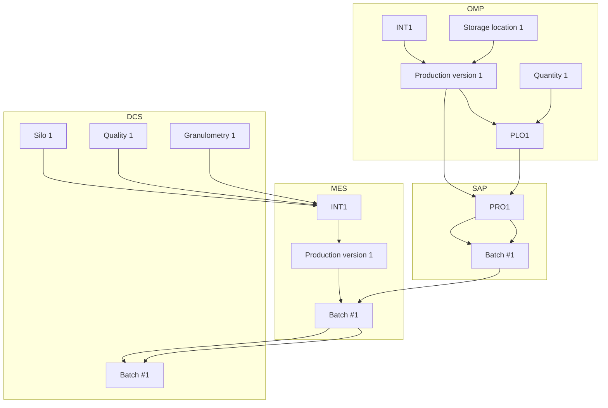

1.0 Ideal process – Scheduling and production

<!-- OCR of image2.png via tesseract, mean confidence 96.4 -->

| PLO: Planned | PRO: Process |
| Order | Order |

<!-- Flow read from the image by the local vision model. DRAFT -- on this corpus it recovers about half the arrows and about a third of the arrows it draws are wrong, so check every one against the image before relying on it. The box labels below are read by OCR and are reliable. -->



<!-- labels read from the image via tesseract -->

eee

Production

OMP

version 1

SAP

PRO1

Batch #1

MES

Production

Batch #1

version 1

Granulometry 1

DCS

Silo 1

Quality 1

Batch #1

1.1 Ideal process – Bulk production declaration

<!-- OCR of image3.png via tesseract, mean confidence 90.8 -->

OMP

Quantity1 INT1

SAP

Batch#1

Quantity1 INT1

Quantity1 Batch#1

MES

DCS

Quantity 1

Quantity1 Batch#1

<!-- OCR of image2.png via tesseract, mean confidence 96.4 -->

| PLO: Planned | PRO: Process |
| Order | Order |

1.2 Ideal process – Packaging

<!-- OCR of image4.png via tesseract, mean confidence 84.6 -->

OMP

| Qua

SAP

Label printing

Quantity1 (via EWM)

Consumption on INT1

MES

DCS

<!-- OCR of image2.png via tesseract, mean confidence 96.4 -->

| PLO: Planned | PRO: Process |
| Order | Order |

2.2 Partial downgrading of a silo after production – Packaging and loading

<!-- Flow read from the image by the local vision model. DRAFT -- on this corpus it recovers about half the arrows and about a third of the arrows it draws are wrong, so check every one against the image before relying on it. The box labels below are read by OCR and are reliable. -->

```mermaid
flowchart TD
    subgraph OMP
        ART1
        Quantity2
        PLO1.1
        Batch#1
        PLO1
    end

    subgraph SAP
        PRO1.1
        ART1
        Batch#1
        Label printing
        Quantity2("via EWM")
        Consumption on INT1
        ART1
        Silo1
        ART2
        Quantity3("1-2)(via Simba")
        Consumption on INT2
    end

    subgraph MES
    end

    subgraph DCS
    end

    ART1 --> PLO1.1
    Quantity2 --> PLO1.1
    PLO1.1 --> PRO1.1
    PRO1.1 --> Batch#1
    PRO1.1 --> ART1
    Batch#1 --> Label printing
    Label printing --> Quantity2("via EWM")
    Quantity2("via EWM") --> Consumption on INT1
    ART1 --> ART1
    ART1 --> Silo1
    Silo1 --> ART2
    ART2 --> Quantity3("1-2)(via Simba")
    Quantity3("1-2)(via Simba") --> Consumption on INT2
```

<!-- labels read from the image via tesseract -->

OMP

Quantity2 (via EWM)

SAP

L= }

Label printing

Consumption on INT1

Quantity3 (1-2) (via Simba)

Consumption on INT2

MES

DCS

<!-- OCR of image2.png via tesseract, mean confidence 96.4 -->

| PLO: Planned | PRO: Process |
| Order | Order |

2.0 and 2.1 equal to 1.0 and 1.1

3.0 Full silo downgrading during production – Scheduling and production

<!-- OCR of image6.png via tesseract, mean confidence 92.6 -->

Production

OMP

version 1

PLO1

SAP

PRO1

Batch #1

MES

Production

Batch #1

version 2

Granulometry

Batch #1

<!-- OCR of image2.png via tesseract, mean confidence 96.4 -->

| PLO: Planned | PRO: Process |
| Order | Order |

3.1 Full silo downgrading during production – Production declaration

<!-- OCR of image2.png via tesseract, mean confidence 96.4 -->

| PLO: Planned | PRO: Process |
| Order | Order |

Same as 1.1 since we have a PRO where to declare production

3.2 Full silo downgrading during production – Packaging

<!-- OCR of image7.png via tesseract, mean confidence 80.7 -->

OMP

SAP

+! Label printing

Quantity1 (via C=} EWM)

Consumption — on INT1

MES

DCS

<!-- OCR of image2.png via tesseract, mean confidence 96.4 -->

| PLO: Planned | PRO: Process |
| Order | Order |

INT Structure - SODA ASH (to be reviewed since BIB, real INT, and SL have the same article)

<!-- image8.png read by Qwen3-VL (local vision model) -->

31851: SL

31851 (ROAB):  
SL - To BICAR Structure

30156: SD

SD

31851
135731
150393
162672
184428
202666

WAGONS
BIAB
30156
150391
153707
163083

15366: SD COOL

SD COOL

15366

Only 1 batch per time

INT structure - BICAR

```mermaid
flowchart TD
    A["31851 (ROAA): SL - From SODA Structure"] --> B["31851 (ROAB): SL"]
    B --> C["32043: BIR 0/50 @INT"]
    B --> D["46474: BIR 0/50 EOLO @INT"]
    C --> E["32042.1: BIR 0/13 @INT"]
    C --> F["32042.2: BIR 0/13 @INT"]
    C --> G["58307.1: BIR 0/13+ @INT"]
    C --> H["58307.2: BIR 0/13+ @INT"]
    C --> I["32044.1: BIR 13/27 @INT"]
    C --> J["32044.2: BIR 13/27 @INT"]
    C --> K["32046.1: BIR 27/50 @INT"]
    C --> L["32046.2: BIR 27/50 @INT"]
    C --> M["32046.3: BIR 27/50 @INT"]
    C --> N["32046.4: BIR 27/50 @INT"]
    D --> O["47301.1: BIR 0/50 COMBINE @INT"]
    D --> P["47301.2: BIR 0/50 COMBINE @INT"]
    D --> Q["47301.3: BIR 0/50 COMBINE @INT"]
    D --> R["317049"]
    E --> S["31859"]
    E --> T["182206"]
    E --> U["166494"]
    E --> V["322871"]
    E --> W["319993"]
    F --> X["180924"]
    G --> Y["322961"]
    G --> Z["317731"]
    G --> AA["202075"]
    H --> AB["204455"]
    I --> AC["31861"]
    I --> AD["179754"]
    I --> AE["317706"]
    I --> AF["-154859"]
    J --> AG["154034"]
    K --> AH["188281"]
    K --> AI["177803"]
    L --> AJ["32490??"]
    M --> AK["165548"]
    M --> AL["166496"]
    M --> AM["31873"]
    N --> AN["194910"]
    N --> AO["194909"]
    O --> AP["166495"]
    O --> AQ["321276"]
    O --> AR["322195"]
    P --> AS["41295"]
    P --> AT["304203"]
    P --> AU["304237"]
    P --> AV["168524"]
    P --> AW["170104"]
    P --> AX["182651"]
    P --> AY["166909"]
    P --> AZ["203070"]
    P --> BA["-31874"]
    P --> BB["132660"]
    P --> BC["-172136"]
    Q --> BD["31867"]
    Q --> BE["304301"]
    Q --> BF["161873"]
    Q --> BG["163575"]
    Q --> BH["167626"]
    Q --> BI["180114"]
    Q --> BJ["182753"]
    Q --> BK["165524"]
    Q --> BL["304302"]
    Q --> BM["304313"]
    Q --> BN["304316"]
    Q --> BO["304330"]
    Q --> BP["201218"]
    Q --> BQ["304312"]
    Q --> BR["315401"]
```

<!-- Flow read from the image by the local vision model. DRAFT -- on this corpus it recovers about half the arrows and about a third of the arrows it draws are wrong, so check every one against the image before relying on it. The box labels below are read by OCR and are reliable. -->



<!-- labels read from the image via tesseract -->

31851 (ROAA): SL - From SODA Structure

31851 (ROAB): SL

|

32043: BIR 0/SO @INT

47301.1: BIR 0/SO = G DINT

47301.2: BIR 0/SO = G DINT

47301.3: BIR 0/SO = G DINT

32042.1: BIR 0/13 @INT

32042.2: BIR 0/13 @INT

58307.1: BIR 0/13+ @INT

58307.2: BIR 0/13+ @INT

32044.1: BIR 13/27 @INT

32044.2: BIR 13/27 @INT

32046.1: BIR 27/50 @INT

32046.2: BIR 27/50 @INT

32046.3: BIR 27/50 @INT

32046.4: BIR 27/50 @INT

FOOD 0/50

41295

177803

| 321276 _

304203

| 202075 |

304237

| 254859. |

168524

| 229992 |

170104

182651

166909

203070

Max 12 simultaneous batches

  

INT structure - CASO

<!-- image10.png read by Qwen3-VL (local vision model) -->

| 47091 (ROAA): CaCl2 liq @INT |
|---|
| 47091 (ROAC): CaCl2 liq @INT |
| FOOD | FOOD | FCC | FCC | Feed | TEC | TEC | ROAD | 45663: Caso TEC solution @INT | 20425: CASO TEC SOLUTION 35%-37% *R | 25930: CASO TEC SOLUTION 35%-37% *R |
| LT | NON LT | LT | NON LT | NON LT | LT | NON LT | NON LT | DC 6 | DC 1 | RS72 |
|  |  |  |  |  |  |  |  | TEC | TEC | FCC |

Max 5 simultaneous batches

  

Open questions

1. The silos level will be on SAP? How frequent it will be updated?
2. How we will manage the filling/empting process?
3. Downgrading
4. Full silo during production
5. Last tons in the silo (normally sent to a truck)
4. What if we produce in a different day compared to the scheduled one? What happen to the batch created during scheduling and which batch # we will use for production declaration?
5. INT structure detail: what if we have to comunicate with production a specific INT product but the capability of the process is very low (high probability of downgrading)?  

  